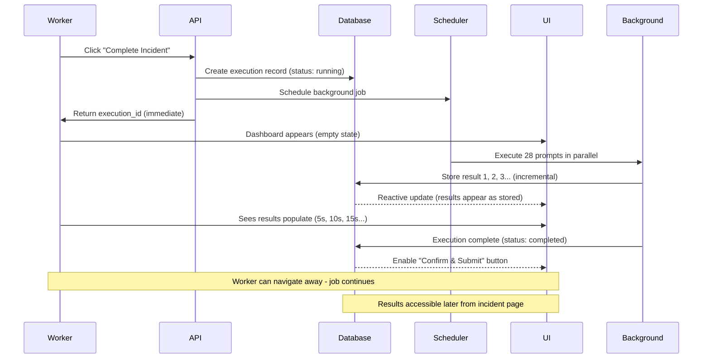

# Epic 11: Multi-Prompt Analysis System
**Parallel AI Analysis & Observation Framework with Unified Prompt Management**

> **Document Purpose**: Complete specification for Epic 11, a cross-epic feature that refactors the existing AI prompt system (Epic 6) with better UX and extends it to support flexible, parallel AI analysis prompts that run 20-50+ questions simultaneously against incident data (Epic 3), event narratives, and future "Moments That Matter" entries.

> **Cross-Epic Dependencies**: This epic extends **Epic 6** (AI Prompt Management) with improved UX and extends **Epic 3** (Incident Capture) with automated analysis capabilities.

---

## Executive Summary

### The Problem

**Current State**:
- Adding a new AI analysis question requires 2-3 days of developer work (schema changes, forms, API endpoints, UI components)
- AI Prompt Admin UI (Epic 6) is functional but has UX/visualization issues
- No way to run multiple AI prompts in parallel on the same data
- Angela can't experiment with new analysis questions without developer help

**Business Impact**:
- Slow iteration on NDIS compliance checks
- Can't quickly adapt to regulatory changes
- Limited ability to surface risk patterns systematically
- Team leader analysis still mostly manual (30+ minutes per incident)

### The Solution

**Epic 11 delivers a unified, flexible AI prompt system that enables Angela to**:
1. **Manage all prompts** (generation + analysis) in one improved admin interface
2. **Create unlimited analysis prompts** that run in parallel (20-50+ prompts in 15-30 seconds)
3. **Organize prompts into logical groups** that can be renamed/reordered easily
4. **Test prompts** with real incident data before activating
5. **See results as signals** (✅ 🚨 🟢 🟡 🔴) not complex data entry

**Key Capabilities**:
- **Incident Analysis** (immediate): 28+ NDIS compliance/risk/root cause prompts
- **Event Observations** (future): Real-time hints for frontline workers
- **Moments That Matter** (future): Daily voice recording analysis

### Business Value

**Time Savings**:
- Angela adds new analysis question: ~~2-3 days~~ → **2 minutes**
- Team leader incident analysis: ~~30 minutes~~ → **1 minute** (automated signals)

**Cost Savings**:
- Manual analysis: ~$25-40 per incident (labor)
- Automated analysis: ~$0.25 per incident (AI + 5 min review)
- **Savings**: 85% reduction in analysis cost

**Quality Improvement**:
- Consistent analysis across all incidents (nothing falls through cracks)
- Early risk detection (automated flagging)
- Compliance confidence (NDIS criteria checked every time)

---

## Cross-Epic Dependencies & Integration Points

**Epic 11 is a cross-epic feature** that extends and integrates with multiple existing epics:

### Epic 6: AI Prompt Management (Foundation)

**Extends:**
- `ai_prompts` table - adds new fields for batch analysis mode
- Admin UI at `/admin/ai-prompts` - refactors with better UX (Story 11.0)
- DX toolbar components - extracts for reuse in batch testing
- Adaptive token management (Story 6.9) - reused for analysis prompts

**Integration Points:**
- Story 11.0 refactors Epic 6 UI (improves all prompts, not just analysis)
- Story 11.1 extends Epic 6 schema (unified table approach)
- Story 11.2 adds "Analysis Prompts" tab alongside existing "Generation Prompts"

**Benefits:**
- Single source of truth for all AI prompts
- Angela learns one system (not two separate UIs)
- Shared infrastructure (versioning, testing, token management)

### Epic 3: Incident Capture (Data Source)

**Consumes:**
- Complete incident records from Epic 3 workflow
- All narrative phases (before/during/end/post event)
- Clarification Q&A pairs
- Enhanced narratives
- Incident metadata (participant, reporter, date, location)

**Integration Points:**
- Story 11.4 adds Step 8 "Analysis & Close" to incident workflow
- Analysis executes after Step 7 completion
- Results displayed before final incident submission
- Non-blocking UX (worker can navigate away during analysis)

**User Flow:**
1. Frontline worker completes Epic 3 workflow (Steps 1-7)
2. Epic 11 triggers automated analysis (28+ prompts run in parallel)
3. Worker reviews analysis signals and submits incident
4. Incident marked complete, ready for team leader review

### Future Cross-Epic Extensions

**Epic 5: Incident Analysis Workflow** (when implemented)
- Epic 11 provides automated pre-analysis (signals for team leader)
- Team leader can override/refine analysis results
- Shared analysis data model

**"Moments That Matter"** (future epic)
- Epic 11 infrastructure ready for voice recording analysis
- Same multi-prompt framework applies to different data sources
- Story 11.6 planned for implementation

**Event Observations** (future feature)
- Epic 11 can provide passive hints to workers during narrative writing
- Same prompt system, different execution mode
- Story 11.5 planned for implementation

---

## Table of Contents

- [User Experience Overview](#user-experience-overview)
- [Real-World Use Cases](#real-world-use-cases)
- [Technical Architecture](#technical-architecture)
- [Epic 11 Story Breakdown](#epic-11-story-breakdown)
- [Prompt Examples & Templates](#prompt-examples--templates)
- [Implementation Decisions](#implementation-decisions)

---

## User Experience Overview

### For Angela: Unified Prompt Management

**Single Admin Interface**: `/admin/ai-prompts` (improved from Epic 6)

**Two Tabs**:
1. **Generation Prompts** - Existing prompts (question generation, narrative enhancement)
2. **Analysis Prompts** - NEW parallel batch prompts (NDIS compliance, risk assessment)

**Shared Features** (both tabs):
- Group management (create, rename, reorder groups)
- Model selection (gpt-5, gpt-4o-mini, etc.)
- Token limit configuration
- Test with sample data
- Drag-drop reordering
- Activate/deactivate
- Usage analytics

**Creating New Analysis Prompt** (2 minutes):
1. Click "+ New Analysis Prompt"
2. Fill form:
   - Name: "PBS Plan Review Needed"
   - Group: "Care Planning" (or create new)
   - Type: Predicate (Yes/No)
   - Prompt Template: [paste from template library]
   - Model: gpt-5
   - Tokens: 150
3. "Test Prompt" → Run against sample incident
4. Review output → Looks good!
5. "Save & Activate" → Immediately available

### For Frontline Workers: Seamless Background Analysis

**Step 8 of Incident Capture**: "Incident Analysis & Close"

**Non-Blocking Flow**:
1. Worker clicks "Complete Incident Report"
2. **Dashboard appears immediately** (empty state, spinner)
3. Worker sees: "Analysis in progress... 5 / 28 prompts complete"
4. **After ~5 seconds**: First results appear (NDIS Compliance group)
   - Worker starts reading results while analysis continues
5. **After ~10 seconds**: More results appear (Risk Assessment group)
6. **After ~20 seconds**: All 28 results visible
7. Worker reviews signals (1-2 minutes)
8. "Confirm & Submit" button enabled when complete

**If Worker Navigates Away**:
- Analysis continues in background (Convex scheduled job)
- Results saved to database
- Notification appears when complete
- Can view results later from:
  - Incident detail page ("View Analysis" button)
  - Dashboard ("Recent Analyses" widget)
  - Notifications bell

**Results Display**:
```
✅ Incident Analysis Complete

🟢 NDIS COMPLIANCE
✅ Reportable Incident: YES - requires Commission notification within 24 hours
⚠️ Severity: MODERATE
✅ Notification Deadline: Within 24 hours (due by 3:45 PM tomorrow)
🚨 Abuse/Neglect Indicators: POSSIBLE - requires team leader review

🔴 RISK ASSESSMENT
🔴 Participant Risk: HIGH - immediate safety plan update recommended
🟡 Staff Risk: MEDIUM - consider two-staff protocol
🟢 Environmental Risk: LOW

🚨 IMMEDIATE ACTIONS REQUIRED
✅ Management Escalation: YES - due to participant risk level
✅ Care Plan Update: YES - recommended within 48 hours
```

---

## Real-World Use Cases

### Use Case 1: Incident Analysis (Epic 4 - Immediate)

**When**: After frontline worker completes 8-step incident capture

**Data Input**: Complete incident record
- Reporter, participant, date/time, location
- All four narrative phases (before/during/end/post event)
- All clarification Q&A pairs
- Enhanced narratives with AI improvements

**Angela's Pre-Configured Prompt Groups**:

#### **NDIS Compliance (5 prompts)**
1. "Is this a NDIS reportable incident?" → YES/NO
2. "NDIS severity level?" → Minor/Moderate/Severe/Critical
3. "Notification timeframe?" → Immediate/24hrs/5days/None
4. "Abuse/neglect indicators?" → YES/NO/Possible
5. "External investigation required?" → YES/NO/Escalate

#### **Risk Assessment (8 prompts)**
1. "Participant risk level" → Low/Medium/High/Critical
2. "Staff risk level" → Low/Medium/High/Critical
3. "Environmental hazards identified" → YES/NO + description
4. "Recurrence likelihood without intervention" → Low/Medium/High
5. "Deteriorating participant condition indicator" → YES/NO/Monitor
6. "Immediate safety measures required" → YES/NO + recommendations
7. "Medication review recommended" → YES/NO/Consult
8. "Risk to other participants" → None/Low/Medium/High

#### **Root Cause Analysis (6 prompts)**
1. "Primary contributing factors" → Environmental/Medical/Behavioral/Communication/Staff/Systemic
2. "Systemic process gaps evident" → YES/NO + brief note
3. "Staff training opportunities" → YES/NO + specific topics
4. "Incident preventability with existing protocols" → YES/NO/Uncertain
5. "Inadequate staffing indicator" → YES/NO/Context-dependent
6. "Unmet participant needs" → YES/NO + describe

#### **Staff Performance (4 prompts)**
1. "De-escalation protocols followed" → YES/NO/Partially
2. "Documentation completeness" → Complete/Incomplete/Needs Improvement
3. "Communication effectiveness" → Effective/Partially/Ineffective/NA
4. "Additional training recommended" → YES/NO + topics

#### **Immediate Actions (5 prompts)**
1. "Police notification required" → YES/NO/Consult
2. "Management escalation priority" → Urgent/Required/Recommended/Not Needed
3. "Care plan update priority" → Immediate/48hrs/Next Review/Not Required
4. "Critical file notes required" → YES/NO + suggested notes
5. "Family notification" → YES-Urgent/YES-24hrs/Consult/Not Required

**Total**: 28 prompts, ~20-30 seconds execution time

**Output**: Structured signals with action items auto-generated from red/yellow flags

### Use Case 2: Event-Level Observations (Future - Post Epic 4)

**When**: While frontline worker writes each narrative phase

**Data Input**: Single event phase text

**Purpose**: Show brief observations (NOT questions to answer) to help worker think

**Example** (Before Event phase):
```
Worker types:
"John was pacing in the day room around 2:30 PM. He seemed agitated,
repeatedly asking about when his family would visit. The room was quite
noisy with the television and several other participants talking loudly."

💡 AI Observations (non-intrusive panel below):
✓ Potential antecedents: Environmental noise, Unmet need (family visit timing)
✓ Participant state: Agitation indicators (pacing, repetitive questions)
ℹ️ Consider noting: Was quiet space offered? Communication about visit timing?
```

**Key**: These are **passive observations** shown to worker - not questions requiring answers

### Use Case 3: Moments That Matter Analysis (Future - Post Epic 4)

**When**: End of shift after voice recordings transcribed

**Data Input**: Bundled daily voice notes (5-20 recordings)

**Workflow**:
1. Worker records 12 voice notes during shift ("John had a good morning", "Meds administered", etc.)
2. System transcribes in background
3. At shift end, system bundles all moments
4. Runs analysis prompts in parallel:
   - **Handoff Items** (6 prompts): Extract continuity items for next shift
   - **Compliance Checks** (5 prompts): Verify activities/meds completed
   - **Incident Detection** (4 prompts): "Does any moment suggest unreported incident?"
5. Presents dashboard: "3 handoff items, 1 possible incident detected, 2 compliance notes"
6. Worker reviews and can promote to formal incident with one click

---

## Technical Architecture

### System Components

#### 1. Unified Prompt System (Refactored from Epic 6)

**Single Table**: `ai_prompts` (extended, not replaced)

**New Fields Added**:
```typescript
ai_prompts: defineTable({
  // ✅ EXISTING FIELDS (keep all Epic 6 fields):
  prompt_name: v.string(),
  prompt_template: v.string(),
  ai_model: v.string(),
  max_tokens: v.optional(v.number()),
  temperature: v.optional(v.number()),
  baseline_max_tokens: v.optional(v.number()), // Story 6.9
  adjusted_at: v.optional(v.number()),
  // ... all other Epic 6 fields

  // ✅ NEW FIELDS (Epic 4 additions):
  execution_mode: v.union(
    v.literal("single"),        // Traditional one-off prompt
    v.literal("batch_analysis") // Parallel batch execution
  ),
  prompt_type: v.optional(v.union(
    v.literal("generation"),     // Existing (questions, enhancement)
    v.literal("predicate"),      // NEW: Yes/No decisions
    v.literal("classification"), // NEW: Category selection
    v.literal("observation")     // NEW: Brief insights
  )),
  data_source_id: v.optional(v.string()), // "incident_analysis", etc.
  group_id: v.optional(v.id("prompt_groups")), // Foreign key to groups
  output_format: v.optional(v.string()), // "Yes/No", "Low/Medium/High"
  display_order: v.optional(v.number()), // For batch prompts
})
```

**Benefits of Unified System**:
- ✅ Single source of truth
- ✅ Angela learns one system (not two)
- ✅ Shared infrastructure (token management, versioning, DX tools)
- ✅ Epic 6 adaptive token management works for analysis prompts too

#### 2. Prompt Groups Table (NEW)

**Purpose**: Manage logical groupings with referential integrity

```typescript
prompt_groups: defineTable({
  data_source_id: v.string(), // Which data source
  group_name: v.string(), // Display name (Angela can edit)
  description: v.optional(v.string()),
  display_order: v.number(), // Order groups appear in UI
  is_active: v.boolean(),
  created_at: v.number(),
  updated_at: v.number(),
})
  .index("by_data_source", ["data_source_id"])
  .index("by_data_source_order", ["data_source_id", "display_order"]),
```

**Benefits**:
- Angela renames "NDIS Compliance" → affects all prompts automatically
- Can't delete group if prompts reference it (validation)
- Bulk operations: "Deactivate all prompts in this group"

#### 3. Data Source Profiles (Configuration)

**Purpose**: Define what data can be analyzed

```typescript
data_source_profiles: defineTable({
  profile_id: v.string(), // "incident_analysis", "event_observation"
  name: v.string(),
  description: v.optional(v.string()),
  data_structure: v.string(), // JSON schema of available fields
  is_active: v.boolean(),
  created_at: v.number(),
  updated_at: v.number(),
})
  .index("by_active", ["is_active"])
  .index("by_profile_id", ["profile_id"]),
```

**Initial Profiles**:
1. **incident_analysis** (active) - Complete incident with narratives
2. **event_observation** (future) - Single event phase
3. **moments_analysis** (future) - Daily voice recording bundle

#### 4. Execution & Results Tables

**Tracks batch executions and stores results**:

```typescript
analysis_executions: defineTable({
  data_source_id: v.string(),
  source_record_id: v.string(), // Incident ID, etc.
  started_at: v.number(),
  completed_at: v.optional(v.number()),
  total_prompts_run: v.number(),
  successful_prompts: v.number(),
  failed_prompts: v.number(),
  total_execution_time_ms: v.number(),
  total_tokens_used: v.number(),
  total_cost: v.number(),
  status: v.union(
    v.literal("running"),
    v.literal("completed"),
    v.literal("failed"),
    v.literal("partial_failure")
  ),
})
  .index("by_source_record", ["data_source_id", "source_record_id"])
  .index("by_status", ["status"]),

analysis_results: defineTable({
  execution_id: v.id("analysis_executions"),
  prompt_id: v.id("ai_prompts"),
  prompt_name: v.string(),
  group_name: v.string(),
  raw_output: v.string(),
  structured_output: v.object({
    signal: v.string(), // "YES", "HIGH", "Environmental", etc.
    justification: v.optional(v.string()),
    confidence: v.optional(v.number()),
  }),
  execution_time_ms: v.number(),
  tokens_used: v.number(),
  cost: v.number(),
  success: v.boolean(),
  error_message: v.optional(v.string()),
  created_at: v.number(),
})
  .index("by_execution", ["execution_id"])
  .index("by_execution_group", ["execution_id", "group_name"]),
```

### Background Processing Architecture

**Problem**: Don't block worker for 20-30 seconds

**Solution**: Convex scheduled jobs + reactive queries



**Key Implementation**:

```typescript
// Frontend: Reactive subscription
function AnalysisResultsDashboard({ executionId }) {
  // ✅ Updates automatically as results arrive
  const execution = useQuery(api.analysisExecution.getExecutionRecord, {
    execution_id: executionId
  });
  const results = useQuery(api.analysisExecution.getExecutionResults, {
    execution_id: executionId
  });

  const isComplete = execution?.status === "completed";
  const resultCount = results ? Object.values(results).flat().length : 0;

  return (
    <div>
      {/* Show progress */}
      {!isComplete && <p>Analysis in progress... {resultCount} / 28 results</p>}

      {/* Results appear incrementally */}
      {resultCount > 0 && <ResultsDisplay results={results} />}

      {/* Enable submit when complete */}
      <Button disabled={!isComplete}>Confirm & Submit</Button>
    </div>
  );
}
```

**Benefits**:
- ✅ Zero blocking time (worker productive immediately)
- ✅ Progressive disclosure (results appear as ready)
- ✅ Job continues if worker leaves page
- ✅ Results accessible later (stored in database)

---

## Epic 4 Story Breakdown

### Overview

**Epic Goal**: Refactor AI prompt admin UI and extend with parallel batch analysis capabilities

**Duration**: 4 weeks (20 working days)
**Team Size**: 2 developers (backend + frontend)
**Dependencies**: Epic 6 (AI Prompt Management - complete)

### Story 11.0: AI Prompt Admin UI Refactor

**Priority**: CRITICAL (Foundation for rest of epic)
**Estimated Effort**: 1 week (5 days)
**Focus**: Improve UX/visualization of existing prompt system

#### Requirements

**Problems to Solve**:
1. Current UI is functional but hard to navigate (all prompts in one flat list)
2. No grouping or organization
3. Model/token controls could be clearer
4. DX toolbar difficult to extend

**Improvements**:
1. **Better Visualization**
   - Group prompts by subsystem/workflow (collapsible sections)
   - Add "Generation Prompts" vs "Analysis Prompts" tabs (prep for 4.2)
   - Color-code prompt types (generation, predicate, classification)
   - Usage stats dashboard (execution count, success rate, avg tokens)

2. **Group Management**
   - Create `prompt_groups` table
   - Migrate existing prompts to groups based on `workflow_step`
   - UI: Create, rename, reorder groups
   - Drag-drop prompts between groups

3. **Improved Controls**
   - Model selector: Show cost estimates (gpt-5: $0.015, gpt-4o-mini: $0.001)
   - Token limit: Visual slider + text input, show baseline vs adjusted
   - Temperature: Slider with labels (0.0 = Deterministic, 1.0 = Creative)
   - Quick toggle: Active/Inactive with confirmation

4. **Refactor DX Toolbar**
   - Extract reusable components:
     - `PromptVariablePreview` (shows {{variables}} and values)
     - `PromptTestingPanel` (execute and view results)
     - `PromptPerformanceMetrics` (timing, tokens, cost)
   - Make extensible for batch testing (Story 11.2)

5. **Template Library**
   - Add "Templates" tab with starter templates
   - Predicate template, Classification template, Observation template
   - "Use Template" button pre-fills create form

#### Acceptance Criteria

- [ ] Grouped UI with collapsible sections
- [ ] Create/rename/delete groups (with validation)
- [ ] Drag-drop reordering works
- [ ] Model selector shows cost estimates
- [ ] Template library with 3 starter templates
- [ ] DX toolbar components extracted and reusable
- [ ] Migration script for existing prompts (assign to default group)
- [ ] All existing Epic 6 functionality preserved
- [ ] Responsive design (tablet/desktop)

#### Technical Implementation

**New Components**:
- `apps/web/components/admin/prompts/PromptGroupManager.tsx` - Group CRUD
- `apps/web/components/admin/prompts/PromptCard.tsx` - Individual prompt display
- `apps/web/components/admin/prompts/TemplateLibrary.tsx` - Template browser
- `apps/web/components/admin/prompts/ModelSelector.tsx` - Enhanced model picker
- `apps/web/components/developer/PromptVariablePreview.tsx` - Extracted from toolbar
- `apps/web/components/developer/PromptTestingPanel.tsx` - Extracted from toolbar

**Database Migration**:
```typescript
// Create prompt_groups table
// Seed default groups: "Question Generation", "Narrative Enhancement", "Contributing Analysis"
// Assign existing prompts to groups based on workflow_step
```

---

### Story 11.1: Extend Unified Prompt System (Backend)

**Priority**: CRITICAL
**Estimated Effort**: 1 week (5 days)
**Dependencies**: Story 11.0 (refactored UI)
**Focus**: Extend schema and backend for batch analysis

#### Requirements

**Schema Extensions**:
1. Add fields to `ai_prompts` table:
   - `execution_mode` (single/batch_analysis)
   - `prompt_type` (generation/predicate/classification/observation)
   - `data_source_id` (optional, for batch prompts)
   - `group_id` (foreign key to prompt_groups)
   - `output_format` (optional, for analysis prompts)
   - `display_order` (optional, for batch prompts)

2. Create `data_source_profiles` table

3. Create `analysis_executions` table

4. Create `analysis_results` table

**Backend Functions**:
1. `createDataSourceProfile` - System admin only
2. `listDataSourceProfiles` - All admins
3. `createAnalysisPrompt` - Angela (extends `createPrompt` mutation)
4. `updateAnalysisPrompt` - Angela (extends `updatePrompt` mutation)
5. `listPromptsByDataSource` - Query with filtering
6. `getPromptsByGroup` - Return prompts grouped
7. `reorderPrompts` - Bulk update display_order
8. `runAnalysisExecution` - Main orchestration action
9. `executeInBackground` - Scheduled background job
10. `getExecutionResults` - Query results by execution_id

**Seed Data**:
- Create "incident_analysis" data source profile
- Migrate 5 existing prompts as examples (set execution_mode: "single")

#### Acceptance Criteria

- [ ] Schema changes deployed with proper indexes
- [ ] All 10 backend functions implemented with auth
- [ ] Migration script for existing prompts (set defaults)
- [ ] Seed data: incident_analysis profile + example groups
- [ ] Unit tests for CRUD operations
- [ ] Performance: Query 50 prompts <100ms
- [ ] Background job executes independently (worker can leave page)

---

### Story 11.2: Analysis Prompts Admin UI

**Priority**: CRITICAL
**Estimated Effort**: 1 week (5 days)
**Dependencies**: Story 11.1 (backend), Story 11.0 (refactored UI)
**Focus**: Extend admin UI for analysis prompts

#### Requirements

**New "Analysis Prompts" Tab** (in `/admin/ai-prompts`):

1. **Data Source Selector** (top of page)
   - Dropdown: Select data source (initially "Incident Analysis")
   - Shows description and available fields

2. **Grouped Prompt Table**
   - One section per group (collapsible)
   - Columns: Name, Type, Output Format, Status, Usage, Actions
   - Drag-drop reordering within/between groups
   - Quick toggle Active/Inactive
   - Bulk select (checkboxes)

3. **Create/Edit Analysis Prompt Modal**
   - Form fields:
     - Name (required)
     - Description (optional)
     - Group (dropdown with "Create New")
     - Prompt Type (predicate/classification/observation)
     - Prompt Template (textarea with template selector)
     - Output Format (text input with examples)
     - Max Tokens (number, default 150)
     - AI Model (dropdown with cost indicators)
     - Temperature (slider)
     - Display Order (auto-assigned, editable)
   - "Test Prompt" button → Uses existing DX testing panel (refactored in 4.0)
   - Preview pane: Shows expected output format

4. **Batch Testing Panel** (extends DX toolbar from 4.0)
   - Select sample incident
   - Select group to test (or all prompts)
   - "Run Batch Test" button
   - Progress: "Running 28 prompts... 15/28 complete"
   - Results table: Prompt | Signal | Time | Tokens | Status
   - Color-coded success/failure
   - Click row to see full response

5. **Bulk Operations**
   - Select multiple prompts (checkboxes)
   - Actions: Activate, Deactivate, Change Group, Delete

6. **Usage Analytics**
   - Per-prompt metrics: Execution count, success rate, avg time
   - Sort by most/least used
   - Filter by group
   - Cost tracking (tokens × model rate)

#### Acceptance Criteria

- [ ] "Analysis Prompts" tab functional
- [ ] Full CRUD operations work
- [ ] Drag-drop reordering persists correctly
- [ ] Test prompt uses refactored DX panel from 4.0
- [ ] Batch testing executes and displays results
- [ ] Bulk operations work (multi-select)
- [ ] Template library integration ("Use Template" pre-fills form)
- [ ] Responsive design (tablet/desktop)
- [ ] Permission check: Angela-level users only
- [ ] Loading states and error handling

---

### Story 11.3: Parallel Execution Engine

**Priority**: CRITICAL
**Estimated Effort**: 1 week (5 days)
**Dependencies**: Story 11.1 (backend schema)
**Focus**: Batch execution orchestration

#### Requirements

**Core Function**: `runAnalysisExecution`
- Input: Data source ID, source record ID (incident ID)
- Returns: Execution ID immediately (non-blocking)
- Schedules background job via Convex scheduler

**Background Job**: `executeInBackground`
- Fetch all active prompts for data source
- Fetch incident data (narratives, metadata, clarifications)
- Execute prompts in parallel (Promise.all, batch of 10)
- Store results incrementally (enables reactive UI)
- Update execution status on completion

**Error Handling**:
- Graceful degradation (one failure doesn't block others)
- Retry transient failures (network issues, rate limits)
- Log errors with context
- Mark execution as "partial_failure" if some prompts fail

**Performance**:
- Target: 30 prompts in <30 seconds
- Batch execution (10 parallel at a time, not 30 simultaneous)
- Reuse existing `aiService.ts` infrastructure
- Update prompt usage stats (execution_count, success_rate)

**Integration**:
- Leverage Epic 6 adaptive token management (Story 6.9)
- Use existing AI logging (`ai_request_logs`)
- Integrate with rate limiting and cost tracking

#### Acceptance Criteria

- [ ] `runAnalysisExecution` returns immediately (non-blocking)
- [ ] Background job continues if worker leaves page
- [ ] Executes 30 prompts in <30 seconds
- [ ] Graceful failure: 5 failed prompts don't block 25 others
- [ ] Results stored incrementally (reactive UI updates)
- [ ] Prompt stats updated automatically
- [ ] Integration tests with sample incident
- [ ] Performance test: 50 prompts complete in <60s
- [ ] Error logging comprehensive

---

### Story 11.4: Results Dashboard & Incident Integration

**Priority**: CRITICAL
**Estimated Effort**: 1 week (5 days)
**Dependencies**: Stories 11.2 (admin UI), 11.3 (execution engine)
**Focus**: Frontline worker UI

#### Requirements

**New Workflow Step**: Step 8 of Incident Capture "Analysis & Close"

**UI Flow**:
1. Worker clicks "Complete Incident Report"
2. Dashboard appears immediately (empty state, spinner)
3. Progress indicator: "Analysis in progress... 5 / 28 prompts"
4. Results populate incrementally as prompts complete
5. Worker reviews signals (grouped by category)
6. "Confirm & Submit" enabled when complete

**Results Dashboard Components**:

1. **Header**
   - Title: "Incident Analysis Complete"
   - Timestamp, execution time, prompts run
   - Export buttons (PDF, JSON)

2. **Summary Cards**
   - 🔴 Red Flags: X critical issues
   - 🟡 Yellow Warnings: Y items needing attention
   - 🟢 Green Signals: Z confirmed/cleared

3. **Grouped Results** (collapsible sections)
   - One section per group
   - Color-coded status summary per group
   - Individual result cards with signal icons

4. **Action Items Panel** (auto-generated)
   - Extracted from red/yellow flags
   - Priority-sorted
   - Due dates for time-sensitive items
   - Assigned roles (team lead, management)

5. **Review & Submit**
   - Checkbox: "I have reviewed the analysis"
   - Button: "Confirm & Submit Incident"
   - Updates incident status on submission

**Reactive Updates**:
- Use Convex `useQuery` for real-time updates
- Results appear as stored (progressive disclosure)
- Loading states clear as data arrives

**Page Navigation Handling**:
- If worker leaves page, analysis continues
- Results accessible from:
  - Incident detail page ("View Analysis Results" button)
  - Dashboard widget ("Recent Analyses")
  - Notification bell (when complete)

**Mobile/Tablet Support**:
- Responsive layout
- Touch-friendly (collapsible sections)
- Print-friendly (for handoff)

#### Acceptance Criteria

- [ ] Step 8 integrated into incident workflow
- [ ] Dashboard appears immediately (non-blocking)
- [ ] Progressive results display (reactive)
- [ ] Grouped results render correctly
- [ ] Action items auto-generate from flags
- [ ] Export to PDF functional
- [ ] Incident status updates on submit
- [ ] Navigation away doesn't stop analysis
- [ ] Results accessible from incident page later
- [ ] Mobile/tablet responsive
- [ ] Performance: Dashboard loads <2s after execution completes

---

## Prompt Examples & Templates

### Template 1: Predicate Prompt (Binary Decision)

```yaml
Name: [Describe the decision to make]
Type: Predicate
Output Format: Yes/No/Uncertain

Template:
---
Determine if [CONDITION TO CHECK].

Based on the incident narrative for {{participant_name}} on {{event_datetime}},
assess whether [SPECIFIC CRITERIA].

Consider:
- [FACTOR 1 TO EVALUATE]
- [FACTOR 2 TO EVALUATE]
- [FACTOR 3 TO EVALUATE]

Answer: YES (if condition met), NO (if not met), or UNCERTAIN (insufficient info).

Provide one-sentence justification.
---

Best Practices:
- Start with action verb: "Determine if...", "Assess whether..."
- Provide 3-5 clear evaluation criteria
- Define each answer option explicitly
- Keep output short (1 sentence max)
- Use UNCERTAIN when confident answer impossible
```

**Example Instantiation**: NDIS Reportable Incident Check

```yaml
Name: NDIS Reportable Incident
Group: NDIS Compliance
Type: Predicate
Output Format: Yes/No - Brief justification
Model: gpt-5
Tokens: 100

Prompt:
---
Determine if this incident must be reported to the NDIS Quality and Safeguards Commission.

Based on the incident narrative for {{participant_name}} on {{event_datetime}},
assess whether NDIS reportable incident criteria are met.

Consider:
- Did the incident result in serious injury or death?
- Is there alleged abuse, neglect, or exploitation?
- Does it involve unauthorized use of restrictive practices?
- Did it result in police involvement?

Answer: YES or NO with one-sentence justification.
---
```

### Template 2: Classification Prompt (Category Selection)

```yaml
Name: [What you're classifying]
Type: Classification
Output Format: [Category1/Category2/Category3/...]

Template:
---
Classify [WHAT YOU'RE CLASSIFYING] according to the following categories:

Categories:
- [CATEGORY 1]: [When this applies]
- [CATEGORY 2]: [When this applies]
- [CATEGORY 3]: [When this applies]

Based on the incident for {{participant_name}} on {{event_datetime}}:
- Narratives: {{before_event}}, {{during_event}}, {{end_event}}, {{post_event}}

Select the most appropriate category and provide 1-2 sentence justification.
---

Best Practices:
- Define 3-8 distinct categories
- Make categories mutually exclusive (or allow multiple if factors co-occur)
- Each category needs clear definition
- Provide justification for selected category
```

**Example Instantiation**: NDIS Severity Classification

```yaml
Name: NDIS Severity Level
Group: NDIS Compliance
Type: Classification
Output Format: Minor/Moderate/Severe/Critical
Model: gpt-5
Tokens: 150

Prompt:
---
Classify this incident's severity according to NDIS guidelines:

Categories:
- MINOR: No injury, minimal impact, resolved without intervention
- MODERATE: Minor injury/distress, required intervention, no lasting impact
- SEVERE: Significant injury/distress, emergency response, potential lasting impact
- CRITICAL: Life-threatening, permanent injury, requires immediate notification

Based on the incident for {{participant_name}} on {{event_datetime}}:
- Narratives: {{before_event}}, {{during_event}}, {{end_event}}, {{post_event}}

Provide severity level with brief justification.
---
```

### Template 3: Observation Prompt (Descriptive Insight)

```yaml
Name: [What aspect to analyze]
Type: Observation
Output Format: Brief description (1-3 sentences)

Template:
---
Analyze [ASPECT TO EXAMINE] in this incident.

Context:
- Reporter: {{reporter_name}}
- Participant: {{participant_name}}
- Event: {{event_datetime}} at {{location}}

Review the complete narrative and identify [WHAT TO LOOK FOR].

Consider:
- [DIMENSION 1]
- [DIMENSION 2]
- [DIMENSION 3]

Provide 1-3 sentence summary. If none identified, state "No [aspect] identified."
---

Best Practices:
- Be specific about what to observe
- Limit output to 1-3 sentences (conciseness)
- Provide "none identified" fallback
- Focus on actionable insights
- Avoid subjective judgment (stick to facts)
```

**Example Instantiation**: Staff Training Opportunities

```yaml
Name: Staff Training Needs Identified
Group: Root Cause Analysis
Type: Observation
Output Format: Specific training topics or "No gaps identified"
Model: gpt-5
Tokens: 150

Prompt:
---
Analyze staff training opportunities evident in this incident.

Context:
- Reporter: {{reporter_name}}
- Participant: {{participant_name}}
- Event: {{event_datetime}} at {{location}}

Review the complete narrative and identify skills or knowledge areas where
additional training could improve future responses.

Consider:
- De-escalation techniques attempted and effectiveness
- Communication strategies used
- Safety protocols followed
- Recognition of early warning signs

Provide 1-2 specific training topics or state "No training gaps identified."
---
```

### Pre-Filled NDIS Prompt Set (28 prompts)

Complete set of 28 production-ready prompts available in main document appendix.

**Groups**:
- NDIS Compliance (5 prompts)
- Risk Assessment (8 prompts)
- Root Cause Analysis (6 prompts)
- Staff Performance (4 prompts)
- Immediate Actions (5 prompts)

---

## Implementation Decisions

### Decision 1: Unified vs. Separate Prompt Systems

**Decision**: **Unified System (Option B+C Hybrid)**

**Approach**:
1. **Story 11.0**: Refactor existing `ai_prompts` admin UI (improve UX first)
2. **Story 11.1**: Extend unified `ai_prompts` table (add batch analysis fields)
3. **Stories 11.2-11.4**: Build on improved foundation

**Rationale**:
- ✅ Angela manages all prompts in one place (not two)
- ✅ Epic 6 infrastructure (adaptive tokens, versioning, DX) works for analysis prompts
- ✅ Better long-term architecture (one system to maintain)
- ✅ Fixes existing UX debt in Epic 6

**Trade-off**:
- ⚠️ 1 week overhead (Story 11.0 refactor)
- ✅ Cleaner foundation for Epic 11
- ✅ Epic 6 prompts get better UX too

### Decision 2: Background Processing Approach

**Decision**: **Non-Blocking with Convex Reactivity**

**Approach**:
- Return execution ID immediately (don't await completion)
- Schedule background job via Convex scheduler
- Store results incrementally (each prompt triggers reactive update)
- Frontend uses `useQuery` (reactive subscriptions)
- Worker sees results appear progressively

**Benefits**:
- ✅ Zero blocking time (worker productive immediately)
- ✅ Job continues if worker leaves page
- ✅ Results accessible later from incident page
- ✅ Leverages Convex built-in reactivity (no WebSockets to build)

**User Experience**:
- Perceived wait: ~5 seconds (until first results)
- Actual execution: ~20-30 seconds (hidden by progressive display)

### Decision 3: Model Selection Scope

**Decision**: **Per-Prompt + Optional Batch Override**

**Default**: Each prompt configured individually
- Simple prompts (yes/no) → `gpt-4o-mini` ($0.001)
- Complex prompts (analysis) → `gpt-5` ($0.015)

**Override**: Optional execution parameter to force all prompts to one model
- Use case: "Test with cheap model", "Emergency cost control"

**Cost Example** (28 prompts):
- All GPT-5: $0.42 per incident
- Mixed strategy: $0.25 per incident (40% savings) ← **Recommended**
- All GPT-4o-mini: $0.03 per incident (quality risk)

### Decision 4: Group Management

**Decision**: **Separate `prompt_groups` Table with Foreign Keys**

**Rationale**:
- Angela can rename groups (affects all prompts automatically)
- Referential integrity (can't delete group with prompts)
- Enables bulk operations on groups

**Alternative Rejected**: `group_name: v.string()` (no referential integrity)

---

## BMAD Methodology Integration

**Epic 11 follows the BMAD (Before, Model, After, Document) development methodology**. This section defines the systematic knowledge capture and retrospective processes required to complete the Document phase.

### Knowledge Capture After Each Story

**MANDATORY**: After completing each story (11.0-11.4), execute the knowledge capture workflow:

```bash
# After story implementation completion:
*task capture-kdd-knowledge
```

**Knowledge-Driven Development (KDD) Process:**

1. **Git Analysis**: Focus on files that actually changed during story implementation
2. **Pattern Extraction**: Document new architectural patterns discovered
3. **Example Creation**: Extract reusable code and configurations
4. **Lesson Capture**: Record technical insights for future development
5. **Minimal Story Reference**: Brief summary with links to knowledge assets

**KDD writes to knowledge base, NOT stories:**
- `docs/patterns/` - Architectural patterns and best practices
- `docs/examples/` - Working implementation examples
- `docs/lessons-learned/` - Technical insights and breakthroughs
- `docs/testing/technical/` - Testing patterns and infrastructure lessons

**CRITICAL - Story Template Compliance:**
- Story files have "Knowledge Capture Reference" section for **LINKS ONLY**
- **DO NOT write detailed KDD content in stories** - they are not referenced by future agents
- Stories should contain **only file paths** to knowledge base and **1-2 sentence summary** maximum
- All detailed lessons, patterns, and examples go to permanent knowledge base files

**Why KDD Matters**: Transforms individual implementations into institutional knowledge that accelerates future development and prevents knowledge loss.

### Story-Level Retrospectives

**After each story completion**, conduct brief retrospective (15 minutes):

**What Went Well:**
- Which technical decisions proved effective?
- What patterns emerged that should be reused?
- Which tools/approaches exceeded expectations?

**What Could Improve:**
- Where did implementation deviate from plan?
- What unexpected challenges emerged?
- Which assumptions proved incorrect?

**Action Items:**
- Update architecture docs with new patterns
- Refine acceptance criteria for remaining stories
- Adjust story estimates based on actual effort

**Document Location**: `docs/stories/story-11.X.md` (Knowledge Capture Reference section)

### Epic-Level Retrospective

**After Epic 11 completion** (all stories 11.0-8.4 done), conduct comprehensive retrospective:

#### 1. Cross-Epic Integration Review

**Epic 6 Integration:**
- Did unified prompt system achieve expected benefits?
- Is UX improvement measurable? (Angela feedback)
- Did DX toolbar refactor enable reuse as planned?
- Were there unexpected integration challenges?

**Epic 3 Integration:**
- Does Step 8 "Analysis & Close" fit naturally in workflow?
- Is non-blocking UX effective? (Worker feedback)
- Did incident data structure support analysis needs?
- Any schema changes needed retrospectively?

#### 2. Architectural Patterns Discovered

**Document in `docs/patterns/`:**
- Background job execution with Convex scheduler
- Progressive result disclosure with reactive queries
- Cross-epic schema extension patterns
- Foreign key referential integrity with `prompt_groups`

**Reusable Components Created:**
- `PromptGroupManager` - Group CRUD operations
- `PromptTestingPanel` - Extracted DX toolbar component
- `AnalysisExecutionOrchestrator` - Batch execution engine
- `ProgressiveResultsDashboard` - Reactive UI pattern

#### 3. Testing Strategy Evolution

**Document in `docs/testing/technical/`:**
- How did batch execution testing work?
- What mocking strategies proved effective?
- Performance testing approach for 30+ parallel prompts
- CI integration for cross-epic features

**Lessons Learned:**
- Which test patterns from Story 11.3 should be templates?
- How to test background jobs effectively?
- Reactive query testing best practices

#### 4. Business Value Validation

**Compare Metrics to Targets:**
- Angela prompt creation: Actual vs. <2 minute target?
- Incident analysis time: Actual vs. <1 minute target?
- Cost per incident: Actual vs. <$0.25 target?

**User Feedback:**
- Angela (admin): Prompt management experience rating
- Frontline workers: Analysis results usefulness
- Team leaders: Signal quality and actionability

#### 5. Future Epic Guidance

**Lessons for Epic 5** (Incident Analysis Workflow):
- How should Epic 11 automated signals integrate?
- Which analysis results should be editable by team leaders?
- Shared data model considerations

**Lessons for "Moments That Matter"** (Story 11.6):
- What infrastructure from Epic 11 transfers directly?
- Which data source profiles need modification?
- Voice transcript analysis prompt patterns

**Lessons for Event Observations** (Story 11.5):
- How to adapt batch execution for real-time hints?
- UI patterns for passive observations (non-blocking)
- Performance considerations for inline analysis

#### 6. Documentation Updates Required

**After epic retrospective, update:**
- [ ] Architecture docs with new patterns (`docs/architecture/`)
- [ ] Testing guides with batch execution patterns (`docs/testing/`)
- [ ] Cross-epic integration guide (Epic 3 + 6 + 8 touchpoints)
- [ ] `docs/prd/index.md` - Mark Epic 11 as ✅ Complete
- [ ] README or onboarding docs with multi-prompt analysis overview

### BMAD Completion Checklist

**Epic 11 is NOT complete until:**

- [ ] **Before**: Problem and context documented (✅ Done in this PRD)
- [ ] **Model**: Solution designed and stories planned (✅ Done in this PRD)
- [ ] **After**: All 5 stories (11.0-11.4) implemented and tested
- [ ] **Document**: KDD captured for each story (5 knowledge capture sessions)
- [ ] **Document**: Story-level retrospectives completed (5 retrospectives)
- [ ] **Document**: Epic-level retrospective completed (1 comprehensive review)
- [ ] **Document**: Architecture patterns documented in knowledge base
- [ ] **Document**: Testing patterns extracted and documented
- [ ] **Document**: Cross-epic integration lessons captured
- [ ] **Document**: Future epic guidance documented

**Epic Owner**: Responsible for ensuring Document phase completion, not just code delivery.

---

## Success Metrics

### Epic-Level Metrics

**Operational**:
- [ ] Angela adds 20 new prompts in first week without developer help
- [ ] Zero code deployments required for prompt management after Epic 4
- [ ] 100% of incidents receive automated analysis

**Business**:
- [ ] Team leaders rate analysis results "very useful" (>4/5)
- [ ] Average incident analysis time: <1 minute (was 30 minutes)
- [ ] 85% reduction in analysis cost per incident

**Technical**:
- [ ] Analysis execution: <30 seconds for 30 prompts
- [ ] 95%+ uptime for analysis service
- [ ] <$0.10 AI cost per incident analysis

### Story-Level Metrics

**Story 11.0** (UI Refactor):
- [ ] Angela creates new prompt in <2 minutes (timed test)
- [ ] Angela reorders 20 prompts successfully
- [ ] Template library: 3 starter templates available

**Story 11.3** (Execution Engine):
- [ ] 30 prompts execute in <30 seconds
- [ ] 95%+ success rate (<2 failures per 30 prompts)
- [ ] Worker can leave page, job continues

**Story 11.4** (Results Dashboard):
- [ ] Dashboard loads <2 seconds after execution
- [ ] Worker reviews and submits in <3 minutes
- [ ] Mobile/tablet responsive (tested on iPad)

---

## Risk Mitigation

### Risk 1: AI Output Quality Variability

**Mitigation**:
- Temperature set low (0.3) for consistency
- Angela tests prompts before activating
- Structured output format (Zod schemas)
- Human review required (signals inform, don't decide)

### Risk 2: Execution Performance at Scale

**Mitigation**:
- Parallel execution (batches of 10)
- Short prompts (150-300 token outputs)
- Caching incident data (single fetch)
- Circuit breaker for failed AI services

### Risk 3: Cost Overruns

**Mitigation**:
- Mixed model strategy (gpt-4o-mini for simple, gpt-5 for complex)
- Token usage tracking and alerts
- Cost dashboard for Angela
- ~$0.25 per incident (sustainable)

### Risk 4: Poor Prompt Quality

**Mitigation**:
- Template library with examples
- Test prompt feature (sample data)
- Usage stats show low-performing prompts
- Version history (rollback capability)

---

## Future Enhancements (Post-Epic 11)

### Event-Level Observations (Story 11.5)

**Passive observations** shown to frontline workers while writing narratives
- Same infrastructure (data source: "event_observation")
- Display as read-only panel below text area
- Does NOT require answers (engagement boost, not workflow blocker)

### Moments That Matter Analysis (Story 11.6)

**End-of-shift voice recording analysis**
- Bundle 5-20 voice transcripts from shift
- Run analysis prompts: Handoff items, compliance checks, hidden incidents
- Present dashboard with one-click incident promotion

### Advanced Analytics (Story 11.7)

**Prompt performance dashboard**
- Track which prompts frequently produce red flags
- Identify prompts with low success rates
- Cost per prompt optimization
- Pattern recognition across 100+ incidents

---

## Appendix: Complete 28-Prompt NDIS Set

[Available in separate document or expanded in final version]

**NDIS Compliance (5)**: Reportable incident, Severity, Notification timeframe, Abuse/neglect, External investigation
**Risk Assessment (8)**: Participant/staff/environmental risk, Recurrence likelihood, Deteriorating condition, Safety measures, Medication review, Other participants
**Root Cause (6)**: Contributing factors, Process gaps, Training needs, Preventability, Staffing concerns, Unmet needs
**Staff Performance (4)**: Protocol adherence, Documentation quality, Communication effectiveness, Training recommendations
**Immediate Actions (5)**: Police notification, Management escalation, Care plan update, File notes, Family notification

---

**Epic 11 Status**: Ready for Implementation
**Document Version**: 1.0 (Unified)
**Created**: 2025-10-29
**Updated**: 2025-10-30 (Renumbered from Epic 4 → Epic 8 → Epic 11)
**Dependencies**: Epic 6 (AI Prompt Management - Complete), Epic 3 (Incident Capture - Complete)
**Next Steps**: Team review, Epic approval, Story 11.0 kickoff

