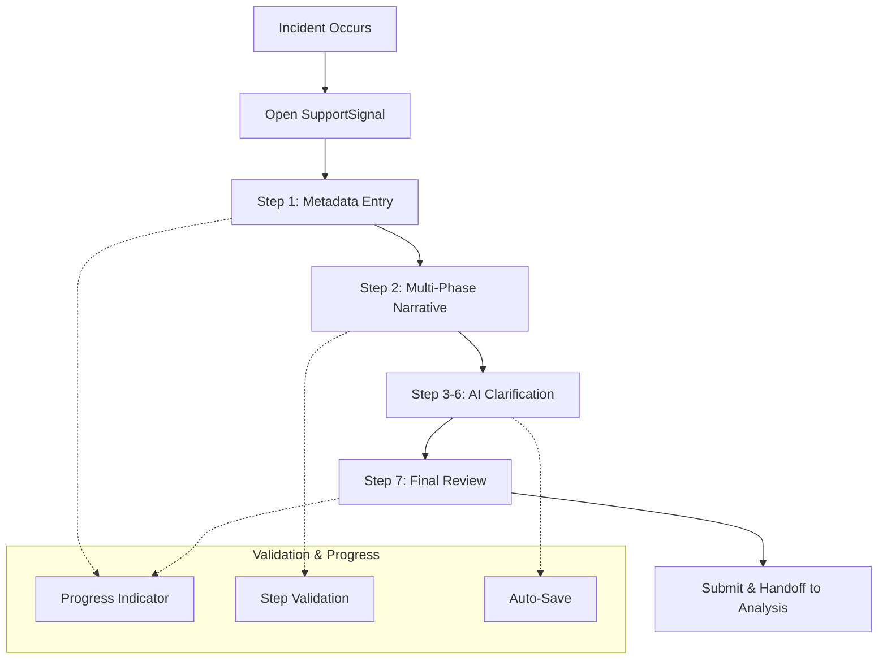

# Epic 2: Incident Capture Workflow

## Epic Overview

**Status**: **READY FOR DEVELOPMENT** ✅  
**Epic 1 Handoff**: COMPLETED - All dependencies satisfied

**Goal**: Implement the complete 7-step incident capture workflow for frontline workers, featuring intelligent narrative collection, AI-powered clarification questions, and seamless handoff to the analysis phase.

**Duration**: 3-4 weeks  
**Team Size**: 2-3 developers (frontend focus)  
**Dependencies**: ✅ Epic 1 (database, AI services, authentication) - **COMPLETED**  
**Primary Users**: Frontline support workers, disability care providers

---

## Business Context

Epic 2 delivers the core value proposition of SupportSignal for frontline workers - transforming chaotic, incomplete incident reporting into a guided, comprehensive process that captures critical details while minimizing cognitive load during stressful post-incident situations.

**Key Business Drivers**:
- **Compliance Assurance**: Structured workflow ensures all required incident details are captured
- **Reduced Cognitive Load**: Progressive disclosure and validation guidance reduces mental burden
- **Improved Data Quality**: AI-generated clarification questions capture details often missed in manual reports
- **Time Efficiency**: Guided workflow is faster than unstructured forms while capturing more information

**Success Metrics**:
- **Completion Rate**: >90% of started incidents reach completion
- **Time to Complete**: <15 minutes average for complete incident capture
- **Data Quality**: >95% of incidents have all narrative phases completed
- **User Satisfaction**: >4.5/5 rating from frontline workers

---

## User Journey Overview



---

## Story Breakdown

### Story 2.1: Wizard Framework & Navigation

**Priority**: CRITICAL  
**Estimated Effort**: 1 week  
**Dependencies**: Epic 1 (session management APIs)

#### Requirements
Build reusable wizard component framework that provides consistent navigation, progress tracking, and validation patterns for the 7-step incident capture workflow.

**Wizard Features**:
- **Progress Indicator**: Visual progress bar showing current step and completion status
- **Navigation Controls**: Next/Back/Skip buttons with validation-based enabling
- **Step Validation**: Prevent forward navigation until current step meets requirements
- **State Persistence**: Auto-save progress with recovery after session interruption
- **Responsive Design**: Mobile-first design optimized for tablet and phone use

#### Acceptance Criteria
- [ ] Reusable `WizardShell` component with configurable steps and validation
- [ ] Progress indicator showing 7 steps with clear visual state (pending/current/completed)
- [ ] Navigation controls that respect validation rules and user permissions
- [ ] Auto-save functionality with 300ms debouncing for all form inputs
- [ ] Session recovery that restores user to exact step and input state
- [ ] Mobile-responsive design tested on iOS Safari and Android Chrome
- [ ] Keyboard navigation and screen reader accessibility compliance

#### Technical Implementation
```typescript
// Wizard Framework Structure
interface WizardStep {
  id: string;
  title: string;
  component: React.ComponentType<WizardStepProps>;
  validator: (data: any) => ValidationResult;
  required: boolean;
}

interface WizardConfig {
  steps: WizardStep[];
  onComplete: (data: any) => Promise<void>;
  autoSave: boolean;
  allowBackNavigation: boolean;
}

// Example: Incident capture wizard configuration
const incidentCaptureSteps: WizardStep[] = [
  {
    id: "metadata",
    title: "Incident Details",
    component: MetadataStep,
    validator: validateMetadata,
    required: true,
  },
  {
    id: "narrative",
    title: "What Happened",
    component: NarrativeStep,
    validator: validateNarrative,
    required: true,
  },
  // ... clarification steps
];
```

---

### Story 2.2: Metadata & Narrative Collection

**Priority**: CRITICAL  
**Estimated Effort**: 1 week  
**Dependencies**: Story 2.1 (wizard framework)

#### Requirements
Implement the first two core steps of incident capture: metadata collection and multi-phase narrative input with real-time validation and user guidance.

**Step 1: Metadata Collection**
- **Reporter Name**: Pre-filled from authenticated user, editable for proxy reporting
- **Participant Name**: NDIS participant involved in incident
- **Event Date/Time**: Date and time picker with timezone handling
- **Location**: Text input for incident location with common location suggestions

**Step 2: Multi-Phase Narrative Collection**
- **Four Narrative Phases**: Before Event, During Event, End Event, Post-Event Support
- **2x2 Grid Layout**: Organized layout showing relationship between narrative phases
- **Rich Text Areas**: Large text inputs optimized for detailed descriptions
- **Phase Requirements**: At least one phase must contain meaningful content to proceed

#### Acceptance Criteria
- [ ] **Metadata Form**: All fields with proper validation and user-friendly error messages
- [ ] **Date/Time Picker**: Native browser inputs with proper timezone and format handling
- [ ] **Narrative Grid**: 2x2 responsive grid layout that works on all screen sizes
- [ ] **Input Validation**: Real-time validation with clear success/error states
- [ ] **Auto-Save**: Continuous saving of all inputs with visual confirmation
- [ ] **Content Requirements**: Clear indication of which narrative phases need content
- [ ] **Progress Tracking**: Visual indication of completion status for each phase

#### User Experience Details
```typescript
// Metadata validation requirements
interface IncidentMetadata {
  reporterName: string;      // Min 2 chars, max 100 chars
  participantName: string;   // Min 2 chars, max 100 chars
  eventDateTime: string;     // Valid ISO datetime, not future
  location: string;          // Min 3 chars, max 200 chars
}

// Narrative phase structure
interface NarrativePhases {
  beforeEvent: string;       // What led up to the incident
  duringEvent: string;       // What happened during the incident
  endEvent: string;          // How the incident was resolved
  postEvent: string;         // Support provided after incident
}

// Validation rule: At least one phase must have ≥50 characters
const validateNarrativeContent = (phases: NarrativePhases): boolean => {
  return Object.values(phases).some(phase => phase.trim().length >= 50);
};
```

---

### Story 2.3: AI-Powered Clarification System

**Priority**: HIGH  
**Estimated Effort**: 1.5 weeks  
**Dependencies**: Story 2.2 (narrative content), Epic 1 (AI services)

#### Requirements
Implement the intelligent clarification question system that generates 2-4 context-aware follow-up questions for each narrative phase, providing separate steps for user responses.

**Steps 3-6: Clarification Questions**
- **Step 3**: Questions about "Before Event" narrative
- **Step 4**: Questions about "During Event" narrative  
- **Step 5**: Questions about "End Event" narrative
- **Step 6**: Questions about "Post-Event Support" narrative

**AI Question Generation**:
- **Context Awareness**: Questions generated based on specific narrative content
- **Phase-Specific**: Different question types for each narrative phase
- **Adaptive Count**: 2-4 questions per phase based on narrative complexity
- **Optional Responses**: Users can skip any question without blocking progress

#### Acceptance Criteria
- [ ] **AI Integration**: Reliable question generation with <10 second response times
- [ ] **Question Display**: Clear, numbered questions with generous answer spaces
- [ ] **Optional Responses**: Skip functionality that doesn't block workflow progression
- [ ] **Error Handling**: Graceful fallback when AI services are unavailable
- [ ] **Question Caching**: Smart caching to avoid re-generating identical questions
- [ ] **Progress Indication**: Clear indication of which questions have been answered
- [ ] **Content Preservation**: Answers saved immediately and persist across sessions

#### AI Integration Architecture
```typescript
// Question generation workflow
const generateClarificationQuestions = async (
  incidentId: string,
  phase: NarrativePhase,
  content: string
): Promise<ClarificationQuestion[]> => {
  // Check cache first
  const cached = await getCachedQuestions(incidentId, phase);
  if (cached) return cached;
  
  // Generate new questions via AI
  const questions = await aiService.generateQuestions({
    incidentContext: await getIncidentMetadata(incidentId),
    narrativePhase: phase,
    narrativeContent: content,
    questionCount: determineQuestionCount(content),
  });
  
  // Cache and store results
  await cacheQuestions(incidentId, phase, questions);
  await logAIRequest(incidentId, 'clarification_questions', questions.length);
  
  return questions;
};

// Example AI-generated questions structure
interface ClarificationQuestion {
  id: string;
  question: string;
  phase: NarrativePhase;
  generatedAt: number;
  answered: boolean;
  answer?: string;
}
```

#### Question Quality Standards
- **Relevant**: Questions directly relate to narrative content provided
- **Open-Ended**: Questions encourage detailed, descriptive responses
- **Non-Leading**: Questions don't suggest specific answers or interpretations
- **Respectful**: Questions handle sensitive content with appropriate language
- **Actionable**: Questions help capture details useful for analysis and compliance

---

### Story 2.4: Narrative Enhancement & Completion

**Priority**: HIGH  
**Estimated Effort**: 1 week  
**Dependencies**: Story 2.3 (clarification responses)

#### Requirements
Implement the final review step that combines original narratives with clarification responses using AI enhancement, providing a comprehensive incident summary ready for analysis workflow handoff.

**Step 7: Enhanced Review & Completion**
- **Narrative Enhancement**: AI combines original narratives with clarification answers
- **Consolidated View**: Single, comprehensive incident narrative for review
- **Edit Capabilities**: Users can modify AI-enhanced content before submission
- **Final Validation**: Confirm all required information is complete and accurate
- **Workflow Handoff**: Seamless transition to analysis phase for team leaders

#### Acceptance Criteria
- [ ] **AI Enhancement**: Intelligent combination of original narratives and clarification responses
- [ ] **Review Interface**: Clean, readable presentation of enhanced narrative content
- [ ] **Edit Functionality**: Users can modify enhanced content with change tracking
- [ ] **Validation Summary**: Clear checklist showing completion status of all requirements
- [ ] **Handoff Process**: Smooth transition that notifies team leaders of ready-for-analysis incidents
- [ ] **Data Integrity**: All original content preserved alongside enhanced versions
- [ ] **Export Preview**: Preview of final incident report format

#### AI Enhancement Process
```typescript
// Narrative enhancement workflow
const enhanceNarrative = async (
  incidentId: string,
  originalNarrative: NarrativePhases,
  clarificationResponses: ClarificationResponse[]
): Promise<EnhancedNarrative> => {
  
  const enhancementRequest = {
    incidentMetadata: await getIncidentMetadata(incidentId),
    originalNarrative,
    clarificationResponses: groupResponsesByPhase(clarificationResponses),
    enhancementGoals: [
      'integrate_clarification_details',
      'improve_chronological_flow', 
      'highlight_key_safety_factors',
      'maintain_original_voice'
    ]
  };
  
  const enhanced = await aiService.enhanceNarrative(enhancementRequest);
  
  // Store both original and enhanced versions
  await storeEnhancedNarrative(incidentId, {
    original: originalNarrative,
    enhanced: enhanced,
    enhancedAt: Date.now(),
    clarificationUsed: clarificationResponses.length,
  });
  
  return enhanced;
};

// Enhanced narrative structure
interface EnhancedNarrative {
  consolidatedNarrative: string;      // Single comprehensive narrative
  keyHighlights: string[];            // Important points identified by AI
  timelineOfEvents: TimelineEntry[];  // Chronological sequence
  safetyFactors: string[];           // Safety-related observations
  enhancementNotes: string;          // AI explanation of enhancements made
}
```

#### Review Interface Requirements
- **Side-by-Side View**: Option to compare original and enhanced narratives
- **Highlight Changes**: Visual indication of AI-added content and modifications
- **Section Navigation**: Easy navigation between different enhanced sections
- **Approval Process**: Clear accept/reject/modify workflow for enhanced content
- **Summary Statistics**: Word count, completion percentage, enhancement impact metrics

---

## Epic Integration Points

### Real-Time Collaboration
- **Progress Sharing**: Team leaders can see capture workflow progress in real-time
- **Handoff Notifications**: Automatic notifications when incidents are ready for analysis
- **Status Updates**: Live status updates visible to relevant team members

### Data Quality Assurance
- **Validation Pipeline**: Multi-layer validation from input through AI processing
- **Error Recovery**: Graceful handling of AI service failures with manual fallbacks
- **Data Integrity**: Preservation of all original content alongside AI enhancements

### Mobile Optimization
- **Progressive Web App**: Full offline capability for initial capture
- **Touch Optimization**: Interface optimized for touch input on tablets and phones
- **Performance**: Fast loading and smooth interactions even on slower devices

---

## Epic Success Criteria

### Functional Requirements
- [ ] **Complete Workflow**: All 7 steps implemented and fully functional
- [ ] **AI Integration**: 95%+ success rate for question generation and enhancement
- [ ] **Mobile Responsive**: Full functionality on iOS and Android browsers
- [ ] **Performance**: <2 second step transitions, <10 second AI processing

### User Experience Requirements
- [ ] **Completion Rate**: >90% of started incidents reach completion in user testing
- [ ] **Time Efficiency**: <15 minutes average completion time for typical incidents
- [ ] **Error Rates**: <5% user errors requiring support intervention
- [ ] **Satisfaction**: >4.5/5 user satisfaction rating from frontline workers

### Quality Assurance
- [ ] **Data Accuracy**: 100% data integrity between capture and analysis handoff
- [ ] **Accessibility**: WCAG 2.1 AA compliance for inclusive design
- [ ] **Cross-Browser**: Full functionality in Safari, Chrome, Firefox, Edge
- [ ] **Error Handling**: Graceful degradation for all failure scenarios

---

## Risks & Mitigation

### Technical Risks
**Risk**: AI service latency affects user experience  
**Mitigation**: Asynchronous processing with progress indicators, local caching for repeated requests

**Risk**: Mobile performance issues with large forms  
**Mitigation**: Progressive loading, efficient state management, performance testing on target devices

**Risk**: Complex validation logic creates user friction  
**Mitigation**: User testing throughout development, clear error messages, contextual help

### User Experience Risks
**Risk**: Workflow too long or complex for stressed frontline workers  
**Mitigation**: User research with actual NDIS workers, streamlined step design, optional vs. required content

**Risk**: AI-generated questions irrelevant or inappropriate  
**Mitigation**: Comprehensive prompt testing, fallback to pre-defined questions, user feedback loops

---

## Dependencies & Handoffs

### ✅ From Epic 1 - DEPENDENCY STATUS: SATISFIED
- **✅ API Layer**: 15/15 incident and narrative management APIs functional and documented
- **✅ AI Services**: Question generation and enhancement services reliable and tested
- **✅ Authentication**: User sessions and MVP permissions working correctly
- **✅ TypeScript Integration**: Complete type definitions provided for frontend development
- **✅ Real-time Features**: Collaborative editing and live updates implemented
- **✅ Error Handling**: Comprehensive error patterns with retry logic established

### To Epic 3
- **Data Handoff**: Complete incident data ready for analysis workflow
- **UI Patterns**: Established patterns for wizard navigation and AI interaction
- **Test Data**: Comprehensive incident data for analysis workflow development

---

## Epic 1 Completion Verification

**Verification Date**: August 8, 2025  
**Verified By**: Bob (Scrum Master), Sarah (Product Owner), James (Dev Agent)

### ✅ **Story 1.5 Deliverables Confirmed**:
- **API Documentation Suite**: Complete documentation for 15/15 APIs
- **TypeScript Definitions**: Full frontend type safety in `apps/web/types/api.d.ts`
- **Authentication Patterns**: MVP-ready auth hooks for immediate development
- **Real-time Subscriptions**: Collaborative workflow patterns implemented
- **Integration Examples**: Comprehensive query/mutation patterns with error handling

### ✅ **Development Environment Ready**:
- **Frontend Integration**: Type-safe API calls with auto-completion
- **Error Boundaries**: Production-ready error handling patterns
- **Real-time Features**: Live incident updates and collaborative editing
- **Performance**: Optimized patterns for production deployment

**RECOMMENDATION**: Epic 2 development team can begin immediately with full confidence in backend infrastructure stability and frontend integration readiness.

---

This epic delivers the core user experience that will define SupportSignal's value to frontline workers - transforming incident reporting from a dreaded chore into a guided, intelligent process that actually helps improve safety outcomes.