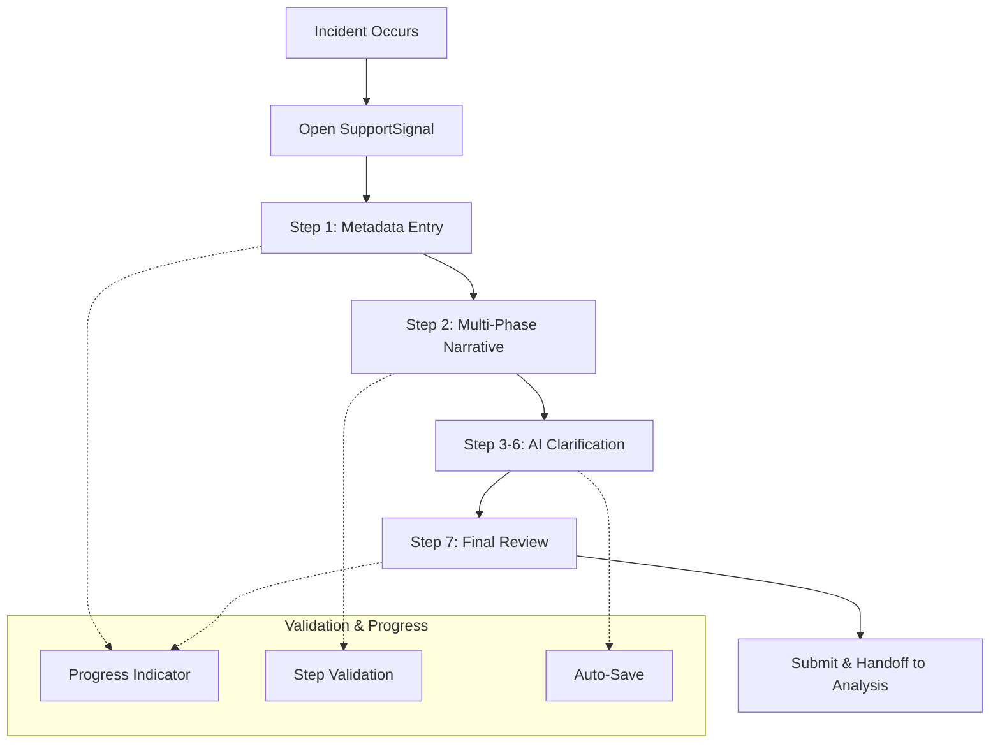

# Epic 3: Incident Capture Workflow

## Epic Overview

**Status**: **WAITING FOR EPIC 2** 🟡  
**Epic 2 Dependency**: Entity management foundation required

**Goal**: Implement the complete 7-step incident capture workflow for frontline workers, featuring intelligent narrative collection, AI-powered clarification questions, comprehensive prompt management, and seamless handoff to the analysis phase.

**Duration**: 4-5 weeks  
**Team Size**: 2-3 developers (frontend focus + AI specialist for Story 3.4)  
**Dependencies**: ✅ Epic 1 (database, AI services, authentication), 🟡 Epic 2 (participants, UI foundation) - **WAITING**  
**Primary Users**: Frontline support workers, disability care providers

---

## Business Context

Epic 3 delivers the core value proposition of SupportSignal for frontline workers - transforming chaotic, incomplete incident reporting into a guided, comprehensive process that captures critical details while minimizing cognitive load during stressful post-incident situations.

**Key Business Drivers**:
- **Compliance Assurance**: Structured workflow ensures all required incident details are captured
- **Reduced Cognitive Load**: Progressive disclosure and validation guidance reduces mental burden
- **Improved Data Quality**: AI-generated clarification questions capture details often missed in manual reports
- **Time Efficiency**: Guided workflow is faster than unstructured forms while capturing more information

**Success Metrics**:
- **Completion Rate**: >90% of started incidents reach completion
- **Time to Complete**: <15 minutes average for complete incident capture
- **Data Quality**: >95% of incidents have all narrative phases completed
- **User Satisfaction**: >4.5/5 rating from frontline workers

---

## User Journey Overview



---

## Story Breakdown

### Story 3.1: Metadata & Narrative Collection

**Priority**: CRITICAL  
**Estimated Effort**: 1 week  
**Dependencies**: Epic 2 (participants, wizard framework)

#### Requirements
Implement the first two core steps of incident capture: metadata collection and multi-phase narrative input with real-time validation and user guidance.

**Step 1: Metadata Collection**
- **Reporter Name**: Pre-filled from authenticated user, editable for proxy reporting
- **Participant Selection**: Dropdown of company's NDIS participants (from Epic 2)
- **Event Date/Time**: Date and time picker with timezone handling
- **Location**: Text input for incident location with common location suggestions

**Step 2: Multi-Phase Narrative Collection**
- **Four Narrative Phases**: Before Event, During Event, End Event, Post-Event Support
- **2x2 Grid Layout**: Organized layout showing relationship between narrative phases
- **Rich Text Areas**: Large text inputs optimized for detailed descriptions
- **Phase Requirements**: At least one phase must contain meaningful content to proceed

#### Acceptance Criteria
- [ ] **Metadata Form**: All fields with proper validation and user-friendly error messages
- [ ] **Reporter Pre-population**: Auto-fill reporter name from authenticated user
- [ ] **Participant Selection**: Dropdown of company participants (Epic 2 dependency)
- [ ] **Date/Time Picker**: Native browser inputs with proper timezone and format handling
- [ ] **Narrative Grid**: 2x2 responsive grid layout that works on all screen sizes
- [ ] **Input Validation**: Real-time validation with clear success/error states
- [ ] **Auto-Save**: Continuous saving of all inputs with visual confirmation
- [ ] **Content Requirements**: Clear indication of which narrative phases need content
- [ ] **Progress Tracking**: Visual indication of completion status for each phase

---

### Story 3.2: AI-Powered Clarification System

**Priority**: HIGH  
**Estimated Effort**: 1.5 weeks  
**Dependencies**: Story 3.1 (narrative content), Epic 1 (AI services)

#### Requirements
Implement the intelligent clarification question system that generates 2-4 context-aware follow-up questions for each narrative phase, providing separate steps for user responses.

**Steps 3-6: Clarification Questions**
- **Step 3**: Questions about "Before Event" narrative
- **Step 4**: Questions about "During Event" narrative  
- **Step 5**: Questions about "End Event" narrative
- **Step 6**: Questions about "Post-Event Support" narrative

#### Acceptance Criteria
- [ ] **AI Integration**: Reliable question generation with <10 second response times
- [ ] **Question Display**: Clear, numbered questions with generous answer spaces
- [ ] **Optional Responses**: Skip functionality that doesn't block workflow progression
- [ ] **Error Handling**: Graceful fallback when AI services are unavailable
- [ ] **Question Caching**: Smart caching to avoid re-generating identical questions
- [ ] **Progress Indication**: Clear indication of which questions have been answered
- [ ] **Content Preservation**: Answers saved immediately and persist across sessions

---

### Story 3.3: Narrative Enhancement & Completion

**Priority**: HIGH  
**Estimated Effort**: 1 week  
**Dependencies**: Story 3.2 (clarification responses)

#### Requirements
Implement the final review step that combines original narratives with clarification responses using AI enhancement, providing a comprehensive incident summary ready for analysis workflow handoff.

**Step 7: Enhanced Review & Completion**
- **Narrative Enhancement**: AI combines original narratives with clarification answers
- **Consolidated View**: Single, comprehensive incident narrative for review
- **Edit Capabilities**: Users can modify AI-enhanced content before submission
- **Final Validation**: Confirm all required information is complete and accurate
- **Workflow Handoff**: Seamless transition to analysis phase for team leaders

#### Acceptance Criteria
- [ ] **AI Enhancement**: Intelligent combination of original narratives and clarification responses
- [ ] **Review Interface**: Clean, readable presentation of enhanced narrative content
- [ ] **Edit Functionality**: Users can modify enhanced content with change tracking
- [ ] **Validation Summary**: Clear checklist showing completion status of all requirements
- [ ] **Handoff Process**: Smooth transition that notifies team leaders of ready-for-analysis incidents
- [ ] **Data Integrity**: All original content preserved alongside enhanced versions
- [ ] **Export Preview**: Preview of final incident report format

---

### Story 3.4: AI Prompt Management & Template System

**Priority**: MEDIUM  
**Estimated Effort**: 1 week  
**Dependencies**: Story 3.2 (AI clarification system)

#### Requirements
Implement a comprehensive AI prompt management system that allows administrators to customize, version, and optimize the prompts used for clarification question generation and narrative enhancement. This ensures consistent, high-quality AI interactions while providing flexibility for different organizational needs.

**Core Functionality**:
- **Prompt Template Library**: Centralized repository of all AI prompts used in the incident workflow
- **Version Management**: Track prompt evolution with rollback capabilities
- **A/B Testing Framework**: Compare prompt effectiveness and automatically optimize
- **Organization Customization**: Company-specific prompt variations for industry requirements
- **Performance Analytics**: Track prompt effectiveness, response quality, and user satisfaction

**Management Interface**:
- **Prompt Editor**: Rich text editor with template variable support
- **Testing Sandbox**: Preview and test prompt changes before deployment  
- **Performance Dashboard**: Real-time analytics on prompt performance metrics
- **Change Management**: Approval workflow for prompt modifications
- **Template Categories**: Organize prompts by workflow step and incident type

#### Acceptance Criteria
- [ ] **Template Management**: CRUD operations for prompt templates with version control
- [ ] **Variable System**: Support for dynamic variables (participant name, incident type, etc.)
- [ ] **A/B Testing**: Automated testing framework comparing prompt variants
- [ ] **Performance Metrics**: Track response quality, generation time, and user engagement
- [ ] **Admin Interface**: Intuitive management dashboard for non-technical administrators
- [ ] **API Integration**: Seamless integration with existing AI services in Stories 3.2-3.3
- [ ] **Backup & Recovery**: Automated backup system with easy restoration of previous versions
- [ ] **Multi-tenant Support**: Company-specific prompt customizations without affecting other organizations

---

## Epic Success Criteria

### Functional Requirements
- [ ] **Complete Workflow**: All 7 steps implemented and fully functional
- [ ] **AI Integration**: 95%+ success rate for question generation and enhancement
- [ ] **Mobile Responsive**: Full functionality on iOS and Android browsers
- [ ] **Performance**: <2 second step transitions, <10 second AI processing

### User Experience Requirements
- [ ] **Completion Rate**: >90% of started incidents reach completion in user testing
- [ ] **Time Efficiency**: <15 minutes average completion time for typical incidents
- [ ] **Error Rates**: <5% user errors requiring support intervention
- [ ] **Satisfaction**: >4.5/5 user satisfaction rating from frontline workers

---

## Dependencies & Handoffs

### ✅ From Epic 1 - DEPENDENCY STATUS: SATISFIED
- **✅ API Layer**: 15/15 incident and narrative management APIs functional and documented
- **✅ AI Services**: Question generation and enhancement services reliable and tested
- **✅ Authentication**: User sessions and MVP permissions working correctly

### 🟡 From Epic 2 - DEPENDENCY STATUS: PENDING
- **🟡 Participants Table**: NDIS participant management for incident metadata
- **🟡 Participant Selection**: Dropdown of company participants for incident reporting
- **🟡 Wizard Framework**: Completed (Stories 2.0 & 2.1)
- **🟡 UI Foundation**: Completed (Stories 2.0 & 2.1)

### To Epic 4 (Analysis Workflow)
- **Data Handoff**: Complete incident data ready for analysis workflow
- **UI Patterns**: Established patterns for wizard navigation and AI interaction
- **Test Data**: Comprehensive incident data for analysis workflow development

---

## Epic 2 Integration Requirements

### Critical Dependencies from Epic 2
1. **Participants Table**: Must be implemented in `apps/convex/schema.ts`
2. **Participant CRUD Operations**: Company-scoped participant management
3. **Role-Based Access**: Only authorized users can create participants
4. **Participant Selection UI**: Dropdown component for incident metadata

### Integration Points
```typescript
// Enhanced incident metadata with participant selection
interface IncidentMetadata {
  reporterName: string;           // Auto-filled from auth user
  participantId: Id<"participants">; // Selected from Epic 2 dropdown
  participantName: string;        // Auto-populated from selection
  eventDateTime: string;          // Date/time picker
  location: string;              // Location input
}

// Participant selection component requirements
const ParticipantSelector = () => {
  const participants = useQuery("participants.listByCompany", { 
    companyId: currentUser.company_id 
  });
  
  return <SearchableDropdown 
    options={participants}
    onSelect={handleParticipantSelection}
    placeholder="Select NDIS participant..."
  />;
};
```

---

This epic delivers the core user experience that will define SupportSignal's value to frontline workers - transforming incident reporting from a dreaded chore into a guided, intelligent process that actually helps improve safety outcomes.

**IMPORTANT**: Epic 3 cannot begin development until Epic 2 (Entity & Relationship Management) is completed, specifically Story 2.2 (NDIS Participants Management).