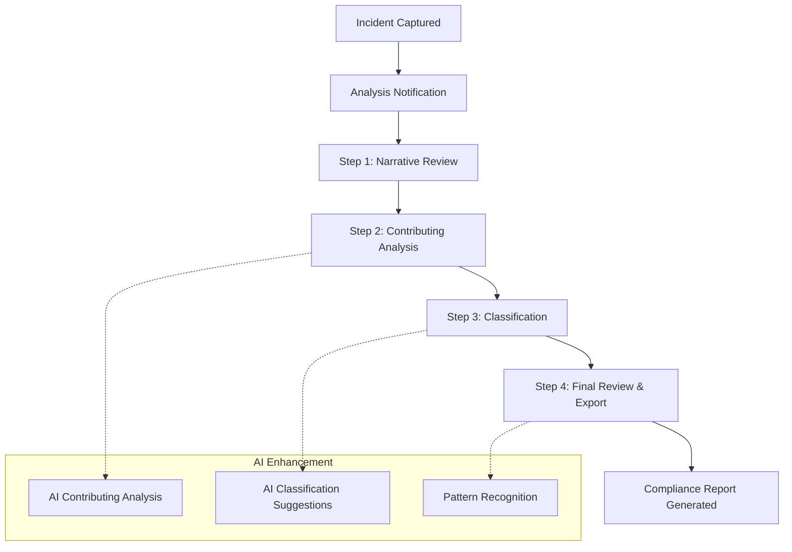

# Epic 4: Incident Analysis Workflow

## Epic Overview

**Goal**: Implement the complete 4-step incident analysis workflow for team leaders, featuring AI-powered contributing conditions analysis, intelligent incident classification, and comprehensive reporting capabilities.

**Duration**: 3-4 weeks  
**Team Size**: 2-3 developers (full-stack focus)  
**Dependencies**: Epic 1 (AI services, APIs), Epic 3 (incident data from capture workflow)  
**Primary Users**: Team leaders, managers, compliance officers

---

## Business Context

Epic 3 completes the SupportSignal value proposition by transforming captured incident data into actionable insights, compliance-ready reports, and organizational learning opportunities. This workflow serves the analytical and oversight needs that drive safety improvements and regulatory compliance.

**Key Business Drivers**:
- **Regulatory Compliance**: Structured analysis meets NDIS incident reporting requirements
- **Safety Improvement**: Systematic analysis of contributing conditions enables preventive measures
- **Operational Efficiency**: AI-powered analysis reduces time from hours to minutes while improving quality
- **Organizational Learning**: Consistent classification enables trend analysis and pattern recognition

**Success Metrics**:
- **Analysis Completion Rate**: >95% of captured incidents receive complete analysis
- **Time to Analysis**: <2 hours from capture completion to analysis start
- **Analysis Quality**: Measurable improvement in depth and consistency vs. manual analysis
- **Export Utilization**: >70% of completed analyses exported for compliance and operational use

---

## User Journey Overview



---

## Story Breakdown

### Story 3.1: Analysis Workflow Setup

**Priority**: CRITICAL  
**Estimated Effort**: 1 week  
**Dependencies**: Epic 1 (analysis APIs), Epic 2 (incident data structure)

#### Requirements
Establish the analysis workflow foundation including navigation, data flow, and workflow state management that supports the 4-step analysis process for team leaders.

**Analysis Workflow Foundation**:
- **Incident Queue**: Dashboard showing incidents ready for analysis
- **Workflow Navigation**: 4-step navigation system with progress tracking
- **Data Prefetch**: Optimized loading of incident data and AI-generated content
- **State Management**: Persistent analysis state with auto-save and recovery
- **Role-Based Access**: Team leader permissions and incident assignment

#### Acceptance Criteria
- [ ] **Analysis Dashboard**: Queue of incidents ready for analysis with sorting and filtering
- [ ] **Workflow Shell**: 4-step navigation system adapted from capture workflow patterns
- [ ] **Data Loading**: Efficient loading of complete incident data including narratives and clarifications
- [ ] **Permission Checking**: Team leaders can only access incidents they're authorized to analyze
- [ ] **Auto-Save**: Continuous saving of analysis progress with session recovery
- [ ] **Progress Tracking**: Visual indication of analysis completion status
- [ ] **Notification System**: Real-time notifications when new incidents are ready for analysis

#### Technical Implementation
```typescript
// Analysis workflow structure
interface AnalysisWorkflow {
  incidentId: string;
  steps: AnalysisStep[];
  currentStep: number;
  completed: boolean;
  assignedTo: string;
  startedAt: number;
  completedAt?: number;
}

interface AnalysisStep {
  id: 'narrative_review' | 'contributing_analysis' | 'classification' | 'final_review';
  title: string;
  completed: boolean;
  data?: any;
}

// Incident analysis dashboard query
export const getIncidentsForAnalysis = query({
  args: {},
  handler: async (ctx) => {
    const currentUser = await getCurrentUser(ctx);
    if (!canPerformAnalysis(currentUser)) {
      throw new ConvexError("Insufficient permissions for analysis");
    }
    
    return await ctx.db
      .query("incidents")
      .withIndex("by_status", (q) => q.eq("captureStatus", "completed"))
      .filter((q) => q.eq(q.field("analysisStatus"), "not_started"))
      .collect();
  },
});
```

---

### Story 3.2: Contributing Conditions Analysis

**Priority**: HIGH  
**Estimated Effort**: 1.5 weeks  
**Dependencies**: Story 3.1 (workflow setup), Epic 1 (AI analysis services)

#### Requirements
Implement AI-powered contributing conditions analysis that examines the complete incident narrative and generates comprehensive analysis of factors that contributed to the incident occurrence.

**Step 2: Contributing Conditions Analysis**
- **AI-Generated Analysis**: Comprehensive analysis of contributing conditions based on complete incident narrative
- **Rich Text Editor**: Full editing capabilities for team leaders to refine AI-generated analysis
- **Analysis Categories**: Structured analysis covering environmental, human, systemic, and procedural factors
- **Evidence Linkage**: Clear connections between analysis points and specific narrative content
- **Retry Mechanisms**: Ability to regenerate analysis if initial results are unsatisfactory

#### Acceptance Criteria
- [ ] **AI Integration**: Reliable generation of contributing conditions analysis from incident narratives
- [ ] **Rich Editor**: Full-featured text editor with formatting, lists, and structure capabilities
- [ ] **Categorized Analysis**: Analysis organized into logical categories (environmental, human, systemic, procedural)
- [ ] **Evidence References**: Clear citations linking analysis points to specific narrative content
- [ ] **Regeneration**: One-click regeneration of analysis with improved prompts if needed
- [ ] **Change Tracking**: Version history and change tracking for analysis modifications
- [ ] **Quality Indicators**: Metrics showing analysis completeness and depth

#### AI Analysis Architecture
```typescript
// Contributing conditions analysis structure
interface ContributingAnalysis {
  incidentId: string;
  generatedAt: number;
  analysisVersion: number;
  categories: {
    environmental: AnalysisPoint[];
    human: AnalysisPoint[];
    systemic: AnalysisPoint[];
    procedural: AnalysisPoint[];
  };
  overallAssessment: string;
  preventiveRecommendations: string[];
  confidenceScore: number;
}

interface AnalysisPoint {
  factor: string;
  description: string;
  severity: 'low' | 'medium' | 'high';
  evidenceReferences: string[];  // References to narrative content
  preventable: boolean;
}

// AI analysis generation
export const generateContributingAnalysis = action({
  args: {
    incidentId: v.id("incidents"),
  },
  handler: async (ctx, { incidentId }) => {
    // Gather complete incident data
    const incident = await ctx.runQuery(api.incidents.getById, { id: incidentId });
    const narrative = await ctx.runQuery(api.narratives.getConsolidated, { incidentId });
    const clarifications = await ctx.runQuery(api.clarifications.getAnswers, { incidentId });
    
    // Construct comprehensive context for AI
    const analysisContext = {
      incidentMetadata: incident,
      consolidatedNarrative: narrative,
      clarificationDetails: clarifications,
      analysisGoals: [
        'identify_contributing_factors',
        'assess_preventability',
        'recommend_preventive_measures',
        'categorize_by_factor_type'
      ]
    };
    
    // Generate AI analysis
    const aiAnalysis = await aiService.generateContributingAnalysis(analysisContext);
    
    // Store analysis with version tracking
    await ctx.runMutation(api.analysis.create, {
      incidentId,
      analysis: aiAnalysis,
      generatedBy: 'ai',
      version: 1,
    });
    
    return aiAnalysis;
  },
});
```

#### Analysis Quality Standards
- **Comprehensive**: Covers all relevant contributing factors identified in the narrative
- **Evidence-Based**: Each analysis point clearly linked to specific narrative evidence
- **Actionable**: Recommendations are specific and implementable by the organization
- **Categorized**: Factors appropriately categorized for systematic review and action
- **Balanced**: Acknowledges both controllable and uncontrollable contributing factors

---

### Story 3.3: Incident Classification System

**Priority**: HIGH  
**Estimated Effort**: 1 week  
**Dependencies**: Story 3.2 (contributing analysis data)

#### Requirements
Implement intelligent incident classification system that uses AI to suggest incident types, severity levels, and categories while allowing team leaders to modify and validate classifications.

**Step 3: Incident Classification**
- **AI Classification Suggestions**: Automated suggestions for incident type, severity, and categories
- **Classification Management**: Interface for adding, editing, and removing classifications
- **Severity Assessment**: Standardized severity levels with clear criteria and AI confidence scoring
- **Category Taxonomy**: Structured classification system aligned with NDIS reporting requirements
- **Validation Rules**: Business logic ensuring classification consistency and completeness

#### Acceptance Criteria
- [ ] **AI Suggestions**: Reliable classification suggestions with confidence scores
- [ ] **Classification Interface**: Intuitive interface for managing multiple classification tags
- [ ] **Severity Levels**: Clear severity scale (minor/moderate/major/critical) with objective criteria
- [ ] **Category Management**: Hierarchical category system supporting NDIS classification requirements
- [ ] **Confidence Scoring**: AI confidence indicators helping team leaders validate suggestions
- [ ] **Validation Logic**: Prevents invalid classification combinations and ensures completeness
- [ ] **Historical Patterns**: Suggestions informed by similar incidents in the organization

#### Classification Data Structure
```typescript
// Incident classification structure
interface IncidentClassification {
  incidentId: string;
  classifications: {
    primary: ClassificationTag;
    secondary: ClassificationTag[];
    custom: ClassificationTag[];
  };
  severity: {
    level: 'minor' | 'moderate' | 'major' | 'critical';
    factors: SeverityFactor[];
    aiConfidence: number;
    manualOverride?: boolean;
  };
  complianceCategories: NDISCategory[];
  classifiedAt: number;
  classifiedBy: string;
  aiSuggested: boolean;
}

interface ClassificationTag {
  id: string;
  category: string;
  subcategory?: string;
  description: string;
  aiConfidence?: number;
  validatedByUser: boolean;
}

interface SeverityFactor {
  factor: 'injury_severity' | 'property_damage' | 'service_disruption' | 'regulatory_impact';
  score: number;
  description: string;
}

// NDIS-specific classification categories
interface NDISCategory {
  code: string;
  title: string;
  description: string;
  mandatory: boolean;
  subcategories?: NDISSubcategory[];
}
```

#### AI Classification Logic
- **Pattern Recognition**: Analysis of similar incidents to suggest appropriate classifications
- **Severity Calculation**: Multi-factor analysis determining appropriate severity level
- **Compliance Mapping**: Automatic mapping to NDIS reporting categories
- **Confidence Scoring**: Transparent confidence levels for each classification suggestion
- **Learning Integration**: Classification accuracy improves over time with user feedback

---

### Story 3.4: Analysis Completion & Export

**Priority**: HIGH  
**Estimated Effort**: 1 week  
**Dependencies**: Stories 3.1, 3.2, 3.3 (complete analysis data)

#### Requirements
Implement the final analysis review and export functionality that generates compliance-ready reports and completes the incident lifecycle with comprehensive documentation.

**Step 4: Final Review & Export**
- **Comprehensive Review**: Consolidated view of complete analysis including narratives, contributing factors, and classifications
- **Export Functionality**: Multiple export formats (JSON, Markdown, PDF) suitable for different use cases
- **Compliance Reports**: NDIS-formatted reports ready for regulatory submission
- **Analysis Summary**: Executive summary highlighting key findings and recommendations
- **Audit Trail**: Complete workflow history from capture through analysis completion

#### Acceptance Criteria
- [ ] **Review Interface**: Clean, comprehensive view of complete incident analysis
- [ ] **Export Options**: JSON (data interchange), Markdown (documentation), PDF (official reports)
- [ ] **NDIS Compliance**: Export formats specifically designed for NDIS reporting requirements
- [ ] **Executive Summary**: Auto-generated summary highlighting key findings and recommendations
- [ ] **Audit Trail**: Complete timeline showing all workflow steps, users, and timestamps
- [ ] **Completion Workflow**: Clear process for marking analysis complete and archiving incident
- [ ] **Notification System**: Automatic notifications to relevant stakeholders upon completion

#### Export Format Specifications
```typescript
// Comprehensive incident report structure
interface IncidentReport {
  metadata: {
    reportId: string;
    generatedAt: number;
    generatedBy: string;
    incidentId: string;
    reportVersion: string;
  };
  
  incidentSummary: {
    basicDetails: IncidentMetadata;
    narrativeSummary: string;
    keyTimeline: TimelineEntry[];
    severity: string;
    primaryClassification: string;
  };
  
  detailedAnalysis: {
    consolidatedNarrative: string;
    contributingFactors: ContributingAnalysis;
    classifications: IncidentClassification;
    preventiveRecommendations: string[];
  };
  
  complianceData: {
    ndisReportingCategories: NDISCategory[];
    regulatoryRequirements: ComplianceRequirement[];
    submittalReadiness: boolean;
  };
  
  auditTrail: {
    captureWorkflow: WorkflowStep[];
    analysisWorkflow: WorkflowStep[];
    dataModifications: ChangeRecord[];
    userAttributions: UserAttribution[];
  };
}

// Export generation
export const generateIncidentReport = action({
  args: {
    incidentId: v.id("incidents"),
    format: v.union(v.literal("json"), v.literal("markdown"), v.literal("pdf")),
  },
  handler: async (ctx, { incidentId, format }) => {
    // Gather all incident data
    const completeIncident = await gatherCompleteIncidentData(ctx, incidentId);
    
    // Generate comprehensive report
    const report = await buildIncidentReport(completeIncident);
    
    // Format according to requested output
    const formattedReport = await formatReport(report, format);
    
    // Log export activity
    await ctx.runMutation(api.activityLogs.create, {
      action: 'incident_report_exported',
      incidentId,
      format,
      timestamp: Date.now(),
    });
    
    return formattedReport;
  },
});
```

#### Report Quality Standards
- **Completeness**: All relevant incident data included in appropriate detail
- **Professional Format**: Clean, readable formatting suitable for official submission
- **Compliance-Ready**: Meets all NDIS incident reporting requirements and standards
- **Actionable**: Clear recommendations and next steps for incident follow-up
- **Auditable**: Complete trail of data sources, modifications, and user attributions

---

## Epic Integration Points

### Cross-Workflow Integration
- **Seamless Handoff**: Smooth transition from capture workflow to analysis with all data intact
- **Real-Time Updates**: Live status updates visible to capture workflow users
- **Collaborative Features**: Ability for team leaders to request clarification from frontline workers

### Organizational Learning
- **Pattern Recognition**: AI analysis of trends across multiple incidents
- **Recommendation Tracking**: Follow-up system for implemented preventive measures
- **Performance Metrics**: Analytics on analysis quality, completion times, and outcomes

### Compliance Integration
- **Automated Mapping**: Incident classifications automatically mapped to regulatory requirements
- **Submission Ready**: Exports formatted for direct submission to NDIS and other regulatory bodies
- **Retention Management**: Automatic data retention and archival according to compliance requirements

---

## Epic Success Criteria

### Functional Requirements
- [ ] **Complete Analysis Workflow**: All 4 steps implemented and fully functional
- [ ] **AI Analysis Quality**: 90%+ of AI-generated analyses require minimal team leader modification
- [ ] **Export Functionality**: All export formats generate correctly formatted, complete reports
- [ ] **Performance**: Analysis workflow completes in <30 minutes for typical incidents

### Business Requirements
- [ ] **Analysis Completion**: >95% of captured incidents receive complete analysis within 24 hours
- [ ] **Compliance Ready**: 100% of exported reports meet NDIS submission requirements
- [ ] **User Satisfaction**: >4.0/5 rating from team leaders for analysis workflow efficiency
- [ ] **Quality Improvement**: Measurable improvement in analysis depth vs. baseline manual process

### Technical Requirements
- [ ] **Data Integrity**: 100% accuracy in data transfer from capture to analysis workflows
- [ ] **AI Reliability**: <5% AI service failure rate with graceful fallback mechanisms
- [ ] **Export Performance**: Report generation completes in <30 seconds for all formats
- [ ] **Audit Compliance**: Complete audit trail maintained throughout analysis process

---

## Risks & Mitigation

### Technical Risks
**Risk**: AI analysis quality inconsistent across different incident types  
**Mitigation**: Comprehensive prompt testing across incident scenarios, feedback loops for AI improvement

**Risk**: Export generation performance issues with large incident datasets  
**Mitigation**: Efficient data aggregation, background processing for large reports, progress indicators

**Risk**: Complex classification system creates user confusion  
**Mitigation**: User testing with actual team leaders, progressive disclosure of classification options

### Business Risks
**Risk**: Analysis workflow too time-consuming reduces team leader adoption  
**Mitigation**: Streamlined interface design, AI-powered efficiency, optional vs. required analysis components

**Risk**: Export formats don't meet evolving compliance requirements  
**Mitigation**: Flexible export system architecture, regular compliance review cycles

---

## Dependencies & Handoffs

### From Epic 1 & Epic 2
- **Complete Incident Data**: All capture workflow data available for analysis
- **AI Services**: Analysis and classification AI services reliable and tested
- **User Management**: Team leader roles and permissions properly configured

### To Production
- **Complete Platform**: End-to-end incident management from capture through compliance reporting
- **Training Materials**: Documentation and training content for team leader onboarding
- **Support Systems**: Monitoring and support infrastructure for production deployment

This epic completes the SupportSignal platform by delivering the analytical and compliance capabilities that transform captured incident data into organizational learning and regulatory compliance - closing the loop on incident management and enabling continuous safety improvement.