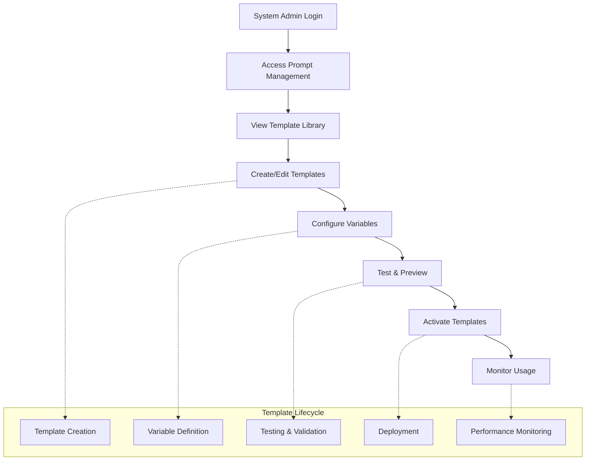

# Epic 6: AI Prompt Management System

> **Quick Navigation:** [6.1](#story-61-core-ai-prompt-management-foundation-) · [6.2](#story-62-phase-specific-question-generation-prompts) · [6.3](#story-63-developer-prompt-testing--interpolation-interface) · [6.4](#story-64-phase-specific-narrative-enhancement-with-auto-trigger) · [6.5](#story-65-llm-model-management-upgrade) · [6.6](#story-66-prompt-architecture--schema-separation-future) · [6.7](#story-67-multi-tenant-prompt-management-future) · [6.8](#story-68-prompt-version-management-future) · [6.9](#story-69-adaptive-token-management-with-self-healing)

## Epic Overview

**Goal**: Provide comprehensive AI prompt template management capabilities that enable system administrators to configure, customize, and control AI prompts used throughout the entire SupportSignal platform.

**Duration**: 1-2 weeks  
**Team Size**: 1-2 developers (backend + admin interface focus)  
**Dependencies**: Epic 1 (AI services, authentication)  
**Primary Users**: System administrators, AI service managers

---

## Business Context

Epic 6 establishes the foundational infrastructure for AI prompt management that supports all AI-powered features across SupportSignal. This epic enables customization and control of AI behavior without code changes, providing operational flexibility and the ability to optimize AI performance through prompt engineering.

**Key Business Drivers**:
- **AI Customization**: Ability to fine-tune AI prompts for optimal results without developer intervention
- **Operational Control**: System administrators can modify AI behavior based on real-world usage patterns
- **Compliance Adaptability**: Prompts can be adjusted to meet changing regulatory requirements
- **Performance Optimization**: A/B testing and optimization of AI prompts based on effectiveness metrics

**Success Metrics**:
- **Prompt Utilization**: All AI services utilize configurable prompt templates
- **Admin Adoption**: System administrators actively manage and optimize prompts
- **Response Quality**: Measurable improvement in AI response quality through prompt optimization
- **Configuration Stability**: Zero AI service disruptions due to prompt management operations

---

## Quick Navigation

**Stories in this Epic:**
- [Story 6.1: Core AI Prompt Management Foundation](#story-61-core-ai-prompt-management-foundation-) - ✅ **Complete** (Critical)
- [Story 6.2: Phase-Specific Question Generation Prompts](#story-62-phase-specific-question-generation-prompts) - ✅ **Complete** (High)
- [Story 6.3: Developer Prompt Testing & Interpolation Interface](#story-63-developer-prompt-testing--interpolation-interface) - ✅ **Complete** (Medium)
- [Story 6.4: Phase-Specific Narrative Enhancement with Auto-Trigger](#story-64-phase-specific-narrative-enhancement-with-auto-trigger) - ✅ **Complete** (High)
- [Story 6.5: LLM Model Management Upgrade](#story-65-llm-model-management-upgrade) - 📋 **Approved** (Medium)
- [Story 6.6: Prompt Architecture & Schema Separation](#story-66-prompt-architecture--schema-separation-future) - 📋 **Planned** (Medium)
- [Story 6.7: Multi-Tenant Prompt Management](#story-67-multi-tenant-prompt-management-future) - 🔮 **Future** (Low)
- [Story 6.8: Prompt Version Management](#story-68-prompt-version-management-future) - 🔮 **Future** (Low)
- [Story 6.9: Adaptive Token Management with Self-Healing](#story-69-adaptive-token-management-with-self-healing) - 📝 **Draft** (High)

---

## User Journey Overview



---

## Story Breakdown

### Story 6.1: Core AI Prompt Management Foundation ✅

**Status**: **COMPLETE** (2025-08-12)  
**Priority**: CRITICAL  
**Estimated Effort**: 3-4 days  

#### Requirements Completed
Comprehensive AI prompt template management system including creation, editing, variable substitution, and integration with existing AI services.

**Core Features Delivered**:
- **System-Level Template Management**: Full CRUD operations for prompt templates
- **Variable Substitution System**: Dynamic `{{variable}}` syntax with type validation
- **Admin Interface**: Simple, effective prompt management UI
- **Integration Ready**: Seamless connection with Stories 3.2-3.3 AI services
- **Default Template Seeding**: NDIS-compatible templates included
- **Caching & Performance**: Optimized prompt resolution with 5-minute TTL

#### Technical Implementation Completed
- **12 Convex backend functions** with comprehensive authentication
- **Complete admin interface** at `/admin/ai-prompts`
- **Variable interpolation engine** with validation
- **Template resolution caching** for performance
- **Security patterns** with system admin access control

---

### Story 6.2: Phase-Specific Question Generation Prompts

**Status**: **COMPLETE** ✅
**Priority**: HIGH
**Estimated Effort**: 2-3 days
**Dependencies**: Story 6.1 (Core prompt management foundation)

#### Requirements
**Problem**: The current system uses one generic `"generate_clarification_questions"` prompt that attempts to handle all four incident phases (`before_event`, `during_event`, `end_event`, `post_event`) by passing the phase as a parameter. This creates suboptimal results because each phase requires different investigation focus areas and question types.

**Solution**: Split the single generic prompt into four specialized, phase-specific prompts that are optimized for their particular phase context and investigation needs.

**Technical Implementation**:
- **Replace single prompt**: Convert from `"generate_clarification_questions"` to four distinct prompts:
  - `"generate_clarification_questions_before_event"`
  - `"generate_clarification_questions_during_event"`
  - `"generate_clarification_questions_end_event"`
  - `"generate_clarification_questions_post_event"`
- **Update question generator**: Modify `questionGenerator.ts` to dynamically select prompt based on phase
- **Remove phase variable**: Each prompt will have phase-specific context hardcoded, removing need for `{{phase}}` variable
- **Optimize for phase context**: Each prompt tailored for specific investigation priorities and question types

**Phase-Specific Optimizations**:
- **Before Event**: Focus on antecedents, environmental factors, participant state
- **During Event**: Focus on actions taken, interventions attempted, safety measures
- **End Event**: Focus on resolution strategies, de-escalation techniques, immediate outcomes
- **Post Event**: Focus on follow-up care, support plan modifications, lesson learned

#### Acceptance Criteria (Completed)
- [x] **Four Phase-Specific Prompts**: Created specialized prompts for each incident phase
- [x] **Dynamic Prompt Selection**: Updated questionGenerator.ts to select prompt based on `args.phase`
- [x] **Hardcoded Phase Context**: Removed generic `{{phase}}` variable, embedded phase context in each prompt
- [x] **Maintain Existing API**: No breaking changes to existing question generation interface
- [x] **Database Migration**: Added new prompts to DEFAULT_PROMPTS and seeded in database
- [x] **Testing**: Verified each phase generates appropriate, phase-specific questions
- [x] **Documentation**: Updated prompt management documentation with new phase-specific approach

**Implementation Evidence**:
- 4 phase-specific prompts implemented in `apps/convex/promptManager.ts` (line 345+)
- Dynamic selection implemented in `apps/convex/lib/ai/questionGenerator.ts` (lines 195-240)
- All prompts successfully seeded and operational

---

### Story 6.3: Developer Prompt Testing & Interpolation Interface

**Status**: **COMPLETE** ✅
**Priority**: MEDIUM
**Estimated Effort**: 3-4 days
**Dependencies**: Story 6.2 (Phase-specific prompts)

#### Requirements
**Problem**: Developers need to test and refine AI prompts during development, but currently must modify database records or code to experiment with prompt variations. There's no easy way to see prompt interpolation in real-time or test different variable combinations.

**Solution**: Extend the existing developer experience control (shown at bottom of incident workflows) to provide comprehensive prompt testing and interpolation capabilities for developers.

**Developer Interface Enhancements**:
- **Prompt Visibility**: Show the current prompt template being used for AI calls
- **Interpolation Preview**: Display all `{{placeholder}}` variables and their current values
- **Property Grid**: Show all input variables going into the prompt with their values
- **Extensible Variables**: Allow adding custom key-value pairs for testing without saving to database
- **Real-time Preview**: Show the fully interpolated prompt that will be sent to the AI
- **Test Execution**: Button to execute the prompt with current variables and see AI response
- **Template Override**: Temporarily modify prompt template for testing (not saved to database)

**Use Cases**:
- **Prompt Development**: Test prompt modifications before updating database templates
- **Variable Testing**: Try different variable combinations to optimize AI responses
- **Debugging**: See exactly what prompt was sent when investigating AI issues
- **Optimization**: Experiment with special instructions or additional context variables

#### Acceptance Criteria (Completed)
- [x] **Developer Controls Extension**: Extended existing developer toolbar with prompt testing capabilities
- [x] **Prompt Template Display**: Shows current active prompt template being used
- [x] **Variable Visualization**: Displays all template variables and their current values in a property grid
- [x] **Extensible Variables**: Allows adding/modifying variables without database changes
- [x] **Real-time Interpolation**: Shows live preview of fully interpolated prompt
- [x] **Template Override**: Allows temporary prompt template modifications for testing
- [x] **Test Execution**: Executes prompt with current variables and displays AI response
- [x] **Developer-Only Access**: Interface only appears for users with developer permissions
- [x] **No Database Changes**: All modifications are temporary and not persisted
- [x] **Context Awareness**: Shows relevant prompt testing for current workflow step/page

**Implementation Evidence**:
- Developer toolbar component: `apps/web/components/developer/DeveloperToolsBar.tsx`
- Prompt testing panel: `apps/web/components/developer/PromptTestingPanel.tsx`
- Variable grid: `apps/web/components/developer/VariablePropertyGrid.tsx`
- Full developer prompt testing interface operational

---

### Story 6.4: Phase-Specific Narrative Enhancement with Auto-Trigger

**Status**: **COMPLETE** ✅ (2025-10-22)
**Priority**: HIGH
**Estimated Effort**: 3-4 days
**Dependencies**: Stories 6.1-6.3 (Core prompt management, phase-specific prompts, developer tools)

#### Requirements
**Problem**: The current system uses one generic `"enhance_narrative"` prompt that attempts to handle all four incident phases by passing phase as a variable. Additionally, narrative enhancement is manually triggered via button clicks, requiring user intervention. This creates two issues:
1. Generic prompt produces suboptimal results (each phase needs different enhancement focus)
2. Manual triggering adds friction to the incident workflow

**Solution**:
1. Split the single generic prompt into four specialized, phase-specific enhancement prompts
2. Automatically trigger narrative enhancement when the page loads (after clarifications complete)
3. Add developer refresh controls for prompt testing and iteration

**Three-Part Implementation**:

**Part 1: Phase-Specific Enhancement Prompts**
- Replace `"enhance_narrative"` with four distinct prompts:
  - `"enhance_narrative_before_event"` - Focus on setup, environment, participant state
  - `"enhance_narrative_during_event"` - Focus on actions, interventions, safety measures
  - `"enhance_narrative_end_event"` - Focus on resolution, de-escalation, outcomes
  - `"enhance_narrative_post_event"` - Focus on follow-up care, support modifications, lessons learned
- Update `aiEnhancement.ts` to dynamically select prompt based on phase
- Remove `{{narrative_phase}}` variable, embed phase-specific guidance in each prompt

**Part 2: Automatic Enhancement Workflow**
- Auto-trigger enhancement on page load when conditions met:
  - Original narrative exists for the phase
  - Clarification questions have been answered
  - Enhanced narrative doesn't exist yet (smart caching)
- Display loading indicator during auto-enhancement
- Remove existing manual enhancement buttons from UI
- Add error handling for AI service failures

**Part 3: Developer Refresh Controls**
- Extend `DeveloperToolsBar` with narrative enhancement section
- Add 4 phase-specific refresh buttons (one per incident phase)
- Each button: Clear cached enhanced narrative + re-trigger enhancement
- Follow Story 6.3's developer access control pattern (`hasDeveloperAccess`)
- Enable prompt testing workflow: Edit prompt → Refresh → See new result

**User Benefits**:
- **Automatic Enhancement**: No manual button clicks needed, seamless workflow
- **Better Quality**: Phase-specific prompts produce more contextually appropriate narratives
- **Developer Workflow**: Easy prompt testing and iteration during development
- **Smart Caching**: Prevents duplicate AI calls, improves performance
- **Future-Proof**: Refresh buttons can become permanent user feature if needed

#### Acceptance Criteria
- [ ] **Four Phase-Specific Enhancement Prompts**: Create specialized prompts for each incident phase
- [ ] **Dynamic Prompt Selection**: Update aiEnhancement.ts to select prompt based on phase
- [ ] **Hardcoded Phase Context**: Remove generic `{{narrative_phase}}` variable
- [ ] **Automatic Enhancement Trigger**: Auto-trigger when page loads (with conditions)
- [ ] **Loading Indicators**: Display spinner/progress during auto-enhancement
- [ ] **Smart Caching**: Check if already enhanced before auto-triggering
- [ ] **Developer Refresh Controls**: Add 4 phase-specific refresh buttons in developer toolbar
- [ ] **Manual Re-Enhancement**: Each refresh button clears cache and re-triggers enhancement
- [ ] **Maintain Existing API**: No breaking changes to existing narrative enhancement interface
- [ ] **Database Migration**: Add new prompts to DEFAULT_PROMPTS and seed in database
- [ ] **Testing**: Verify each phase generates appropriate, phase-specific enhanced narratives
- [ ] **Documentation**: Update prompt management docs with auto-trigger pattern

---

### Story 6.5: LLM Model Management Upgrade

**Status**: **APPROVED** 📋
**Priority**: MEDIUM
**Estimated Effort**: 1-2 days
**Dependencies**: Stories 6.1-6.4 (Core prompt management, phase-specific prompts, developer tools, narrative enhancement)

#### Requirements
Upgrade the default LLM model to a higher quality option and implement comprehensive model management capabilities, enabling system administrators to select optimal AI models per prompt while maintaining cost-effective flexibility.

**Key Features**:
- **Default Model Upgrade**: Change default from `gpt-4o-mini` to `gpt-5` for best quality
- **Model Selection UI**: Dropdown interface for choosing AI models per prompt
- **Required Field**: Make `ai_model` required in ai_prompts schema (with migration)
- **Bulk Assignment**: Select multiple prompts and assign models in bulk
- **Cost Visibility**: Display cost estimates and model capabilities in UI
- **Schema Migration**: Populate existing prompts with default model before making field required

**Business Value**:
- **Quality Improvement**: Best-in-class AI models for NDIS-compliant narratives
- **Flexibility**: Choose cost-effective models for non-critical use cases
- **Cost Control**: Visibility into model costs enables informed decisions
- **Production Ready**: Required field validation prevents prompts without models

#### Acceptance Criteria
- [x] **Default Model Upgrade**: Change default LLM model from `gpt-4o-mini` to `gpt-5`
- [x] **Environment Configuration**: Update `LLM_MODEL` environment variable to new default
- [x] **Schema Migration**: Populate all existing prompts with default model where `ai_model` is NULL
- [x] **Required Field**: Change `ai_prompts.ai_model` from optional to required in schema
- [x] **Model Dropdown**: Add model selection dropdown to prompt editor UI
- [x] **Model Display**: Show current model in prompt listing/management interface
- [x] **Bulk Model Assignment**: Select multiple prompts and assign a new model in bulk
- [x] **Validation**: Ensure all new prompts have a model selected (required field validation)
- [x] **Structured Outputs**: Implement OpenRouter JSON Schema for guaranteed response format compliance
- [x] **Token Limit Optimization**: Increase token limits to support detailed responses from gpt-5
- [x] **Response Validation**: Add Zod schema validation for all AI responses

**Implementation Summary**:
- Environment updates: `~/.env-configs/app.supportsignal.com.au.env` (LLM_MODEL configuration)
- Migration script: `apps/convex/migrations/populatePromptModels.ts` (backfill existing prompts)
- Schema change: `apps/convex/schema.ts` (make ai_model required)
- UI components: Model selector dropdown, bulk assignment interface
- Cost visibility: Display model costs and capabilities in selection UI
- **Structured Outputs**: `apps/convex/aiResponseSchemas.ts` (Zod schemas + JSON Schema conversion)
- **Token Limits**: Updated all AI operations in `apps/convex/aiOperations.ts`:
  - generateClarificationQuestions: 2000 tokens
  - generateMockAnswers: 5000 tokens (increased to 5000 to prevent truncation with gpt-5 detailed responses)
  - enhanceNarrativeContent: 1500 tokens
  - analyzeContributingConditions: 2000 tokens
- **Prompt Templates**: Updated `apps/convex/promptManager.ts` DEFAULT_PROMPTS array for structured output format
- **Cleanup**: Removed duplicate/unused `apps/convex/lib/prompts/default_prompts.ts` file
- **Logging**: Added comprehensive logging to Fill Q&A button handler for debugging
- **Documentation**: Created `docs/lessons-learned/ai-model-challenges-and-solutions.md` explaining model variability and token limits

**Knowledge Capture Reference**:
- [AI Token Limit Debugging Pattern](../patterns/ai-token-limit-debugging.md)
- [Duplicate Configuration Systems Anti-Pattern](../patterns/duplicate-configuration-systems-antipattern.md)
- [Logging Strategy for Debugging](../patterns/logging-strategy-for-debugging.md)

---

### Story 6.9: Adaptive Token Management with Self-Healing

**Status**: **DRAFT** 📝
**Priority**: HIGH
**Estimated Effort**: 2-3 days
**Dependencies**: Story 6.5 (Model management, token limit optimization), ai_requests table schema

#### Problem Statement

**Current Issue**: Manual token limit adjustments in Story 6.5 solved immediate truncation problems but created a maintenance burden. When AI models generate responses that exceed `max_tokens` limits, responses are silently truncated mid-JSON, causing parsing failures and hanging UI spinners. Developers must manually identify truncation issues, update template definitions, and reseed prompts.

**Evidence from Production**:
- END_EVENT question generation hung spinner (Investigation: `docs/investigations/step-5-end-event-question-generation-failure.md`)
- Story 6.5 manually increased `generateMockAnswers` from 2000 to 5000 tokens after discovering truncation
- Retry logic (3 attempts with exponential backoff) wastes time retrying with same inadequate token limit
- No visibility into which prompts are hitting limits without manual investigation

**Root Cause**: Static token limits in template definitions don't adapt to actual AI model response patterns, creating a reactive "break-fix-reseed" cycle instead of proactive self-healing.

#### Requirements

Implement intelligent, self-healing token management that automatically detects truncation, incrementally escalates token limits, persists optimizations to the database, and provides visibility into baseline vs. adjusted values through the AI Prompt Management UI.

**Core Features**:

1. **Truncation Detection**
   - Extract `finish_reason` from OpenRouter API responses
   - Detect when `finish_reason === "length"` (truncation indicator)
   - Correlate JSON parsing errors with token limit issues
   - Log truncation events with context (prompt name, tokens used, limit hit)

2. **Adaptive Retry with Incremental Escalation**
   - Replace current fixed-retry logic with adaptive token escalation
   - Escalation pattern: Start at baseline → Increment by 500 tokens per attempt
   - Example: 2000 → 2500 → 3000 → 3500 (max 3-4 escalation attempts)
   - Only escalate on truncation-related failures (not auth errors, network issues)
   - Success on attempt 2+ triggers automatic database update

3. **Self-Healing Database Updates**
   - When escalated retry succeeds, persist new `max_tokens` value to database
   - Update `ai_prompts.max_tokens` for the specific prompt template
   - Baseline in code template definitions remains unchanged (e.g., 2000)
   - Database now stores "learned" optimal value (e.g., 3000)
   - Future requests use optimized value immediately (no more truncation)

4. **Visual Diff in AI Prompt Management UI**
   - Show baseline vs. current token limit in prompt listing
   - Color-coded indicators:
     - **Green**: Using baseline (no adjustment needed)
     - **Blue** (with diff badge): Adjusted value ("↑ +1000 tokens from baseline")
     - **Yellow**: Approaching escalation limit (warn admin)
   - Diff tooltip: "Auto-increased from 2000 to 3000 on 2025-10-27 after 2 escalation attempts"
   - Reset button: "Reset to Baseline" (admin can manually reset if needed)

5. **Escalation Limits & Safety**
   - Maximum escalation cap: 10,000 tokens (prevent runaway costs)
   - Log warning when prompt reaches 80% of cap (8,000 tokens)
   - Alert admin UI: "Prompt 'generate_end_event_questions' consistently needs high token limits - consider prompt optimization"
   - Track escalation events in logs (how often each prompt hits limits)

6. **Logging Integration**
   - Log truncation events with full context (prompt name, tokens used, limit hit, finish_reason)
   - Log each escalation attempt with before/after token limits
   - Log successful self-healing database updates
   - All logs visible in Convex dashboard for debugging

**Business Value**:
- **Zero-Touch Optimization**: System self-heals without developer intervention
- **Improved Reliability**: No more hanging spinners from truncated responses
- **Cost Efficiency**: Only escalate when needed (don't overprovision all prompts to 5000 tokens)
- **Operational Visibility**: Admins see which prompts need attention
- **Reduced Maintenance**: No more manual "find truncation → update code → reseed" cycles
- **Institutional Learning**: System learns optimal token limits from production usage

#### Acceptance Criteria

**Backend - Truncation Detection**:
- [ ] Extract `finish_reason` from OpenRouter API response in `apps/convex/aiService.ts`
- [ ] Add `finishReason` field to `AIResponse` interface
- [ ] Log truncation events: `⚠️ TRUNCATION DETECTED: prompt='X', tokens_used=2484, max_tokens=2000, finish_reason='length'`

**Backend - Adaptive Retry**:
- [ ] Replace `retryWithBackoff` with `retryWithAdaptiveTokens` in `apps/convex/aiClarification.ts`
- [ ] Implement escalation pattern: baseline → +500 → +500 → +500 (up to 3 escalations)
- [ ] Pass dynamic `maxTokens` parameter through operation function signature
- [ ] Only escalate on truncation-related failures (check `finish_reason` or JSON parse errors)
- [ ] Log each escalation attempt: `🔄 ESCALATION ATTEMPT 2: Increasing max_tokens from 2000 to 2500`

**Backend - Self-Healing Database Updates**:
- [ ] On successful escalated retry, update `ai_prompts.max_tokens` in database
- [ ] Mutation: `updatePromptTokenLimit({ prompt_name, new_max_tokens, reason })`
- [ ] Log self-healing action: `✅ SELF-HEALING: Updated 'generate_end_event_questions' max_tokens from 2000 to 3000`
- [ ] Record metadata: `adjusted_at` timestamp, `adjustment_reason`, `baseline_max_tokens` (from code)

**Database Schema**:
- [ ] Add optional fields to `ai_prompts` table:
  - `baseline_max_tokens: v.optional(v.number())` - Original value from code template
  - `adjusted_at: v.optional(v.number())` - Timestamp of last auto-adjustment
  - `adjustment_reason: v.optional(v.string())` - Why adjustment was made
- [ ] Migration script to backfill `baseline_max_tokens` from current `max_tokens` values

**UI - Visual Diff Display**:
- [ ] Prompt listing shows baseline vs. current token limit
- [ ] Color-coded badges:
  - Green checkmark: `max_tokens === baseline_max_tokens` (no adjustment)
  - Blue badge with ↑ arrow: `max_tokens > baseline_max_tokens` (shows diff: "+1000")
- [ ] Tooltip on hover: "Auto-increased from 2000 to 3000 on 2025-10-27 after detecting truncation"
- [ ] "Reset to Baseline" button (admin action) - resets `max_tokens` to `baseline_max_tokens`

**Safety & Limits**:
- [ ] Maximum escalation cap: 10,000 tokens (configurable via environment variable)
- [ ] Prevent escalation beyond cap: log error and fail operation if exceeded
- [ ] Warning log at 80% of cap: `⚠️ Prompt 'X' approaching token limit cap (8000/10000 tokens)`
- [ ] Admin alert UI: Dashboard widget showing prompts near escalation cap

**Logging & Observability**:
- [ ] Log truncation detection events with context
- [ ] Log each escalation attempt (before/after token limits)
- [ ] Log successful self-healing database updates
- [ ] Log escalation failures (hit cap, non-truncation errors)

**Testing & Validation**:
- [ ] Unit tests: Adaptive retry logic with mocked truncation responses
- [ ] Integration tests: End-to-end truncation → escalation → database update flow
- [ ] Manual test: Temporarily set `max_tokens: 100` for test prompt, trigger truncation, verify auto-escalation
- [ ] Verify no infinite loops: Cap reached → operation fails gracefully
- [ ] Test UI displays correct diff badges and tooltips

**Documentation**:
- [ ] Update `docs/patterns/ai-token-limit-debugging.md` with new adaptive approach
- [ ] Create `docs/patterns/self-healing-token-management.md` pattern guide
- [ ] Update Admin Guide: How to interpret token limit diffs in UI
- [ ] Create runbook: "What to do when prompts hit escalation cap"
- [ ] **Cleanup**: Delete `docs/investigations/step-5-end-event-question-generation-failure.md` (investigation complete, solution implemented)

#### Technical Implementation

**Implementation Timeline**: 2-3 days across 4 phases (detection, retry logic, database, UI)

**Phase 1: Detection & Logging** (Day 1)
1. Update `AIResponse` interface in `apps/convex/aiService.ts`:
   ```typescript
   export interface AIResponse {
     correlationId: string;
     content: string;
     model: string;
     tokensUsed?: number;
     finishReason?: 'stop' | 'length' | 'content_filter';  // NEW
     processingTimeMs: number;
     cost?: number;
     success: boolean;
     error?: string;
   }
   ```

2. Extract `finish_reason` from OpenRouter response (line ~155):
   ```typescript
   return {
     content: data.choices[0].message.content,
     usage: data.usage,
     finishReason: data.choices[0].finish_reason,  // NEW
   };
   ```

3. Add truncation detection logging throughout `aiClarification.ts`:
   ```typescript
   if (result.finishReason === 'length') {
     console.warn('⚠️ TRUNCATION DETECTED', {
       prompt_name: promptConfig.name,
       tokens_used: result.tokensUsed,
       max_tokens: maxTokens,
       finish_reason: result.finishReason,
       timestamp: new Date().toISOString()
     });
   }
   ```

**Phase 2: Adaptive Retry Logic** (Day 1-2)
1. Create new retry function in `apps/convex/aiClarification.ts`:
   ```typescript
   const retryWithAdaptiveTokens = async <T>(
     operation: (maxTokens: number) => Promise<AIResponse & T>,
     context: { prompt_name: string; baseline_max_tokens: number },
     escalation_increment: number = 500,
     max_escalations: number = 4
   ): Promise<T> => {
     const TOKEN_CAP = parseInt(process.env.MAX_TOKEN_ESCALATION_CAP || '10000');

     for (let attempt = 0; attempt < max_escalations; attempt++) {
       const maxTokens = Math.min(
         context.baseline_max_tokens + (attempt * escalation_increment),
         TOKEN_CAP
       );

       console.log(`🔄 ADAPTIVE RETRY ATTEMPT ${attempt + 1}/${max_escalations}`, {
         max_tokens: maxTokens,
         escalation_from_baseline: maxTokens - context.baseline_max_tokens,
       });

       try {
         const result = await operation(maxTokens);

         // Check if truncated
         if (result.finishReason === 'length') {
           console.warn(`⚠️ Response truncated at ${maxTokens} tokens, escalating...`);
           if (attempt < max_escalations - 1) continue;  // Try next increment
           throw new Error(`Token limit exceeded even after ${max_escalations} escalations`);
         }

         // Success! Update database if escalated
         if (attempt > 0) {
           await ctx.runMutation(api.promptManager.updatePromptTokenLimit, {
             prompt_name: context.prompt_name,
             new_max_tokens: maxTokens,
             baseline_max_tokens: context.baseline_max_tokens,
             adjustment_reason: `Auto-increased after ${attempt + 1} truncation-based escalation attempts`,
           });

           console.log(`✅ SELF-HEALING: Updated '${context.prompt_name}' max_tokens to ${maxTokens}`);
         }

         return result;

       } catch (error) {
         // Only retry on truncation-related errors
         const isTruncationError =
           error.message.includes('JSON') ||
           error.message.includes('parse') ||
           error.message.includes('truncat');

         if (!isTruncationError || attempt >= max_escalations - 1) {
           throw error;  // Not truncation or out of attempts
         }
       }
     }
   };
   ```

2. Update `generateClarificationQuestions` and other AI operations to use adaptive retry
3. Pass baseline value from prompt template definition through to retry function

**Phase 3: Database Schema & Mutation** (Day 2)
1. Add fields to `ai_prompts` schema:
   ```typescript
   ai_prompts: defineTable({
     // ... existing fields ...
     max_tokens: v.number(),  // Current effective value (may be adjusted)
     baseline_max_tokens: v.optional(v.number()),  // Original from code template
     adjusted_at: v.optional(v.number()),  // Timestamp of last adjustment
     adjustment_reason: v.optional(v.string()),  // Why it was adjusted
   })
   ```

2. Create mutation in `apps/convex/promptManager.ts`:
   ```typescript
   export const updatePromptTokenLimit = mutation({
     args: {
       prompt_name: v.string(),
       new_max_tokens: v.number(),
       baseline_max_tokens: v.number(),
       adjustment_reason: v.string(),
     },
     handler: async (ctx, args) => {
       const prompt = await ctx.db
         .query("ai_prompts")
         .withIndex("by_name", q => q.eq("prompt_name", args.prompt_name))
         .filter(q => q.eq(q.field("is_active"), true))
         .first();

       if (!prompt) throw new Error(`Prompt not found: ${args.prompt_name}`);

       await ctx.db.patch(prompt._id, {
         max_tokens: args.new_max_tokens,
         baseline_max_tokens: args.baseline_max_tokens,
         adjusted_at: Date.now(),
         adjustment_reason: args.adjustment_reason,
       });

       return { success: true, updated_prompt: args.prompt_name };
     },
   });
   ```

**Phase 4: UI Visual Diff** (Day 2-3)
1. Update AI Prompt Management listing component:
   ```typescript
   // Show token limit with diff badge
   const TokenLimitDisplay = ({ prompt }) => {
     const isAdjusted = prompt.max_tokens !== prompt.baseline_max_tokens;
     const diff = isAdjusted ? prompt.max_tokens - prompt.baseline_max_tokens : 0;

     return (
       <div className="flex items-center gap-2">
         <span>{prompt.max_tokens} tokens</span>
         {isAdjusted && (
           <Badge variant="blue" className="text-xs">
             ↑ +{diff}
           </Badge>
         )}
         {!isAdjusted && <CheckCircle className="h-4 w-4 text-green-500" />}
       </div>
     );
   };
   ```

2. Add tooltip with adjustment details
3. Add "Reset to Baseline" button (admin only)

#### Success Criteria

**Operational Success**:
- Zero manual token limit adjustments after deployment
- All truncation-related failures automatically resolve via escalation
- Admin UI clearly shows which prompts have been auto-adjusted
- No prompts hit escalation cap (proper baseline values established)

**Performance Success**:
- First-attempt success rate increases from ~70% to ~95% (fewer retries needed)
- Average API call count per operation decreases (less wasted retry attempts)
- No increase in overall token costs (only escalate when needed)

**User Experience Success**:
- Zero hanging spinners from truncated responses
- Operations complete faster (fewer retry delays)
- Admins can identify problematic prompts at a glance

**System Health**:
- Escalation events logged and trackable
- Token usage trends visible in analytics
- Automatic optimization learning from production usage

#### Risks & Mitigations

**Risk 1: Runaway Token Escalation**
- Mitigation: Hard cap at 10,000 tokens (configurable)
- Mitigation: Warning at 80% of cap
- Mitigation: Admin alerts for prompts consistently hitting high limits

**Risk 2: Cost Increase from Higher Token Limits**
- Mitigation: Only escalate on actual truncation (not preemptive)
- Mitigation: Track cost per prompt template in analytics
- Mitigation: Admin dashboard shows cost trends

**Risk 3: Database Corruption from Concurrent Updates**
- Mitigation: Use Convex optimistic concurrency control
- Mitigation: Log all adjustments for audit trail
- Mitigation: Admin "Reset to Baseline" escape hatch

**Risk 4: False Positives (Non-Truncation Errors Triggering Escalation)**
- Mitigation: Only escalate on `finish_reason === 'length'` or JSON parse errors
- Mitigation: Don't escalate on auth errors, network failures, rate limits
- Mitigation: Log escalation triggers for pattern analysis

#### Future Enhancements

**Post-Story Improvements** (Story 6.10 or later, after accumulating ai_requests data):
- **Historical Analytics** (REQUIRES DATA): Calculate P95/P99 token usage per prompt from ai_requests table, recommend baseline adjustments
- **Token Usage Dashboard**: Admin UI showing token limit health, trends, cost analysis
- **Predictive Baselines**: Use historical data to set optimal baselines before deployment
- **Machine Learning**: Predict optimal token limits based on prompt characteristics
- **A/B Testing**: Test different escalation increments (500 vs 1000 tokens)
- **Cost Optimization**: Automatically reduce token limits if P99 usage drops over time
- **Multi-Model Support**: Different baselines for gpt-5 vs gpt-4o-mini
- **Prompt Recommendations**: "Your prompt is verbose - consider simplification to reduce tokens"

**Integration Opportunities**:
- Story 6.6: Schema separation (prompt instructions vs output schema)
- Story 6.8: Version management (track token limit changes across versions)
- Story 6.10: Historical analytics using accumulated ai_requests data

---

### Story 6.6: Prompt Architecture & Schema Separation (Future)

**Status**: **PLANNED** 📋
**Priority**: MEDIUM
**Estimated Effort**: 2-3 days
**Dependencies**: Story 6.5 (Model management, structured outputs foundation)

#### Requirements
Architectural improvements to separate prompt instructions from output schemas, enable production-to-code template synchronization, and support domain expert (Angela) workflow for continuous prompt improvement.

**Core Architectural Changes**:
- **Schema Separation**: Split prompt templates into instructions (editable) and output schema (code-controlled)
- **Structured Outputs**: OpenRouter JSON Schema integration for guaranteed response format compliance
- **Template Sync Pattern**: Claude Code-based workflow to sync production improvements back to code templates
- **Domain Expert Workflow**: Enable Angela to improve prompts in production without breaking schemas

**Technical Implementation**:
- Add `output_schema` field to ai_prompts table (JSON Schema format)
- Lock schema editing in UI (developer-only via code)
- Add template sync instructions to promptManager.ts file header
- Create Zod schemas for all AI response types
- Integrate `response_format` parameter in OpenRouter requests
- Add validation layer using Zod for runtime type safety

#### Acceptance Criteria
- [ ] **Schema Separation**: Instructions and schema stored separately in database
- [ ] **Locked Schemas**: UI prevents schema editing, shows read-only view
- [ ] **Sync Workflow**: Documentation and pattern for syncing production prompts to code
- [ ] **Structured Outputs**: All AI operations use JSON Schema with OpenRouter
- [ ] **Zod Validation**: Runtime validation of all AI responses against schemas
- [ ] **Model Agnostic**: Same schema works across all supported models (gpt-5, gpt-4o-mini, claude, etc.)

**Business Value**:
- **Quality**: Angela can continuously improve prompts based on real-world usage
- **Reliability**: Structured outputs prevent model variability breaking responses
- **Maintainability**: Production improvements flow back to code naturally
- **Safety**: Schema changes require code review, preventing accidental breaking changes

---

## Future Story Opportunities

Additional enhancements could include:

### Story 6.7: Multi-Tenant Prompt Management (Future)
- Company-specific prompt customizations
- Template inheritance and override systems
- Bulk template operations

### Story 6.8: Prompt Version Management (Future)
- Advanced versioning with rollback capabilities
- Change approval workflows
- Template change impact analysis

---

## Epic Completion Status

### Current State: **CORE STORIES COMPLETE, MODEL MANAGEMENT READY** 🚧

**Story 6.1**: ✅ Complete - Core AI prompt management foundation
**Story 6.2**: ✅ Complete - Phase-specific question generation prompts
**Story 6.3**: ✅ Complete - Developer prompt testing & interpolation interface
**Story 6.4**: ✅ Complete - Phase-specific narrative enhancement with auto-trigger
**Story 6.5**: ✅ Complete - LLM model management upgrade with structured outputs
**Story 6.6**: 📋 Planned - Prompt architecture & schema separation
**Story 6.7**: 📋 Future - Multi-tenant prompt management
**Story 6.8**: 📋 Future - Prompt version management

**Epic 6 Achievement Summary**:
- ✅ **System Administrator Control**: Full prompt template management
- ✅ **Variable System**: Dynamic content substitution
- ✅ **Performance Optimized**: Caching and efficient resolution
- ✅ **Security Compliant**: Proper authentication and authorization
- ✅ **Integration Ready**: Available for all AI services
- ✅ **Documentation Complete**: Comprehensive implementation guides

**Technical Deliverables**:
- **27 files implemented** (backend, frontend, documentation)
- **5,430+ lines of code** added
- **Comprehensive KDD documentation** created
- **Security audit completed** with authentication pattern fixes

---

## Integration Points

### Dependencies Satisfied:
- ✅ **Epic 1**: Authentication and AI services integration
- ✅ **Story 3.2-3.3**: AI clarification and enhancement services

### Enables Future Development:
- **All AI-powered features**: Can leverage configurable prompts
- **Epic 5**: Team leader analysis workflow can use customizable AI prompts
- **Future epics**: Any AI functionality benefits from prompt management

---

## Knowledge Capture

### Key Architectural Patterns Established:
- **System-level prompt template management** patterns
- **Variable substitution and template parsing** systems
- **Runtime prompt resolution and caching** patterns
- **AI service integration** for configurable prompts

### Documentation Created:
- **Implementation KDD**: Detailed technical implementation guide
- **Security KDD**: Authentication pattern documentation
- **Template Comparison**: NDIS vs SupportSignal prompt analysis
- **Admin Interface Guide**: Complete usage documentation

---

## Contact & Support

**Epic Owner**: System Administrator  
**Technical Lead**: Development Team  
**Documentation**: Complete implementation and usage guides available

---

*Epic 6 Status: Foundation Complete - Ready for Future Enhancements*  
*Last Updated: 2025-08-29*  
*Version: 1.0*