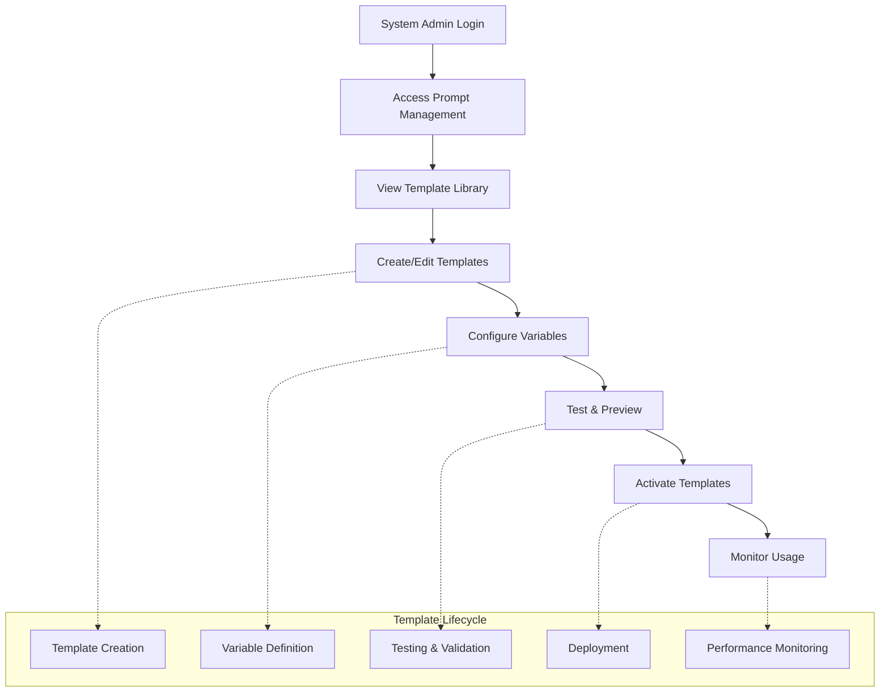

# Epic 6: AI Prompt Management System

## Epic Overview

**Goal**: Provide comprehensive AI prompt template management capabilities that enable system administrators to configure, customize, and control AI prompts used throughout the entire SupportSignal platform.

**Duration**: 1-2 weeks  
**Team Size**: 1-2 developers (backend + admin interface focus)  
**Dependencies**: Epic 1 (AI services, authentication)  
**Primary Users**: System administrators, AI service managers

---

## Business Context

Epic 6 establishes the foundational infrastructure for AI prompt management that supports all AI-powered features across SupportSignal. This epic enables customization and control of AI behavior without code changes, providing operational flexibility and the ability to optimize AI performance through prompt engineering.

**Key Business Drivers**:
- **AI Customization**: Ability to fine-tune AI prompts for optimal results without developer intervention
- **Operational Control**: System administrators can modify AI behavior based on real-world usage patterns
- **Compliance Adaptability**: Prompts can be adjusted to meet changing regulatory requirements
- **Performance Optimization**: A/B testing and optimization of AI prompts based on effectiveness metrics

**Success Metrics**:
- **Prompt Utilization**: All AI services utilize configurable prompt templates
- **Admin Adoption**: System administrators actively manage and optimize prompts
- **Response Quality**: Measurable improvement in AI response quality through prompt optimization
- **Configuration Stability**: Zero AI service disruptions due to prompt management operations

---

## User Journey Overview

---

## Story Breakdown

### Story 6.1: Core AI Prompt Management Foundation ✅

**Status**: **COMPLETE** (2025-08-12)  
**Priority**: CRITICAL  
**Estimated Effort**: 3-4 days  

#### Requirements Completed
Comprehensive AI prompt template management system including creation, editing, variable substitution, and integration with existing AI services.

**Core Features Delivered**:
- **System-Level Template Management**: Full CRUD operations for prompt templates
- **Variable Substitution System**: Dynamic `{{variable}}` syntax with type validation
- **Admin Interface**: Simple, effective prompt management UI
- **Integration Ready**: Seamless connection with Stories 3.2-3.3 AI services
- **Default Template Seeding**: NDIS-compatible templates included
- **Caching & Performance**: Optimized prompt resolution with 5-minute TTL

#### Technical Implementation Completed
- **12 Convex backend functions** with comprehensive authentication
- **Complete admin interface** at `/admin/ai-prompts`
- **Variable interpolation engine** with validation
- **Template resolution caching** for performance
- **Security patterns** with system admin access control

---

### Story 6.2: Advanced Prompt Management & Analytics

**Status**: **PLANNED** 📋  
**Priority**: MEDIUM  
**Estimated Effort**: 4-5 days  
**Dependencies**: Story 6.1 (Core prompt management foundation)

#### Requirements
Enhance the basic prompt management system with advanced capabilities including A/B testing, performance analytics, testing sandbox, and workflow management. These features optimize prompt effectiveness and provide comprehensive management capabilities.

**Advanced Functionality**:
- **A/B Testing Framework**: Compare prompt effectiveness and automatically optimize
- **Performance Analytics**: Track prompt effectiveness, response quality, and user satisfaction  
- **Testing Sandbox**: Preview and test prompt changes before deployment
- **Change Management**: Approval workflow for prompt modifications
- **Rich Analytics Dashboard**: Real-time analytics on prompt performance metrics
- **Advanced Version Control**: Full version history with rollback capabilities
- **Template Categories**: Advanced organization by workflow step and incident type

**Management Interface Enhancements**:
- **Rich Text Editor**: Enhanced prompt editing with syntax highlighting and validation
- **Performance Dashboard**: Comprehensive analytics and reporting interface
- **Batch Operations**: Bulk import/export and management operations
- **Backup & Recovery**: Automated backup system with easy restoration

#### Acceptance Criteria
- [ ] **A/B Testing**: Automated testing framework comparing prompt variants
- [ ] **Performance Metrics**: Comprehensive tracking of response quality and user engagement
- [ ] **Testing Sandbox**: Safe environment for testing prompt changes before deployment
- [ ] **Rich Text Editor**: Enhanced editing interface with template variable support
- [ ] **Analytics Dashboard**: Real-time performance metrics and reporting
- [ ] **Change Management**: Approval workflow for prompt modifications
- [ ] **Backup & Recovery**: Automated backup system with version restoration
- [ ] **Advanced Analytics**: Detailed prompt effectiveness and optimization recommendations

---

## Future Story Opportunities

Additional enhancements could include:

### Story 6.3: Multi-Tenant Prompt Management (Future)
- Company-specific prompt customizations
- Template inheritance and override systems
- Bulk template operations

### Story 6.4: Prompt Version Management (Future)  
- Advanced versioning with rollback capabilities
- Change approval workflows
- Template change impact analysis

---

## Epic Completion Status

### Current State: **FOUNDATION COMPLETE** ✅

**Story 6.1**: ✅ Complete - All core functionality implemented and deployed  
**Story 6.2**: 📋 Planned - Advanced analytics and management capabilities

**Epic 6 Achievement Summary**:
- ✅ **System Administrator Control**: Full prompt template management
- ✅ **Variable System**: Dynamic content substitution
- ✅ **Performance Optimized**: Caching and efficient resolution
- ✅ **Security Compliant**: Proper authentication and authorization
- ✅ **Integration Ready**: Available for all AI services
- ✅ **Documentation Complete**: Comprehensive implementation guides

**Technical Deliverables**:
- **27 files implemented** (backend, frontend, documentation)
- **5,430+ lines of code** added
- **Comprehensive KDD documentation** created
- **Security audit completed** with authentication pattern fixes

---

## Integration Points

### Dependencies Satisfied:
- ✅ **Epic 1**: Authentication and AI services integration
- ✅ **Story 3.2-3.3**: AI clarification and enhancement services

### Enables Future Development:
- **All AI-powered features**: Can leverage configurable prompts
- **Epic 5**: Team leader analysis workflow can use customizable AI prompts
- **Future epics**: Any AI functionality benefits from prompt management

---

## Knowledge Capture

### Key Architectural Patterns Established:
- **System-level prompt template management** patterns
- **Variable substitution and template parsing** systems
- **Runtime prompt resolution and caching** patterns
- **AI service integration** for configurable prompts

### Documentation Created:
- **Implementation KDD**: Detailed technical implementation guide
- **Security KDD**: Authentication pattern documentation
- **Template Comparison**: NDIS vs SupportSignal prompt analysis
- **Admin Interface Guide**: Complete usage documentation

---

## Contact & Support

**Epic Owner**: System Administrator  
**Technical Lead**: Development Team  
**Documentation**: Complete implementation and usage guides available

---

*Epic 6 Status: Foundation Complete - Ready for Future Enhancements*  
*Last Updated: 2025-08-29*  
*Version: 1.0*