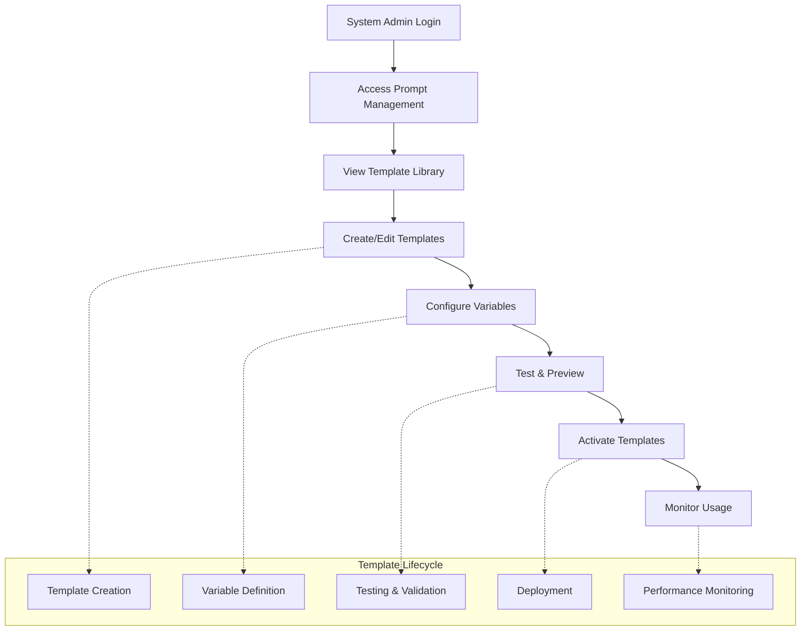

# Epic 6: AI Prompt Management System

## Epic Overview

**Goal**: Provide comprehensive AI prompt template management capabilities that enable system administrators to configure, customize, and control AI prompts used throughout the entire SupportSignal platform.

**Duration**: 1-2 weeks  
**Team Size**: 1-2 developers (backend + admin interface focus)  
**Dependencies**: Epic 1 (AI services, authentication)  
**Primary Users**: System administrators, AI service managers

---

## Business Context

Epic 6 establishes the foundational infrastructure for AI prompt management that supports all AI-powered features across SupportSignal. This epic enables customization and control of AI behavior without code changes, providing operational flexibility and the ability to optimize AI performance through prompt engineering.

**Key Business Drivers**:
- **AI Customization**: Ability to fine-tune AI prompts for optimal results without developer intervention
- **Operational Control**: System administrators can modify AI behavior based on real-world usage patterns
- **Compliance Adaptability**: Prompts can be adjusted to meet changing regulatory requirements
- **Performance Optimization**: A/B testing and optimization of AI prompts based on effectiveness metrics

**Success Metrics**:
- **Prompt Utilization**: All AI services utilize configurable prompt templates
- **Admin Adoption**: System administrators actively manage and optimize prompts
- **Response Quality**: Measurable improvement in AI response quality through prompt optimization
- **Configuration Stability**: Zero AI service disruptions due to prompt management operations

---

## User Journey Overview

---

## Story Breakdown

### Story 6.1: Core AI Prompt Management Foundation ✅

**Status**: **COMPLETE** (2025-08-12)  
**Priority**: CRITICAL  
**Estimated Effort**: 3-4 days  

#### Requirements Completed
Comprehensive AI prompt template management system including creation, editing, variable substitution, and integration with existing AI services.

**Core Features Delivered**:
- **System-Level Template Management**: Full CRUD operations for prompt templates
- **Variable Substitution System**: Dynamic `{{variable}}` syntax with type validation
- **Admin Interface**: Simple, effective prompt management UI
- **Integration Ready**: Seamless connection with Stories 3.2-3.3 AI services
- **Default Template Seeding**: NDIS-compatible templates included
- **Caching & Performance**: Optimized prompt resolution with 5-minute TTL

#### Technical Implementation Completed
- **12 Convex backend functions** with comprehensive authentication
- **Complete admin interface** at `/admin/ai-prompts`
- **Variable interpolation engine** with validation
- **Template resolution caching** for performance
- **Security patterns** with system admin access control

---

### Story 6.2: Phase-Specific Question Generation Prompts

**Status**: **IN PROGRESS** 🚧  
**Priority**: HIGH  
**Estimated Effort**: 2-3 days  
**Dependencies**: Story 6.1 (Core prompt management foundation)

#### Requirements
**Problem**: The current system uses one generic `"generate_clarification_questions"` prompt that attempts to handle all four incident phases (`before_event`, `during_event`, `end_event`, `post_event`) by passing the phase as a parameter. This creates suboptimal results because each phase requires different investigation focus areas and question types.

**Solution**: Split the single generic prompt into four specialized, phase-specific prompts that are optimized for their particular phase context and investigation needs.

**Technical Implementation**:
- **Replace single prompt**: Convert from `"generate_clarification_questions"` to four distinct prompts:
  - `"generate_clarification_questions_before_event"`
  - `"generate_clarification_questions_during_event"`
  - `"generate_clarification_questions_end_event"`
  - `"generate_clarification_questions_post_event"`
- **Update question generator**: Modify `questionGenerator.ts` to dynamically select prompt based on phase
- **Remove phase variable**: Each prompt will have phase-specific context hardcoded, removing need for `{{phase}}` variable
- **Optimize for phase context**: Each prompt tailored for specific investigation priorities and question types

**Phase-Specific Optimizations**:
- **Before Event**: Focus on antecedents, environmental factors, participant state
- **During Event**: Focus on actions taken, interventions attempted, safety measures
- **End Event**: Focus on resolution strategies, de-escalation techniques, immediate outcomes
- **Post Event**: Focus on follow-up care, support plan modifications, lesson learned

#### Acceptance Criteria
- [ ] **Four Phase-Specific Prompts**: Create specialized prompts for each incident phase
- [ ] **Dynamic Prompt Selection**: Update questionGenerator.ts to select prompt based on `args.phase`
- [ ] **Hardcoded Phase Context**: Remove generic `{{phase}}` variable, embed phase context in each prompt
- [ ] **Maintain Existing API**: No breaking changes to existing question generation interface
- [ ] **Database Migration**: Add new prompts to DEFAULT_PROMPTS and seed in database
- [ ] **Testing**: Verify each phase generates appropriate, phase-specific questions
- [ ] **Documentation**: Update prompt management documentation with new phase-specific approach

---

### Story 6.3: Developer Prompt Testing & Interpolation Interface

**Status**: **PLANNED** 📋  
**Priority**: MEDIUM  
**Estimated Effort**: 3-4 days  
**Dependencies**: Story 6.2 (Phase-specific prompts)

#### Requirements
**Problem**: Developers need to test and refine AI prompts during development, but currently must modify database records or code to experiment with prompt variations. There's no easy way to see prompt interpolation in real-time or test different variable combinations.

**Solution**: Extend the existing developer experience control (shown at bottom of incident workflows) to provide comprehensive prompt testing and interpolation capabilities for developers.

**Developer Interface Enhancements**:
- **Prompt Visibility**: Show the current prompt template being used for AI calls
- **Interpolation Preview**: Display all `{{placeholder}}` variables and their current values
- **Property Grid**: Show all input variables going into the prompt with their values
- **Extensible Variables**: Allow adding custom key-value pairs for testing without saving to database
- **Real-time Preview**: Show the fully interpolated prompt that will be sent to the AI
- **Test Execution**: Button to execute the prompt with current variables and see AI response
- **Template Override**: Temporarily modify prompt template for testing (not saved to database)

**Use Cases**:
- **Prompt Development**: Test prompt modifications before updating database templates
- **Variable Testing**: Try different variable combinations to optimize AI responses
- **Debugging**: See exactly what prompt was sent when investigating AI issues
- **Optimization**: Experiment with special instructions or additional context variables

#### Acceptance Criteria
- [ ] **Developer Controls Extension**: Extend existing developer toolbar with prompt testing capabilities
- [ ] **Prompt Template Display**: Show current active prompt template being used
- [ ] **Variable Visualization**: Display all template variables and their current values in a property grid
- [ ] **Extensible Variables**: Allow adding/modifying variables without database changes
- [ ] **Real-time Interpolation**: Show live preview of fully interpolated prompt
- [ ] **Template Override**: Allow temporary prompt template modifications for testing
- [ ] **Test Execution**: Execute prompt with current variables and display AI response
- [ ] **Developer-Only Access**: Ensure interface only appears for users with developer permissions
- [ ] **No Database Changes**: All modifications are temporary and not persisted
- [ ] **Context Awareness**: Show relevant prompt testing for current workflow step/page

---

### Story 6.4: Advanced Prompt Management & Analytics (Future)

**Status**: **FUTURE** 📋  
**Priority**: LOW  
**Estimated Effort**: 4-5 days  
**Dependencies**: Stories 6.2-6.3 (Phase-specific prompts and developer tools)

#### Requirements
Enhance the prompt management system with advanced capabilities including A/B testing, performance analytics, testing sandbox, and workflow management for production optimization.

**Advanced Functionality**:
- **A/B Testing Framework**: Compare prompt effectiveness and automatically optimize
- **Performance Analytics**: Track prompt effectiveness, response quality, and user satisfaction  
- **Testing Sandbox**: Preview and test prompt changes before deployment
- **Change Management**: Approval workflow for prompt modifications
- **Rich Analytics Dashboard**: Real-time analytics on prompt performance metrics
- **Advanced Version Control**: Full version history with rollback capabilities

#### Acceptance Criteria
- [ ] **A/B Testing**: Automated testing framework comparing prompt variants
- [ ] **Performance Metrics**: Comprehensive tracking of response quality and user engagement
- [ ] **Testing Sandbox**: Safe environment for testing prompt changes before deployment
- [ ] **Analytics Dashboard**: Real-time performance metrics and reporting
- [ ] **Change Management**: Approval workflow for prompt modifications

---

## Future Story Opportunities

Additional enhancements could include:

### Story 6.5: Multi-Tenant Prompt Management (Future)
- Company-specific prompt customizations
- Template inheritance and override systems
- Bulk template operations

### Story 6.6: Prompt Version Management (Future)  
- Advanced versioning with rollback capabilities
- Change approval workflows
- Template change impact analysis

---

## Epic Completion Status

### Current State: **FOUNDATION COMPLETE, PHASE-SPECIFIC IN PROGRESS** 🚧

**Story 6.1**: ✅ Complete - All core functionality implemented and deployed  
**Story 6.2**: 🚧 In Progress - Phase-specific question generation prompts  
**Story 6.3**: 📋 Planned - Developer prompt testing and interpolation interface  
**Story 6.4**: 📋 Future - Advanced analytics and management capabilities

**Epic 6 Achievement Summary**:
- ✅ **System Administrator Control**: Full prompt template management
- ✅ **Variable System**: Dynamic content substitution
- ✅ **Performance Optimized**: Caching and efficient resolution
- ✅ **Security Compliant**: Proper authentication and authorization
- ✅ **Integration Ready**: Available for all AI services
- ✅ **Documentation Complete**: Comprehensive implementation guides

**Technical Deliverables**:
- **27 files implemented** (backend, frontend, documentation)
- **5,430+ lines of code** added
- **Comprehensive KDD documentation** created
- **Security audit completed** with authentication pattern fixes

---

## Integration Points

### Dependencies Satisfied:
- ✅ **Epic 1**: Authentication and AI services integration
- ✅ **Story 3.2-3.3**: AI clarification and enhancement services

### Enables Future Development:
- **All AI-powered features**: Can leverage configurable prompts
- **Epic 5**: Team leader analysis workflow can use customizable AI prompts
- **Future epics**: Any AI functionality benefits from prompt management

---

## Knowledge Capture

### Key Architectural Patterns Established:
- **System-level prompt template management** patterns
- **Variable substitution and template parsing** systems
- **Runtime prompt resolution and caching** patterns
- **AI service integration** for configurable prompts

### Documentation Created:
- **Implementation KDD**: Detailed technical implementation guide
- **Security KDD**: Authentication pattern documentation
- **Template Comparison**: NDIS vs SupportSignal prompt analysis
- **Admin Interface Guide**: Complete usage documentation

---

## Contact & Support

**Epic Owner**: System Administrator  
**Technical Lead**: Development Team  
**Documentation**: Complete implementation and usage guides available

---

*Epic 6 Status: Foundation Complete - Ready for Future Enhancements*  
*Last Updated: 2025-08-29*  
*Version: 1.0*