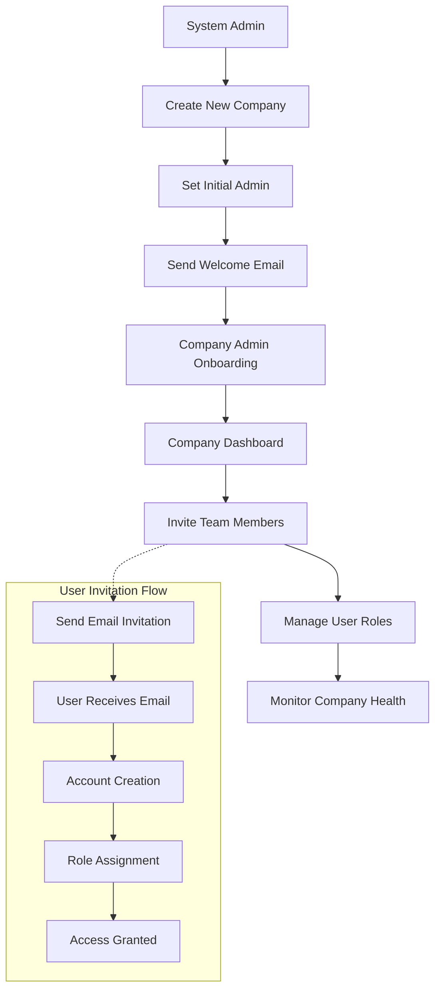

# Epic 7: Multi-Tenant Administration & Onboarding System

## Epic Overview

**Goal**: Establish comprehensive multi-tenant administration capabilities that enable system administrators to onboard new companies, manage user invitations, and provide company administrators with self-service user management tools.

**Duration**: 2-3 weeks
**Team Size**: 2-3 developers (backend, frontend, integration focus)
**Dependencies**: Epic 1 (Authentication), Epic 6 (AI Prompt Management)
**Primary Users**: System administrators, company administrators
**Requirements Source**: [Multi-Tenant Administration Requirements Analysis](../multi-tenant-administration-requirements.md)

---

## Business Context

Epic 7 addresses critical gaps in SupportSignal's multi-tenant administration system, enabling operational scalability and reducing administrative burden. This epic transforms SupportSignal from a single-tenant system requiring manual intervention into a self-service multi-tenant platform.

**Key Business Drivers**:
- **Operational Scalability**: Enable onboarding of 100+ companies with minimal system admin intervention
- **Self-Service Administration**: Company admins manage their own users, reducing support burden by 75%
- **User Experience**: New companies operational within 24 hours, new users active within 1 hour
- **Revenue Enablement**: Remove operational barriers to customer acquisition and expansion

**Success Metrics**:
- **Onboarding Efficiency**: 90% of company onboarding completed without system admin intervention
- **User Management**: 90% of user management handled by company admins
- **Time to Value**: New companies operational in <24 hours
- **Admin Workload**: 75% reduction in routine administrative tasks

---

## User Journey Overview



---

## Story Breakdown

### Story 7.1: Company Creation & Onboarding Workflow

**Status**: **PLANNED** 📋
**Priority**: CRITICAL
**Estimated Effort**: 4-5 days

#### Requirements

**Problem**: System administrators cannot easily onboard new organizations. The existing `createCompany` function lacks authentication and UI, requiring manual database manipulation.

**Solution**: Implement authenticated company creation workflow with automatic slug generation, initial admin setup, and welcome email integration.

**Technical Implementation**:
- **Authenticated Company Creation**: Upgrade existing backend function with proper authentication
- **Company Creation Form**: Admin interface for new company onboarding
- **Slug Generation**: Automatic URL-friendly identifier creation with conflict resolution
- **Initial Admin Assignment**: Link first company administrator during creation
- **Welcome Email Integration**: Use existing Cloudflare Worker email service for onboarding

#### Acceptance Criteria
- [ ] **Company Creation Form**: System admin interface at `/admin/companies/create`
- [ ] **Authenticated Backend**: Upgrade `createCompany` function with system admin authentication
- [ ] **Automatic Slug Generation**: URL-friendly company identifiers with conflict resolution
- [ ] **Initial Admin Setup**: Assign first company administrator during creation
- [ ] **Welcome Email**: Automated welcome email using existing Resend service
- [ ] **Input Validation**: Comprehensive validation for company name, email, and admin details
- [ ] **Error Handling**: Graceful handling of duplicate names, invalid emails, auth failures
- [ ] **Success Confirmation**: Clear feedback on successful company creation

---

### Story 7.2: User Invitation System with Email Integration

**Status**: **PLANNED** 📋
**Priority**: CRITICAL
**Estimated Effort**: 5-6 days
**Dependencies**: Story 7.1 (Company creation foundation)

#### Requirements

**Problem**: Users can only be promoted/demoted, not invited. All user management requires system admin intervention, limiting operational efficiency.

**Solution**: Implement comprehensive user invitation system integrating BetterAuth authentication with existing Cloudflare Worker email service.

**Technical Implementation**:
- **Invitation Database Schema**: Track invitation tokens, expiration, and status
- **Email Integration**: Use existing Resend service for invitation delivery
- **BetterAuth Integration**: Seamless account creation during invitation acceptance
- **Token Security**: Secure invitation link generation with expiration
- **Role Assignment**: Assign appropriate roles during invitation process

#### Acceptance Criteria
- [ ] **User Invitation Schema**: `user_invitations` table with token management
- [ ] **Invitation Form**: Interface for sending user invitations with role selection
- [ ] **Email Integration**: Automated invitation emails using existing Cloudflare Worker
- [ ] **Secure Tokens**: Cryptographically secure invitation tokens with expiration
- [ ] **BetterAuth Integration**: Seamless account creation during invitation acceptance
- [ ] **Role Assignment**: Proper role assignment during invitation process
- [ ] **Status Tracking**: Track invitation status (pending, accepted, expired, revoked)
- [ ] **Invitation Management**: View and manage pending invitations

---

### Story 7.3: Company-Scoped User Management Interface

**Status**: **PLANNED** 📋
**Priority**: HIGH
**Estimated Effort**: 4-5 days
**Dependencies**: Story 7.2 (User invitation system)

#### Requirements

**Problem**: Company administrators cannot manage their own users. All user management requires system admin intervention, creating operational bottlenecks.

**Solution**: Implement company-scoped user management interface enabling company admins to invite, manage, and deactivate users within their organization.

**Technical Implementation**:
- **Company Admin Dashboard**: Dedicated interface for company user management
- **Scoped User Listing**: Show only users within company boundary
- **Role Management**: Company admins can assign roles within their scope
- **User Deactivation**: Ability to deactivate users while preserving data integrity

#### Acceptance Criteria
- [ ] **Company Admin Interface**: Dedicated user management at `/company-admin/users`
- [ ] **Scoped User Listing**: Display only company users with filtering and search
- [ ] **User Invitation**: Company admins can invite new users to their company
- [ ] **Role Management**: Assign and modify user roles within company scope
- [ ] **User Deactivation**: Deactivate users while maintaining data integrity
- [ ] **Permission Boundaries**: Strict enforcement of company data isolation
- [ ] **User Profile Management**: View and edit user profiles within company
- [ ] **Bulk Operations**: Support for bulk user management actions

---

### Story 7.4: Enhanced Company Dashboard with Analytics

**Status**: **PLANNED** 📋
**Priority**: HIGH
**Estimated Effort**: 3-4 days
**Dependencies**: Story 7.3 (Company user management)

#### Requirements

**Problem**: Company administrators lack visibility into their organization's health and activity. Current company management interfaces provide only basic information updates.

**Solution**: Create comprehensive company dashboard providing key metrics, user activity overview, and health indicators for company administrators.

**Technical Implementation**:
- **Company Health Metrics**: User count, participant count, recent activity tracking
- **Activity Overview**: Recent user logins, incident creation, system usage
- **Basic Analytics**: Simple charts and metrics relevant to company operations
- **Quick Actions**: Direct access to common administrative tasks

#### Acceptance Criteria
- [ ] **Company Dashboard**: Comprehensive overview at `/company-admin/dashboard`
- [ ] **Health Metrics**: Display user count, participant count, recent activity
- [ ] **Activity Tracking**: Show recent user activity and system usage
- [ ] **Quick Actions**: Direct links to user management, participant management
- [ ] **Performance Metrics**: Basic analytics on company usage patterns
- [ ] **Mobile Responsive**: Full functionality on mobile devices
- [ ] **Real-time Updates**: Live data refresh using Convex real-time capabilities
- [ ] **Export Capabilities**: Export company data and reports

---

### Story 7.5: System-Wide Company Management Tools

**Status**: **PLANNED** 📋
**Priority**: MEDIUM
**Estimated Effort**: 3-4 days
**Dependencies**: Story 7.4 (Company dashboard)

#### Requirements

**Problem**: System administrators need simple overview of all companies in the system for monitoring and lifecycle management. Additionally, test companies created during development and testing need to be safely removed along with all their related data.

**Solution**: Implement system-wide company management interface providing company listing, basic metrics, lifecycle management tools, and comprehensive cleanup capabilities for test companies.

**Technical Implementation**:
- **Company Listing Interface**: Simple table view of all companies with key metrics
- **Company Lifecycle Management**: Activate, suspend, and reactivate companies
- **System Overview**: Total counts and system-wide health indicators
- **Company Status Management**: Easy status updates and monitoring
- **Test Company Cleanup System**: Safe removal of test companies with comprehensive data preview
- **Cascade Deletion Engine**: Remove all related data across tables (users, participants, incidents, sessions, etc.)
- **Cleanup Audit Trail**: Complete logging of all cleanup operations for compliance

#### Acceptance Criteria
- [ ] **Company Listing**: System admin interface at `/admin/companies/list`
- [ ] **Company Overview**: List all companies with user/participant counts
- [ ] **Status Management**: Activate, suspend, reactivate companies
- [ ] **System Metrics**: Total system statistics and health indicators
- [ ] **Company Health**: Quick view of company activity and status
- [ ] **Search and Filter**: Find companies by name, status, activity level
- [ ] **Bulk Operations**: Perform actions on multiple companies
- [ ] **Lifecycle Tracking**: Monitor company creation and activity patterns
- [ ] **Test Company Cleanup**: Remove companies with status "test" and all related data
- [ ] **Cleanup Preview**: Show detailed list of data to be deleted before confirmation
- [ ] **Cascade Deletion**: Remove all related users, participants, incidents, and dependent data
- [ ] **Cleanup Logging**: Comprehensive audit trail of cleanup operations

---

## Technical Architecture Requirements

### Backend Functions Required

#### Company Management Functions
```typescript
// Company Creation & Onboarding
companies.create.createCompanyWithAuth       // Authenticated company creation
companies.onboarding.createCompanyWithAdmin  // Create company + initial admin
companies.onboarding.sendWelcomeEmail       // Welcome email workflow
companies.admin.getCompanyDashboard         // Company-specific analytics
companies.admin.listAllCompanies           // System admin company listing
companies.lifecycle.suspendCompany         // Company deactivation
companies.lifecycle.reactivateCompany      // Company reactivation
companies.cleanup.previewTestCompanyCleanup // Preview data to be deleted for test companies
companies.cleanup.executeTestCompanyCleanup // Execute cleanup of test companies with full cascade deletion
```

#### User Management Functions (BetterAuth Integration)
```typescript
// User Invitation System
users.invite.sendUserInvitation           // Email invitation using Resend service
users.invite.acceptInvitation             // BetterAuth account creation
users.invite.listPendingInvitations       // Track invitation status
users.invite.revokeInvitation             // Cancel pending invitations

// Company-Scoped User Management
users.company.listCompanyUsers            // Company admin user listing
users.company.createCompanyUser           // Direct user creation
users.company.updateUserRole              // Company admin role management
users.company.deactivateUser              // User deactivation
```

#### Analytics Functions
```typescript
// Basic Company Metrics
analytics.company.getUserCount            // Simple user count
analytics.company.getParticipantCount     // Simple participant count
analytics.company.getBasicStats           // Combined basic metrics
analytics.system.getCompanyList           // Company listing with counts
```

### Database Schema Additions

#### User Invitations Table
```sql
user_invitations: {
  _id: id,
  email: string,
  company_id: id("companies"),
  role: union("company_admin", "team_lead", "frontline_worker"),
  invited_by: id("users"),
  invitation_token: string,
  expires_at: number,
  status: union("pending", "accepted", "expired", "revoked"),
  created_at: number,
  accepted_at: optional(number)
}
```

### Integration Requirements

#### Email Service Integration
- **Service**: Existing Cloudflare Worker with Resend API
- **Endpoint**: `https://supportsignal-email-with-resend.your-account.workers.dev`
- **Integration**: Company creation welcome emails, user invitation emails
- **Reference**: `/Users/davidcruwys/dev/clients/supportsignal/supportsignal-email-with-resend/INTEGRATION.md`

#### BetterAuth Integration
- **Authentication**: Integrate with existing BetterAuth system
- **Session Management**: Use existing `sessions` table
- **Password Management**: Leverage existing `password_reset_tokens` table
- **Account Creation**: Seamless user account creation during invitation acceptance

---

## Epic Completion Status

### Current State: **PLANNED - READY FOR IMPLEMENTATION** 📋

**Story 7.1**: 📋 Planned - Company creation & onboarding workflow
**Story 7.2**: 📋 Planned - User invitation system with email integration
**Story 7.3**: 📋 Planned - Company-scoped user management interface
**Story 7.4**: 📋 Planned - Enhanced company dashboard with analytics
**Story 7.5**: 📋 Planned - System-wide company management tools

**Epic 7 Target Deliverables**:
- 🎯 **Complete Company Onboarding**: New companies operational within 24 hours
- 🎯 **Self-Service User Management**: 90% of user operations handled by company admins
- 🎯 **Scalable Administration**: Support 100+ companies with minimal system admin load
- 🎯 **Integrated Email Workflows**: Automated notifications using existing infrastructure
- 🎯 **Comprehensive Analytics**: Company health monitoring and system overview

---

## Integration Points

### Dependencies Satisfied:
- ✅ **Epic 1**: Authentication system (BetterAuth) ready for integration
- ✅ **Email Infrastructure**: Cloudflare Worker with Resend service operational
- ✅ **Company Management**: Basic company management interfaces exist
- ✅ **User Management**: Role-based access system established

### Enables Future Development:
- **Enhanced Analytics**: Foundation for advanced reporting and insights
- **API Management**: Company-specific API access controls
- **Compliance Reporting**: Company-segregated compliance data
- **Advanced Workflows**: Complex multi-company business processes

---

## Risk Considerations

### Technical Risks
- **Email Delivery**: Invitation emails may be blocked by spam filters
- **Token Security**: Invitation tokens require secure generation and expiration
- **Data Isolation**: Must maintain strict company data separation
- **Performance**: Company-scoped queries must remain performant at scale

### Mitigation Strategies
- **Email Testing**: Comprehensive testing across email providers
- **Security Audit**: Thorough review of invitation token generation
- **Data Access Patterns**: Careful design of company-scoped database queries
- **Performance Testing**: Load testing with realistic multi-company scenarios

---

## Knowledge Capture

### Key Architectural Patterns Established:
- **Multi-tenant administration** patterns with company isolation
- **User invitation workflows** with email integration
- **Company lifecycle management** with status tracking
- **Delegated administration** with proper permission boundaries

### Requirements Documentation:
- **Detailed Requirements Analysis**: [Multi-Tenant Administration Requirements](../multi-tenant-administration-requirements.md)
  - Current system capabilities analysis
  - Critical gaps identification (5 major gaps)
  - Technical architecture requirements
  - Database schema specifications
  - User journey definitions

### Integration Documentation:
- **Email Service Integration**: Complete API documentation and examples
- **BetterAuth Integration**: Account creation and authentication patterns
- **Company Management**: Administrative interface and workflow patterns

---

## Contact & Support

**Epic Owner**: System Administrator
**Technical Lead**: Development Team
**Business Stakeholder**: Company Administrators
**Documentation**: Multi-tenant administration requirements analysis available

---

*Epic 7 Status: Ready for Implementation - Foundation for Scalable Multi-Tenant Operations*
*Last Updated: 2025-01-19*
*Version: 1.0*