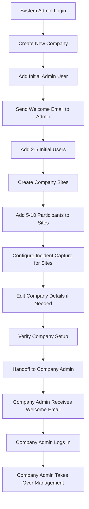

# Epic 7: Rapid Company Onboarding (System Admin Perspective)

> **Quick Navigation:** [7.1](#story-71-company-creation--onboarding-workflow) · [7.2](#story-72-initial-user-setup-system-admin) · [7.3](#story-73-site-management-system-admin) · [7.4](#story-74-initial-participant-setup-system-admin) · [7.5](#story-75-system-wide-company-management--editing) · [7.6](#story-76-incident-capture-site-selection)

## Epic Overview

**Goal**: Enable SupportSignal system administrators to rapidly onboard new service provider companies with minimal initial setup - creating the company, setting up sites, adding users, and adding participants to get the organization operational within 24 hours.

**Duration**: 2-3 weeks
**Team Size**: 1-2 developers (backend, frontend focus)
**Dependencies**: Epic 1 (Authentication)
**Primary Users**: System administrators (SupportSignal employees)
**Requirements Source**: [Multi-Tenant Administration Requirements Analysis](../multi-tenant-administration-requirements.md)

**Note**: This epic focuses on **lightweight rapid onboarding** from the SupportSignal perspective. Full self-service user and participant management by company administrators will be addressed in Epic 9.

**Important**: Site creation and deletion is **system admin only** (Epic 7). Company admins can **rename sites** in Epic 9 but cannot create or delete them.

---

## Business Context

Epic 7 enables SupportSignal system administrators to quickly onboard new service provider organizations. This is the **initial setup phase** where SupportSignal staff prepare a new company for operation by creating the company record, setting up sites (locations), setting up initial users (admin + frontline workers), and adding sample participants.

**Key Business Drivers**:
- **Rapid Onboarding**: Get new service providers operational within 24 hours
- **Minimal Setup**: System admin adds just enough data to make the company functional
- **Site-Based Organization**: Participants belong to sites (physical locations) for better organization
- **Handoff to Company**: After initial setup, company admins take over ongoing management
- **Revenue Enablement**: Fast time-to-value for new customers

**Success Metrics**:
- **Onboarding Speed**: New companies operational in <24 hours
- **Setup Efficiency**: System admin can onboard a company in <30 minutes
- **Initial Data**: Company has 1+ sites, 1 admin + 2-5 users, 5-10 participants assigned to sites
- **Handoff Success**: Company admin can immediately access their dashboard and data

**Scope Clarification**:
- **IN SCOPE**: System admin lightweight setup (company + sites + initial users + sample participants)
- **IN SCOPE**: Site creation and deletion by system admins
- **OUT OF SCOPE**: Company admin self-service management (see Epic 9)
- **OUT OF SCOPE**: Bulk imports, advanced NDIS compliance features (see Epic 9)
- **NOTE**: Company admins can rename sites in Epic 9 (but not create/delete)

---

## Multi-Tenant Site Architecture

**Key Concept: Sites represent physical locations where frontline workers look after participants.**

```
Company (NDIS Service Provider)
  └── Sites (1 or more locations)
        ├── Site 1 (e.g., "North Sydney Office")
        │     ├── Participant 1
        │     ├── Participant 2
        │     └── Participant 3
        └── Site 2 (e.g., "Parramatta Branch")
              ├── Participant 4
              └── Participant 5

Incidents
  └── Linked to Site (dropdown selection during incident capture)
```

**Relationships**:
- Company → Sites (one-to-many)
- Site → Participants (one-to-many)
- Incident → Site (many-to-one)
- Participants MUST have a site before creation
- Incidents capture which site the incident occurred at

---

## User Journey Overview

**System Admin Rapid Onboarding Workflow:**



**Key Insight**: This is a **one-time setup flow** performed by SupportSignal staff. After handoff, the company admin uses Epic 9 features for ongoing management (but NOT site management - sites remain system admin only).

---

## Quick Navigation

**Stories in this Epic:**
- [Story 7.1: Company Creation & Onboarding Workflow](#story-71-company-creation--onboarding-workflow) - ✅ **Complete** (Critical)
- [Story 7.2: Initial User Setup (System Admin)](#story-72-initial-user-setup-system-admin) - ✅ **Complete** (Critical)
- [Story 7.3: Site Management (System Admin)](#story-73-site-management-system-admin) - ✅ **Complete** (Critical) 🚨 *Security fix in 7.5*
- [Story 7.4: Initial Participant Setup (System Admin)](#story-74-initial-participant-setup-system-admin) - ✅ **Complete** (High) 🚨 *Security fix in 7.5*
- [Story 7.5: System-Wide Company Management & Editing](#story-75-system-wide-company-management--editing) - ✅ **Approved** (Medium) 🚨 *Includes Phase 0 security fix*
- [Story 7.6: Incident Capture Site Selection](#story-76-incident-capture-site-selection) - 📋 **Planned** (High)

---

## Story Breakdown

### Story 7.1: Company Creation & Onboarding Workflow

**Status**: **COMPLETED** ✅
**Priority**: CRITICAL
**Estimated Effort**: 4-5 days (Actual: Completed)

#### Requirements

**Problem**: System administrators cannot easily onboard new organizations. The existing `createCompany` function lacks authentication and UI, requiring manual database manipulation.

**Solution**: Implement authenticated company creation workflow with automatic slug generation, initial admin setup, and welcome email integration.

**Technical Implementation**:
- **Authenticated Company Creation**: Upgrade existing backend function with proper authentication
- **Company Creation Form**: Admin interface for new company onboarding
- **Slug Generation**: Automatic URL-friendly identifier creation with conflict resolution
- **Initial Admin Assignment**: Link first company administrator during creation
- **Welcome Email Integration**: Use existing Cloudflare Worker email service for onboarding

#### Acceptance Criteria
- [x] **Company Creation Form**: System admin interface at `/admin/companies/create` ✅
- [x] **Authenticated Backend**: Upgrade `createCompany` function with system admin authentication ✅
- [x] **Automatic Slug Generation**: URL-friendly company identifiers with conflict resolution ✅
- [x] **Initial Admin Setup**: Assign first company administrator during creation ✅
- [x] **Welcome Email**: Automated welcome email using existing Resend service ✅
- [x] **Input Validation**: Comprehensive validation for company name, email, and admin details ✅
- [x] **Error Handling**: Graceful handling of duplicate names, invalid emails, auth failures ✅
- [x] **Success Confirmation**: Clear feedback on successful company creation ✅

**Implementation Status**: Story 7.1 is complete. See `docs/stories/7.1.story.md` for full details.

---

### Story 7.2: Initial User Setup (System Admin)

**Status**: **COMPLETED** ✅
**Priority**: CRITICAL
**Estimated Effort**: 5-6 days (Actual: Completed October 9, 2025)
**Dependencies**: Story 7.1 (Company creation foundation)

#### Requirements

**Problem**: After creating a company, the system admin needs a quick way to add 2-5 initial users (frontline workers, team leads) to make the company operational.

**Solution**: System admin interface to quickly invite initial users with email invitations, role assignment, and automatic account creation.

**Technical Implementation**:
- **Invitation Database Schema**: Track invitation tokens, expiration, and status ✅
- **Email Integration**: Use existing Resend service for invitation delivery ✅
- **bcrypt-based auth Integration**: Seamless account creation during invitation acceptance ✅
- **Token Security**: Secure invitation link generation with expiration ✅
- **Role Assignment**: Assign appropriate roles during invitation process ✅

**Scope**: Lightweight user addition (2-5 users) for initial setup. Full user lifecycle management is in Epic 9.

#### Acceptance Criteria
- [x] **User Invitation Schema**: `user_invitations` table with token management ✅
- [x] **Backend Functions**: All invitation mutations and queries implemented ✅
- [x] **Email Integration**: Automated invitation emails using existing Cloudflare Worker ✅
- [x] **Secure Tokens**: Cryptographically secure invitation tokens with expiration ✅
- [x] **bcrypt-based auth Integration**: Seamless account creation during invitation acceptance ✅
- [x] **Role Assignment**: Proper role assignment during invitation process ✅
- [x] **Status Tracking**: Track invitation status (pending, accepted, expired, revoked) ✅
- [x] **Invitation Form UI**: System admin interface for sending invitations ✅
- [x] **Invitation Management UI**: View and manage pending invitations ✅

**Implementation Status**: Complete (see `docs/stories/7.2.story.md`). All backend and frontend components implemented and tested.

---

### Story 7.3: Site Management (System Admin)

**Status**: **PLANNED** 📋
**Priority**: CRITICAL
**Estimated Effort**: 3-4 days
**Dependencies**: Story 7.2 (User setup)

#### CRITICAL PREREQUISITES - Schema Changes Required

**⚠️ IMPORTANT**: Before implementing Story 7.3, the following schema changes MUST be made to `apps/convex/schema.ts`:

**1. Add Sites Table:**
```typescript
sites: defineTable({
  _id: v.id("sites"),
  company_id: v.id("companies"),
  name: v.string(),
  created_at: v.number(),
  created_by: v.id("users"),
  updated_at: v.optional(v.number())
})
  .index("by_company", ["company_id"])
  .index("by_name", ["company_id", "name"])
```

**2. Update Participants Table** (for Story 7.4):
```typescript
participants: defineTable({
  // ... existing fields ...
  site_id: v.id("sites"),  // NEW FIELD - REQUIRED
  // ... existing fields ...
})
  .index("by_site", ["site_id"])  // NEW INDEX
  .index("by_company_and_site", ["company_id", "site_id"])  // NEW INDEX
```

**3. Update Incidents Table** (for Story 7.6):
```typescript
incidents: defineTable({
  // ... existing fields ...
  site_id: v.id("sites"),  // NEW FIELD - REQUIRED
  // ... existing fields ...
})
  .index("by_site", ["site_id"])  // NEW INDEX
  .index("by_company_and_site", ["company_id", "site_id"])  // NEW INDEX
```

**Schema Deployment**: These changes must be deployed to Convex before proceeding with frontend implementation.

#### Requirements

**Problem**: Service provider companies have multiple physical locations (sites) where frontline workers look after participants. Currently, there's no way to organize participants by location. The system needs site management to properly organize participants by their physical care location.

**Solution**: Implement site management system where system admins create and manage sites for companies. Participants will be assigned to sites. This provides better organization and will enable future features like site-specific reporting and rostering.

**Technical Implementation**:
- **Sites Database Schema**: New `sites` table with company relationship
- **Site CRUD Operations**: Create, read, update, delete sites for a company
- **Primary Site Convention**: Each company must have at least one site (default: "Primary")
- **Site Validation**: Prevent deletion of sites that have participants assigned
- **Data Migration**: Create "Primary" site for all existing companies and link existing participants

**Scope**: System admin creates and deletes sites. Company admins can **rename sites** in Epic 9 (but not create/delete).

#### Acceptance Criteria
- [ ] **Sites Database Schema**: New `sites` table with `company_id`, `name`, `created_at` fields
- [ ] **Site Management Interface**: System admin interface at `/admin/companies/{id}/sites`
- [ ] **Create Site**: Form to add new site to a company
- [ ] **List Sites**: View all sites for a company with participant counts
- [ ] **Edit Site**: Update site name and details
- [ ] **Delete Site**: Remove site (validation: cannot delete if has participants)
- [ ] **Default Site Creation**: Auto-create "Primary" site when company is created
- [ ] **Site Validation**: Enforce at least one site per company
- [ ] **Migration Script**: Create "Primary" site for all existing companies
- [ ] **Participant Migration**: Link all existing participants to their company's Primary site
- [ ] **Backend Functions**: `sites.admin.*` functions for CRUD operations
- [ ] **Company Scoping**: Sites are company-scoped, system admin can manage all sites

#### Migration Strategy

**The migration must follow this exact order to maintain referential integrity:**

**Phase 1: Schema Setup** (Story 7.3 start)
1. Add `sites` table to `apps/convex/schema.ts`
2. Deploy schema changes to Convex (`bunx convex deploy`)
3. Verify table creation using Convex dashboard or `bunx convex data sites`
4. Confirm `sites` table is ready before proceeding

**Phase 2: Create Primary Sites** (Story 7.3 implementation)
1. Develop migration script: `sites.migration.createPrimarySitesForExistingCompanies()`
2. For each company without sites:
   - Create site with name "Primary"
   - Set `company_id` to link to company
   - Set `created_by` to system admin user
   - Set `created_at` to current timestamp
3. Verify all companies have at least one site
4. Log all site creation operations for audit trail

**Phase 3: Update Participants Schema** (Story 7.4 prerequisite)
1. Add `site_id: v.id("sites")` field to `participants` table in schema.ts
2. Add indexes: `by_site` and `by_company_and_site`
3. Deploy schema changes to Convex
4. Develop migration script: `participants.migration.linkToPrimarySites()`
5. For each participant without `site_id`:
   - Find participant's `company_id`
   - Find company's Primary site
   - Set `participant.site_id = primary_site._id`
6. Verify all participants have `site_id` populated
7. Log all participant updates for audit trail

**Phase 4: Update Incidents Schema** (Story 7.6 prerequisite)
1. Add `site_id: v.id("sites")` field to `incidents` table in schema.ts
2. Add indexes: `by_site` and `by_company_and_site`
3. Deploy schema changes to Convex
4. Develop migration script: `incidents.migration.linkToPrimarySites()`
5. For each incident without `site_id`:
   - Find incident's company via `participant.company_id`
   - Find company's Primary site
   - Set `incident.site_id = primary_site._id`
6. Verify all incidents have `site_id` populated
7. Log all incident updates for audit trail

**Story 7.3 Completion Criteria:**

Story 7.3 is ONLY complete when:
- ✅ Sites table exists in `schema.ts` and deployed to Convex
- ✅ Primary sites created for all existing companies
- ✅ Migration scripts tested and documented
- ✅ Site CRUD backend functions implemented and tested
- ✅ Site management UI functional (`/admin/companies/{id}/sites`)
- ✅ All acceptance criteria met

**Migration Script Locations:**
```
apps/convex/sites/migration.ts       // createPrimarySitesForExistingCompanies
apps/convex/participants/migration.ts // linkToPrimarySites
apps/convex/incidents/migration.ts    // linkToPrimarySites
```

---

### Story 7.4: Initial Participant Setup (System Admin)

**Status**: **PLANNED** 📋
**Priority**: HIGH
**Estimated Effort**: 3-4 days
**Dependencies**: Story 7.3 (Sites must exist before participants)

#### Requirements

**Problem**: After creating a company, setting up users, and creating sites, the system admin needs a quick way to add 5-10 sample participants so the company can start using the incident capture workflow immediately. **Participants must be assigned to a site.**

**Solution**: System admin interface to quickly add initial participants with basic NDIS information and site assignment - just enough to make the system functional.

**Technical Implementation**:
- **Participant Creation Form**: Simple form for adding participants one at a time
- **Site Selection**: Dropdown to select site (required field)
- **Company Scoping**: Participants automatically associated with the company
- **Basic NDIS Data**: First name, last name, NDIS number, support level
- **No Bulk Import**: Lightweight individual participant creation (bulk operations in Epic 9)

**Scope**: Quick setup of 5-10 participants for initial operation. Full participant lifecycle management is in Epic 9.

#### Acceptance Criteria
- [ ] **Participant Form**: System admin interface at `/admin/companies/{id}/participants/create`
- [ ] **Basic Fields**: First name, last name, NDIS number, DOB, support level
- [ ] **Site Selection**: Dropdown showing company's sites (required field)
- [ ] **Site Validation**: Cannot create participant without selecting a site
- [ ] **Company Association**: Participants automatically linked to correct company
- [ ] **NDIS Number Validation**: Basic format validation for NDIS numbers
- [ ] **Success Feedback**: Confirmation after participant creation
- [ ] **Participant List**: View created participants with site information
- [ ] **Site Filter**: Filter participants by site in listing

---

### Story 7.5: System-Wide Company Management & Editing

**Status**: **PLANNED** 📋
**Priority**: MEDIUM
**Estimated Effort**: 3-4 days
**Dependencies**: Story 7.4 (Participant setup)

#### Requirements

**Problem**: System administrators need to:
1. Edit company details after creation (contact info, status, settings)
2. View simple overview of all companies for monitoring
3. Manage company lifecycle (activate, suspend, reactivate)
4. Safely remove test companies with all related data (including sites and participants)

**Solution**: Implement system-wide company management interface providing company editing, listing, basic metrics, lifecycle management tools, and comprehensive cleanup capabilities for test companies.

**Technical Implementation**:
- **Company Edit Interface**: Form to update company details, contact info, status
- **Company Listing Interface**: Simple table view of all companies with key metrics
- **Company Lifecycle Management**: Activate, suspend, and reactivate companies
- **System Overview**: Total counts and system-wide health indicators
- **Company Status Management**: Easy status updates and monitoring
- **Test Company Cleanup System**: Safe removal of test companies with comprehensive data preview
- **Cascade Deletion Engine**: Remove all related data across tables (sites, users, participants, incidents, sessions, etc.)
- **Cleanup Audit Trail**: Complete logging of all cleanup operations for compliance

#### Acceptance Criteria
- [ ] **Company Edit Form**: System admin interface at `/admin/companies/{id}/edit`
- [ ] **Edit Company Details**: Update name, contact email, phone, address, settings
- [ ] **Company Status Management**: Update company status (active, trial, suspended, test)
- [ ] **Company Listing**: System admin interface at `/admin/companies/list`
- [ ] **Company Overview**: List all companies with user/participant/site counts
- [ ] **System Metrics**: Total system statistics and health indicators
- [ ] **Company Health**: Quick view of company activity and status
- [ ] **Search and Filter**: Find companies by name, status, activity level
- [ ] **Bulk Operations**: Perform actions on multiple companies
- [ ] **Lifecycle Tracking**: Monitor company creation and activity patterns
- [ ] **Test Company Cleanup**: Remove companies with status "test" and all related data
- [ ] **Cleanup Preview**: Show detailed list of data to be deleted (including sites, participants, incidents)
- [ ] **Cascade Deletion**: Remove all related sites, users, participants, incidents, and dependent data
- [ ] **Cleanup Logging**: Comprehensive audit trail of cleanup operations

---

### Story 7.6: Incident Capture Site Selection

**Status**: **PLANNED** 📋
**Priority**: MEDIUM
**Estimated Effort**: 2-3 days
**Dependencies**: Story 7.3 (Sites must exist)

#### Requirements

**Problem**: When frontline workers capture incidents, the system needs to know which site (location) the incident occurred at. This enables site-specific reporting and helps track which locations have the most incidents.

**Solution**: Add site selection dropdown to the incident capture wizard on the first page, positioned just above the location text field. All incidents must be associated with a site.

**Technical Implementation**:
- **Incident Schema Update**: Add `site_id` field to incidents table (required)
- **Site Dropdown**: Dropdown showing company's sites on incident wizard page 1
- **Site Selection**: Required field - cannot proceed without selecting site
- **Default Behavior**: If company has only one site, auto-select it
- **Data Migration**: Populate all existing incidents with their company's Primary site

**Scope**: Add site selection to incident capture. Site-based incident reporting comes in future epic.

#### Acceptance Criteria
- [ ] **Incident Schema Update**: Add `site_id` field to incidents table (required, references sites)
- [ ] **Site Dropdown**: Add site selection dropdown on incident wizard page 1
- [ ] **Dropdown Position**: Place dropdown just above location text field
- [ ] **Site Data**: Dropdown shows all sites for the user's company
- [ ] **Required Field**: Site selection is required to proceed in wizard
- [ ] **Auto-Select**: If company has only one site, automatically select it
- [ ] **Validation**: Cannot create incident without site selection
- [ ] **Migration Script**: Populate all existing incidents with Primary site
- [ ] **Incident List**: Show site information in incident listings
- [ ] **Site Filter**: Add site filter to incident search/filter interface

**Migration Requirements**:
```typescript
// Migration: Link existing incidents to Primary site
// For each incident without site_id:
//   - Find the incident's company (via participant → company)
//   - Find the company's Primary site
//   - Set incident.site_id = primary_site._id
```

---

## Technical Architecture Requirements

### Backend Functions Required

#### Company Management Functions
```typescript
// Company Creation & Onboarding
companies.create.createCompanyWithAuth       // Authenticated company creation ✅
companies.onboarding.createCompanyWithAdmin  // Create company + initial admin ✅
companies.onboarding.sendWelcomeEmail       // Welcome email workflow ✅

// Company Editing & Management (Story 7.5)
companies.admin.getCompanyDetails           // Get company for editing
companies.admin.updateCompanyDetails        // Update company information
companies.admin.listAllCompanies           // System admin company listing
companies.lifecycle.updateCompanyStatus    // Company status management
companies.cleanup.previewTestCompanyCleanup // Preview data to be deleted for test companies
companies.cleanup.executeTestCompanyCleanup // Execute cleanup of test companies with full cascade deletion
```

#### Site Management Functions (System Admin Perspective)
```typescript
// Site Management (Story 7.3)
sites.admin.createSite                     // Create new site for company
sites.admin.listCompanySites              // List all sites for a company
sites.admin.getSiteDetails                // Get site details with participant count
sites.admin.updateSite                    // Update site name and details
sites.admin.deleteSite                    // Delete site (validation: no participants)
sites.admin.getPrimarySite                // Get or create Primary site for company
sites.validation.validateSiteDeletion     // Check if site can be deleted
sites.migration.createPrimarySites        // Migration: create Primary for all companies
sites.migration.linkParticipantsToPrimary // Migration: link existing participants
```

#### User Management Functions (System Admin Perspective)
```typescript
// Initial User Setup (System Admin)
users.invite.sendUserInvitation           // Email invitation using Resend service ✅
users.invite.acceptInvitation             // bcrypt-based auth account creation ✅
users.invite.listPendingInvitations       // Track invitation status ✅
users.invite.revokeInvitation             // Cancel pending invitations ✅
```

#### Participant Management Functions (System Admin Perspective)
```typescript
// Initial Participant Setup (System Admin - Story 7.4)
participants.admin.createParticipant      // Create individual participant for company (requires site_id)
participants.admin.listCompanyParticipants // View participants for a specific company
participants.admin.filterParticipantsBySite // Filter participants by site
participants.validation.validateNdisNumber // Basic NDIS number format validation
```

#### Incident Management Functions
```typescript
// Incident Capture Site Selection (Story 7.6)
incidents.capture.listCompanySites        // Get sites for incident capture dropdown
incidents.capture.createIncidentWithSite  // Create incident with site selection
incidents.migration.linkIncidentsToPrimary // Migration: link existing incidents to Primary site
```

**Note**: Advanced user and participant management (bulk operations, lifecycle management, etc.) will be in Epic 9 backend functions. **Site creation and deletion stays in Epic 7. Company admins can rename sites in Epic 9.**

---

## Database Schema Additions

### Sites Table (NEW - Story 7.3)
```typescript
sites: defineTable({
  _id: v.id("sites"),
  company_id: v.id("companies"),
  name: v.string(),  // e.g., "Primary", "North Sydney Office", "Parramatta Branch"
  created_at: v.number(),
  created_by: v.id("users"),
  updated_at: v.optional(v.number())
})
  .index("by_company", ["company_id"])
  .index("by_name", ["company_id", "name"])
```

**Relationships**:
- `sites.company_id` → `companies._id` (many-to-one)
- `participants.site_id` → `sites._id` (many-to-one)
- `incidents.site_id` → `sites._id` (many-to-one)

**Constraints**:
- Each company must have at least one site
- Site names must be unique within a company
- Sites cannot be deleted if they have participants assigned

### Participants Table Updates (Story 7.4)
```typescript
participants: defineTable({
  // ... existing fields ...
  site_id: v.id("sites"),  // NEW FIELD - REQUIRED
  // ... existing fields ...
})
  .index("by_site", ["site_id"])  // NEW INDEX
  .index("by_company_and_site", ["company_id", "site_id"])  // NEW INDEX
```

### Incidents Table Updates (Story 7.6)
```typescript
incidents: defineTable({
  // ... existing fields ...
  site_id: v.id("sites"),  // NEW FIELD - REQUIRED
  // ... existing fields ...
})
  .index("by_site", ["site_id"])  // NEW INDEX
  .index("by_company_and_site", ["company_id", "site_id"])  // NEW INDEX
```

### User Invitations Table (Implemented ✅)
```typescript
user_invitations: {
  _id: id,
  email: string,
  company_id: id("companies"),
  role: union("company_admin", "team_lead", "frontline_worker"),
  invited_by: id("users"),
  invitation_token: string,
  expires_at: number,
  status: union("pending", "accepted", "expired", "revoked"),
  created_at: number,
  accepted_at: optional(number)
}
```

**Implementation Status**: Schema added in Story 7.2. See schema.ts for details.

---

## Data Migration Plan

### Migration 1: Create Primary Sites (Story 7.3)
```typescript
// For all existing companies without sites:
// 1. Create a site named "Primary"
// 2. Associate with company
// 3. Mark as default site

migration.sites.createPrimarySitesForExistingCompanies();
```

### Migration 2: Link Participants to Primary Site (Story 7.3)
```typescript
// For all existing participants without site_id:
// 1. Find the participant's company
// 2. Get the company's Primary site
// 3. Set participant.site_id = primary_site._id

migration.participants.linkToPrimarySites();
```

### Migration 3: Link Incidents to Primary Site (Story 7.6)
```typescript
// For all existing incidents without site_id:
// 1. Find the incident's company (via participant)
// 2. Get the company's Primary site
// 3. Set incident.site_id = primary_site._id

migration.incidents.linkToPrimarySites();
```

**Migration Execution Order**:
1. Create `sites` table schema
2. Run Migration 1 (create Primary sites)
3. Update `participants` schema (add `site_id` field)
4. Run Migration 2 (link participants to Primary sites)
5. Update `incidents` schema (add `site_id` field)
6. Run Migration 3 (link incidents to Primary sites)

---

## Integration Requirements

### Email Service Integration (Implemented ✅)
- **Service**: Existing Cloudflare Worker with Resend API
- **Endpoint**: `https://supportsignal-email-with-resend.your-account.workers.dev`
- **Integration**: Company creation welcome emails, user invitation emails
- **Status**: Fully integrated in Stories 7.1 and 7.2

### bcrypt-based auth Integration (Implemented ✅)
- **Authentication**: Integrated with existing bcrypt-based auth system
- **Session Management**: Uses existing `sessions` table
- **Password Management**: Leverages existing `password_reset_tokens` table
- **Account Creation**: Seamless user account creation during invitation acceptance
- **Status**: Fully integrated in Story 7.2

---

## Epic Completion Status

### Current State: **33% COMPLETE - IN PROGRESS** 🚧

**Story 7.1**: ✅ **COMPLETE** - Company creation & onboarding workflow
**Story 7.2**: ✅ **COMPLETE** - Initial user setup (system admin)
**Story 7.3**: 📋 **PLANNED** - Site management (system admin)
**Story 7.4**: 📋 **PLANNED** - Initial participant setup (requires sites)
**Story 7.5**: 📋 **PLANNED** - System-wide company management & editing
**Story 7.6**: 📋 **PLANNED** - Incident capture site selection

**Epic 7 Target Deliverables**:
- ✅ **Rapid Company Creation**: System admin can create companies with initial admin
- ✅ **User Onboarding**: System admin can invite initial users with full workflow
- 📋 **Site Management**: System admin creates and manages sites for companies
- 📋 **Participant Setup**: System admin can add sample participants to sites
- 📋 **Company Management**: Edit companies and system-wide oversight with test cleanup
- 📋 **Incident Site Tracking**: Incidents capture which site they occurred at

**Success Criteria**:
- System admin can onboard a new company in <30 minutes
- New companies have 1+ sites, 1 admin + 2-5 users, 5-10 participants assigned to sites
- Company admins receive welcome emails and can log in immediately
- System admin can edit company details after creation
- Participants are organized by site (physical location)
- Incidents track which site they occurred at
- Test companies can be cleaned up with full data cascade deletion (including sites)

---

## Integration Points

### Dependencies Satisfied:
- ✅ **Epic 1**: Authentication system (bcrypt-based auth) integrated
- ✅ **Email Infrastructure**: Cloudflare Worker with Resend service operational and integrated
- ✅ **Multi-tenant Database**: Company, user, and participant tables ready
- ✅ **User Invitations**: Complete backend infrastructure for user onboarding

### Enables Future Development:
- **Epic 9 (Service Provider Operations)**: Foundation for company admin self-service
  - Full user lifecycle management by company admins
  - Full participant lifecycle management with NDIS compliance
  - Bulk operations and data imports
  - Advanced analytics and reporting
  - **Site renaming**: Company admins can rename their sites (but not create/delete)
- **Epic 10+**: Site-based reporting and analytics
- **Epic 11+**: Site-specific rostering and scheduling

---

## Risk Considerations

### Technical Risks (Updated for Sites)
- ✅ **Email Delivery**: Mitigated - tested and working in Stories 7.1 and 7.2
- ✅ **Token Security**: Mitigated - cryptographically secure implementation in Story 7.2
- **Site Migration**: Risk of data inconsistency when linking existing participants and incidents to Primary sites
- **Site Deletion**: Risk of orphaned participants if site deletion validation fails
- **Participant Data Quality**: Risk of incorrect NDIS numbers during rapid setup
- **Test Data Cleanup**: Risk of accidentally deleting production companies
- **Company Editing Conflicts**: Risk of concurrent edits by multiple system admins

### Mitigation Strategies
- ✅ **Email Integration**: Proven working with Cloudflare Worker + Resend
- ✅ **Token Security**: Cryptographic token generation with expiration implemented
- **Migration Safety**: Comprehensive migration scripts with validation and rollback capability
- **Site Validation**: Strict validation preventing deletion of sites with participants
- **NDIS Validation**: Basic format validation to prevent obvious errors
- **Cleanup Safety**: Multi-step confirmation with preview before deletion
- **Status Filtering**: Only companies with `status: "test"` can be cleaned up
- **Edit Locking**: Optimistic concurrency control for company editing

---

## Knowledge Capture

### Key Architectural Patterns Established:
- ✅ **Company creation workflow** with automatic admin assignment (Story 7.1)
- ✅ **Email integration patterns** using Cloudflare Worker + Resend (Stories 7.1, 7.2)
- ✅ **User invitation system** with secure tokens and bcrypt-based auth integration (Story 7.2)
- **Site-based organization** for multi-location service providers
- **Data migration patterns** for adding new required relationships
- **Lightweight onboarding** focused on rapid setup vs comprehensive management
- **Clear separation** between system admin setup (Epic 7) and company admin operations (Epic 9)

### Requirements Documentation:
- **Detailed Requirements Analysis**: [Multi-Tenant Administration Requirements](../multi-tenant-administration-requirements.md)
- **Story Documentation**:
  - `docs/stories/7.1.story.md` - Complete implementation details
  - `docs/stories/7.2.story.md` - Backend implementation and pending frontend work
  - `docs/stories/7.3.story.md` - Site management (to be created)
  - `docs/stories/7.4.story.md` - Participant setup with sites (to be created)
  - `docs/stories/7.5.story.md` - Company editing (to be created)
  - `docs/stories/7.6.story.md` - Incident site selection (to be created)

### Integration Documentation:
- ✅ **Email Service**: Fully documented and working
- ✅ **bcrypt-based auth**: Account creation patterns implemented
- **Site Management**: To be documented in Story 7.3
- **Participant-Site Relationship**: To be documented in Story 7.4
- **Incident-Site Relationship**: To be documented in Story 7.6
- **Migration Patterns**: To be documented across Stories 7.3, 7.4, 7.6

---

## Epic Scope Clarification (Important)

**Epic 7 Focus**: **Rapid onboarding by SupportSignal system administrators**
- Create company + initial admin (✅ Done)
- Edit company details (📋 Planned)
- Add 2-5 initial users (⚙️ Backend done)
- **Create and manage sites** (📋 Planned - NEW)
- Add 5-10 sample participants **to sites** (📋 Planned - UPDATED)
- Configure incident capture **with site selection** (📋 Planned - NEW)
- System oversight and test cleanup (📋 Planned)

**Epic 9 Focus**: **Self-service operations by service provider company administrators**
- Full user lifecycle management
- Full participant lifecycle with NDIS compliance
- Bulk operations and data imports
- Advanced analytics and reporting
- **Site renaming**: Company admins can rename sites (but not create/delete)

This separation ensures Epic 7 stays focused on initial setup with the new site organization model, while Epic 9 provides ongoing operational management. Company admins have limited site management (rename only) to customize their location names without requiring system admin intervention.

---

## Contact & Support

**Epic Owner**: SupportSignal System Administrators
**Technical Lead**: Development Team
**Next Epic**: Epic 9 (Service Provider Operations)
**Documentation**: Full story documentation in `docs/stories/7.*.story.md`

---

*Epic 7 Status: 50% Complete - Rapid Onboarding Foundation with Site Organization*
*Last Updated: 2025-01-20*
*Version: 2.1 (Added Sites concept and management)*
