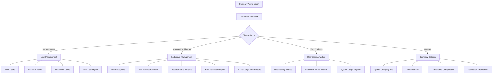

# Epic 9: Service Provider Self-Service Operations

> **Quick Navigation:** [9.1](#story-91-company-admin-dashboard-with-health-metrics) · [9.2](#story-92-full-user-lifecycle-management-company-admin) · [9.3](#story-93-full-participant-lifecycle-management-company-admin) · [9.4](#story-94-bulk-operations--data-management) · [9.5](#story-95-compliance-reporting--advanced-analytics)

## Epic Overview

**Goal**: Enable service provider company administrators to independently manage their organization's users, participants, and operations without requiring system administrator intervention. This epic provides comprehensive self-service tools for full operational management.

**Duration**: 3-4 weeks
**Team Size**: 2-3 developers (backend, frontend, compliance focus)
**Dependencies**: Epic 7 (Rapid Company Onboarding)
**Primary Users**: Company administrators (Service Provider employees)
**Requirements Source**: [Multi-Tenant Administration Requirements Analysis](../multi-tenant-administration-requirements.md)

**Note**: This epic focuses on **comprehensive self-service management** from the company administrator perspective. Initial lightweight setup by system administrators is handled in Epic 7.

**Site Management Note**: Company admins can **rename sites** but cannot create or delete them. Site creation and deletion remain system admin only (Epic 7).

---

## Business Context

Epic 9 empowers service provider organizations to independently manage their operations after the initial setup by SupportSignal system administrators (Epic 7). This is the **ongoing operational management** phase where company administrators have full control over their users, participants, compliance, and analytics.

**Key Business Drivers**:
- **Operational Independence**: Company admins manage their organization without system admin intervention
- **Scalability**: Support organizations with 50+ users and 100+ participants
- **NDIS Compliance**: Full audit trails and compliance features for participant management
- **Efficiency**: Bulk operations for importing/updating users and participants
- **Visibility**: Comprehensive dashboard and analytics for organizational health

**Success Metrics**:
- **Self-Service Rate**: 95% of user and participant management handled by company admins
- **Admin Workload**: 90% reduction in system admin routine tasks
- **Onboarding Speed**: Company admins can add new team members in <5 minutes
- **Data Quality**: 95% accuracy in participant data with validation and compliance checks

---

## Quick Navigation

**Stories in this Epic:**
- [Story 9.1: Company Admin Dashboard with Health Metrics](#story-91-company-admin-dashboard-with-health-metrics) - 📋 **Planned** (High)
- [Story 9.2: Full User Lifecycle Management (Company Admin)](#story-92-full-user-lifecycle-management-company-admin) - 📋 **Planned** (Critical)
- [Story 9.3: Full Participant Lifecycle Management (Company Admin)](#story-93-full-participant-lifecycle-management-company-admin) - 📋 **Planned** (Critical)
- [Story 9.4: Bulk Operations & Data Management](#story-94-bulk-operations--data-management) - 📋 **Planned** (High)
- [Story 9.5: Compliance Reporting & Advanced Analytics](#story-95-compliance-reporting--advanced-analytics) - 📋 **Planned** (Medium)

---

**Scope Clarification**:
- **IN SCOPE**: Full lifecycle management for users and participants by company admins
- **IN SCOPE**: Bulk operations, NDIS compliance, audit trails, advanced analytics
- **IN SCOPE**: Site renaming (company admins can rename their sites)
- **OUT OF SCOPE**: Initial company creation and setup (see Epic 7)
- **OUT OF SCOPE**: Site creation and deletion (system admin only)

---

## User Journey Overview

**Company Admin Self-Service Workflow:**



**Key Insight**: Company administrators have **full operational control** within their organization's scope. All changes are audited and scoped to their company.

---

## Story Breakdown

### Story 9.1: Company Admin Dashboard with Health Metrics

**Status**: **PLANNED** 📋
**Priority**: HIGH
**Estimated Effort**: 4-5 days
**Dependencies**: Epic 7 (Company onboarding foundation)

#### Requirements

**Problem**: Company administrators lack visibility into their organization's health, activity, and operational metrics. They also need to manage basic company settings like renaming their sites to reflect actual location names (e.g., rename "Primary" to "North Sydney Office").

**Solution**: Create comprehensive company dashboard providing key metrics, user/participant activity overview, recent incidents, quick access to common administrative tasks, and company settings including site renaming capability.

**Technical Implementation**:
- **Company Health Overview**: User count, participant count, active incidents, recent activity
- **Activity Metrics**: User logins, incident creation, participant interactions in last 7/30 days
- **Quick Actions**: Direct links to invite users, add participants, view reports
- **Company Settings**: Access to company information and site management
- **Site Renaming**: Company admins can rename their sites (cannot create/delete)
- **Real-time Updates**: Live data refresh using Convex real-time subscriptions
- **Mobile Responsive**: Full dashboard functionality on mobile devices

**Scope**: Company-scoped dashboard showing only data within the administrator's organization. Site management is LIMITED to renaming only.

#### Acceptance Criteria
- [ ] **Dashboard Interface**: Company admin dashboard at `/company-admin/dashboard`
- [ ] **Health Metrics Card**: Display user count, participant count, active incidents
- [ ] **Activity Timeline**: Show recent user logins, incident creation, participant updates
- [ ] **Quick Actions Panel**: Links to invite users, add participants, view compliance reports
- [ ] **Usage Charts**: 7-day and 30-day activity trends (users, incidents, participants)
- [ ] **Company Settings Access**: Link to company settings page from dashboard
- [ ] **Site Management Interface**: Company admin interface at `/company-admin/settings/sites`
- [ ] **List Company Sites**: Display all sites for the company with participant counts
- [ ] **Rename Site**: Edit site name with inline editing or modal form
- [ ] **Site Validation**: Cannot rename site to empty string or duplicate name within company
- [ ] **Audit Logging**: Log all site rename actions with timestamp and user
- [ ] **Permission Boundaries**: Company admins can only rename their own company's sites
- [ ] **No Create/Delete**: UI should NOT show options to create or delete sites
- [ ] **Role-Based Access**: Only company admins and team leads can access dashboard
- [ ] **Real-time Updates**: Dashboard data refreshes automatically when changes occur
- [ ] **Mobile Responsive**: Optimized layout for tablets and mobile phones
- [ ] **Performance**: Dashboard loads in <2 seconds with company data

---

### Story 9.2: Full User Lifecycle Management (Company Admin)

**Status**: **PLANNED** 📋
**Priority**: CRITICAL
**Estimated Effort**: 5-6 days
**Dependencies**: Story 9.1 (Dashboard foundation)

#### Requirements

**Problem**: Company administrators need to manage their team members independently - inviting users, assigning roles, updating permissions, and deactivating users when they leave. Currently, only system admins have this capability.

**Solution**: Implement company-scoped user management interface enabling company admins to handle the complete user lifecycle within their organization, including bulk user imports for large teams.

**Technical Implementation**:
- **User Listing Interface**: Company-scoped user list with search, filtering, sorting
- **User Invitation**: Company admins can invite users with role selection
- **Role Management**: Update user roles (team_lead, frontline_worker) within company scope
- **User Profile Editing**: Update user details, contact information, preferences
- **User Deactivation**: Soft delete users while preserving audit trail and data integrity
- **Bulk User Import**: CSV/Excel import for adding multiple users at once
- **Permission Boundaries**: Strict enforcement - company admins cannot access other companies' users

**Scope**: Full user lifecycle management within company boundary. Company admins cannot promote users to company_admin (security restriction).

#### Acceptance Criteria
- [ ] **User Management Interface**: Company admin interface at `/company-admin/users`
- [ ] **User Listing**: Display all company users with search and filter (role, status, activity)
- [ ] **Invite Users**: Company admins can send email invitations to new users
- [ ] **Role Assignment**: Assign and update roles (team_lead, frontline_worker)
- [ ] **User Profile Management**: Edit user details, contact info, notification preferences
- [ ] **User Deactivation**: Soft delete users with confirmation and audit logging
- [ ] **Pending Invitations**: View and manage pending user invitations
- [ ] **Revoke Invitations**: Cancel pending invitations before acceptance
- [ ] **Bulk User Import**: Upload CSV file to create multiple users at once
- [ ] **Import Validation**: Validate CSV format, duplicate emails, role assignments
- [ ] **Import Preview**: Show preview of users to be created before confirmation
- [ ] **Permission Boundaries**: Cannot access or modify users from other companies
- [ ] **Audit Trail**: Log all user management actions (invite, role change, deactivate)

---

### Story 9.3: Full Participant Lifecycle Management (Company Admin)

**Status**: **PLANNED** 📋
**Priority**: CRITICAL
**Estimated Effort**: 6-7 days
**Dependencies**: Story 9.2 (User management foundation)

#### Requirements

**Problem**: Service providers need comprehensive participant management with NDIS compliance, audit trails, and bulk import capabilities. They manage 50-500 participants and need efficient tools for data entry, status tracking, and compliance reporting.

**Solution**: Implement full participant lifecycle management with NDIS compliance features, bulk import, status lifecycle tracking, and comprehensive audit trails for all participant changes.

**Technical Implementation**:
- **Participant Listing**: Company-scoped list with advanced search and filtering
- **Participant CRUD**: Create, read, update participant profiles with full NDIS data
- **Status Lifecycle**: Track participant status (active, inactive, discharged) with date tracking
- **NDIS Compliance**: Sensitive data handling (DOB, NDIS numbers) with access logging
- **Bulk Participant Import**: CSV/Excel import with NDIS number validation
- **Data Validation**: NDIS number format validation, duplicate detection, required fields
- **Audit Trail**: Complete logging of all participant changes for compliance
- **Data Privacy**: Strict access controls and logging per NDIS requirements

**Scope**: Full participant lifecycle management with NDIS compliance. Company admins can only access participants within their company.

#### Acceptance Criteria
- [ ] **Participant Management Interface**: Company admin interface at `/company-admin/participants`
- [ ] **Participant Listing**: Display all company participants with search and filter
- [ ] **Advanced Search**: Filter by name, NDIS number, status, support level
- [ ] **Create Participant**: Form with full NDIS fields (name, DOB, NDIS number, support level, plan dates)
- [ ] **Edit Participant**: Update participant details with change tracking
- [ ] **Status Management**: Update participant status (active, inactive, discharged) with effective date
- [ ] **NDIS Number Validation**: Real-time validation of NDIS number format
- [ ] **Duplicate Detection**: Warn if NDIS number or name matches existing participant
- [ ] **Bulk Participant Import**: Upload CSV/Excel file to create multiple participants
- [ ] **Import Validation**: Validate NDIS numbers, required fields, duplicates
- [ ] **Import Preview**: Show preview of participants to be created with validation errors
- [ ] **Import Error Handling**: Clear error messages for invalid data with row numbers
- [ ] **Participant Profile View**: Detailed view with incident history, notes, documents
- [ ] **Audit Trail**: Log all participant changes (create, edit, status change) with timestamp and user
- [ ] **Access Logging**: Log all participant profile views for NDIS compliance
- [ ] **Data Privacy**: Sensitive data (DOB, NDIS number) only visible to authorized roles
- [ ] **Permission Boundaries**: Cannot access or modify participants from other companies

---

### Story 9.4: Bulk Operations & Data Management

**Status**: **PLANNED** 📋
**Priority**: HIGH
**Estimated Effort**: 4-5 days
**Dependencies**: Stories 9.2 and 9.3 (User and participant management)

#### Requirements

**Problem**: Service providers need to perform bulk operations efficiently - updating multiple participants at once, bulk status changes, data exports for reporting, and scheduled data maintenance tasks.

**Solution**: Implement comprehensive bulk operation capabilities for users and participants, with export functionality, bulk status updates, and data maintenance tools.

**Technical Implementation**:
- **Bulk Selection**: Multi-select UI for users and participants with select-all
- **Bulk Actions**: Update status, assign roles, send notifications to selected records
- **Bulk Status Updates**: Change status for multiple participants at once
- **Data Export**: Export users and participants to CSV/Excel for external reporting
- **Import Jobs Tracking**: Track bulk import progress with status and error reporting
- **Data Validation**: Validate all bulk operations before execution
- **Rollback Capability**: Ability to preview and cancel bulk operations before completion

**Scope**: Bulk operations scoped to company boundary. Company admins can only perform bulk actions on their own company's data.

#### Acceptance Criteria
- [ ] **Bulk Selection UI**: Checkbox selection for users and participants with select-all
- [ ] **Bulk User Actions**: Update roles, send notifications, deactivate multiple users
- [ ] **Bulk Participant Actions**: Update status, support level for multiple participants
- [ ] **Bulk Status Updates**: Change participant status (active/inactive/discharged) in bulk
- [ ] **Data Export - Users**: Export user list to CSV with selected fields
- [ ] **Data Export - Participants**: Export participant list to CSV with NDIS compliance
- [ ] **Export Field Selection**: Choose which fields to include in export
- [ ] **Import Jobs Dashboard**: View progress of bulk imports with status tracking
- [ ] **Import Error Reporting**: Detailed error reports for failed imports with row numbers
- [ ] **Import Retry**: Ability to fix errors and retry failed import rows
- [ ] **Bulk Operation Preview**: Show preview of changes before execution
- [ ] **Bulk Operation Confirmation**: Require confirmation for destructive bulk actions
- [ ] **Audit Logging**: Log all bulk operations with affected record counts
- [ ] **Permission Boundaries**: Bulk operations only affect company's own data

---

### Story 9.5: Compliance Reporting & Advanced Analytics

**Status**: **PLANNED** 📋
**Priority**: MEDIUM
**Estimated Effort**: 5-6 days
**Dependencies**: Stories 9.1, 9.3 (Dashboard and participant management)

#### Requirements

**Problem**: Service providers need compliance reporting for NDIS audits, operational analytics for business insights, and data exports for external reporting. They need to demonstrate participant data access, changes, and compliance with NDIS requirements.

**Solution**: Implement comprehensive reporting and analytics system with NDIS compliance reports, operational dashboards, data access logs, and customizable report generation.

**Technical Implementation**:
- **Compliance Reports**: NDIS audit reports showing participant data access and changes
- **Operational Analytics**: User activity, incident trends, participant metrics over time
- **Custom Report Builder**: Create custom reports with field selection and date ranges
- **Report Scheduling**: Schedule recurring reports with email delivery
- **Data Access Logs**: Complete audit trail of participant data access for NDIS compliance
- **Export Formats**: PDF, CSV, Excel export for all reports
- **Dashboard Widgets**: Customizable dashboard widgets for key metrics

**Scope**: All reports and analytics are company-scoped. Company admins can only view data for their organization.

#### Acceptance Criteria
- [ ] **Compliance Reports Interface**: Company admin interface at `/company-admin/reports`
- [ ] **NDIS Audit Report**: Participant data access log with user, timestamp, action
- [ ] **Participant Changes Report**: All participant changes with before/after values
- [ ] **User Activity Report**: User logins, actions, incident creation by date range
- [ ] **Incident Trends Report**: Incident count, types, resolution times over time
- [ ] **Participant Metrics**: Participant count by status, support level, plan dates
- [ ] **Custom Report Builder**: Select fields, filters, date ranges for custom reports
- [ ] **Report Preview**: Preview report data before generating final report
- [ ] **Report Export - PDF**: Export reports to PDF with company branding
- [ ] **Report Export - CSV**: Export report data to CSV for external analysis
- [ ] **Report Export - Excel**: Export report data to Excel with formatting
- [ ] **Report Scheduling**: Schedule recurring reports (weekly, monthly)
- [ ] **Report Email Delivery**: Automatically email scheduled reports to company admin
- [ ] **Dashboard Widgets**: Add/remove customizable widgets on dashboard
- [ ] **Widget Configuration**: Configure date ranges, metrics for each widget
- [ ] **Performance**: Reports generate in <10 seconds for 500+ participants
- [ ] **Permission Boundaries**: Reports only include company's own data

---

## Technical Architecture Requirements

### Backend Functions Required

#### Company Dashboard Functions
```typescript
// Company Admin Dashboard
dashboard.company.getHealthMetrics        // User/participant counts, active incidents
dashboard.company.getActivityTimeline     // Recent user/incident/participant activity
dashboard.company.getUsageCharts          // 7-day and 30-day activity trends
dashboard.company.getQuickStats           // Real-time metrics for dashboard cards

// Site Management (Company Admin - LIMITED to rename only)
sites.company.listCompanySites            // List all sites for company admin's company
sites.company.renameSite                  // Rename site (company admin can only rename, not create/delete)
sites.company.validateSiteRename          // Validate site name (no empty, no duplicates)
```

#### User Management Functions (Company Admin Perspective)
```typescript
// Full User Lifecycle Management
users.company.listCompanyUsers            // Company-scoped user listing with filters
users.company.inviteUser                  // Company admin invites new user
users.company.updateUserRole              // Update user role within company scope
users.company.updateUserProfile           // Edit user details and preferences
users.company.deactivateUser              // Soft delete user with audit trail
users.company.listPendingInvitations      // View pending invitations for company
users.company.revokeInvitation            // Cancel pending invitation
users.bulk.importUsers                    // Bulk user import from CSV
users.bulk.validateUserImport             // Validate CSV before import
users.bulk.updateUsersBulk                // Bulk update for multiple users
```

#### Participant Management Functions (Company Admin Perspective)
```typescript
// Full Participant Lifecycle Management
participants.company.listCompanyParticipants   // Company-scoped participant listing
participants.company.createParticipant         // Create participant with full NDIS data
participants.company.updateParticipant         // Update participant details
participants.company.updateParticipantStatus   // Update status lifecycle
participants.company.getParticipantProfile     // Detailed participant view with history
participants.validation.validateNdisNumber     // Real-time NDIS number validation
participants.validation.checkDuplicates        // Duplicate detection for NDIS numbers
participants.bulk.importParticipants           // Bulk participant import from CSV
participants.bulk.validateParticipantImport    // Validate CSV before import
participants.bulk.updateParticipantsBulk       // Bulk update for multiple participants
```

#### Bulk Operations Functions
```typescript
// Bulk Operations & Data Management
bulk.operations.executeBulkAction         // Execute bulk action with preview
bulk.operations.getBulkOperationStatus    // Track bulk operation progress
bulk.exports.exportUsersToCsv             // Export users to CSV
bulk.exports.exportParticipantsToCsv      // Export participants to CSV
bulk.imports.trackImportJob               // Track import job status and errors
bulk.imports.retryFailedImportRows        // Retry failed import rows after fixes
```

#### Compliance & Analytics Functions
```typescript
// Compliance Reporting
reports.compliance.generateNdisAuditReport    // NDIS audit report with data access logs
reports.compliance.getParticipantChanges      // Participant change history report
reports.compliance.getDataAccessLog           // Complete data access audit trail

// Operational Analytics
reports.analytics.getUserActivity             // User activity metrics
reports.analytics.getIncidentTrends           // Incident trends over time
reports.analytics.getParticipantMetrics       // Participant status and demographics

// Custom Reports
reports.custom.generateCustomReport           // Custom report with field selection
reports.custom.scheduleReport                 // Schedule recurring report
reports.custom.exportReportToPdf              // Export report to PDF
reports.custom.exportReportToCsv              // Export report to CSV
```

---

## Database Schema Additions

### Import Jobs Tracking Table
```typescript
import_jobs: defineTable({
  _id: v.id("import_jobs"),
  company_id: v.id("companies"),
  import_type: v.union("users", "participants"),
  file_name: v.string(),
  status: v.union("processing", "completed", "failed", "partial"),
  total_records: v.number(),
  processed_records: v.number(),
  success_records: v.number(),
  failed_records: v.number(),
  error_log: v.optional(v.array(v.object({
    row_number: v.number(),
    error_message: v.string(),
    data: v.any()
  }))),
  imported_by: v.id("users"),
  created_at: v.number(),
  completed_at: v.optional(v.number())
})
  .index("by_company", ["company_id"])
  .index("by_status", ["company_id", "status"])
```

### Data Access Audit Log Table (NDIS Compliance)
```typescript
data_access_logs: defineTable({
  _id: v.id("data_access_logs"),
  company_id: v.id("companies"),
  user_id: v.id("users"),
  resource_type: v.union("participant", "user", "incident"),
  resource_id: v.id("participants") | v.id("users") | v.id("incidents"),
  action: v.union("view", "create", "update", "delete", "export"),
  timestamp: v.number(),
  ip_address: v.optional(v.string()),
  user_agent: v.optional(v.string())
})
  .index("by_company", ["company_id"])
  .index("by_resource", ["resource_type", "resource_id"])
  .index("by_user", ["user_id", "timestamp"])
  .index("by_timestamp", ["company_id", "timestamp"])
```

### Scheduled Reports Table
```typescript
scheduled_reports: defineTable({
  _id: v.id("scheduled_reports"),
  company_id: v.id("companies"),
  report_name: v.string(),
  report_type: v.union("ndis_audit", "participant_changes", "user_activity", "custom"),
  report_config: v.object({
    fields: v.array(v.string()),
    filters: v.any(),
    date_range: v.string()
  }),
  schedule: v.union("weekly", "monthly"),
  email_recipients: v.array(v.string()),
  last_run: v.optional(v.number()),
  next_run: v.number(),
  created_by: v.id("users"),
  created_at: v.number()
})
  .index("by_company", ["company_id"])
  .index("by_next_run", ["next_run"])
```

---

## Epic Completion Status

### Current State: **PLANNED - READY FOR IMPLEMENTATION** 📋

**Story 9.1**: 📋 **PLANNED** - Company Admin Dashboard with Health Metrics
**Story 9.2**: 📋 **PLANNED** - Full User Lifecycle Management
**Story 9.3**: 📋 **PLANNED** - Full Participant Lifecycle Management
**Story 9.4**: 📋 **PLANNED** - Bulk Operations & Data Management
**Story 9.5**: 📋 **PLANNED** - Compliance Reporting & Advanced Analytics

**Epic 9 Target Deliverables**:
- 🎯 **Self-Service Management**: Company admins handle 95% of operations independently
- 🎯 **Full User Lifecycle**: Invite, manage, and deactivate users within company scope
- 🎯 **Full Participant Lifecycle**: Comprehensive participant management with NDIS compliance
- 🎯 **Bulk Operations**: Efficient import/export and bulk updates for large datasets
- 🎯 **Compliance & Analytics**: NDIS audit reports and operational insights

**Success Criteria**:
- Company admins can manage users and participants without system admin help
- Support organizations with 50+ users and 500+ participants
- Bulk import 100+ participants in <2 minutes
- Generate NDIS compliance reports in <10 seconds
- 100% audit trail for all participant data access and changes

---

## Integration Points

### Dependencies Satisfied:
- ✅ **Epic 7**: Company onboarding and initial setup completed
- ✅ **Authentication**: BetterAuth integration for user management
- ✅ **Email Infrastructure**: Invitation emails working
- ✅ **Multi-tenant Database**: Company scoping established

### Enables Future Development:
- **Epic 10+**: Advanced incident capture workflows
- **Epic 11+**: Participant health metrics and care planning
- **Epic 12+**: Advanced analytics and AI-powered insights
- **API Integrations**: NDIS portal integrations, external reporting

---

## Risk Considerations

### Technical Risks
- **Data Privacy**: NDIS sensitive data requires strict access controls and audit logging
- **Bulk Import Performance**: Large CSV files (1000+ rows) may cause performance issues
- **Permission Complexity**: Company-scoped permissions must prevent cross-company data access
- **Audit Log Volume**: High-volume audit logging may impact database performance

### Mitigation Strategies
- **Access Control**: Implement strict permission boundaries with automated tests
- **Bulk Import**: Use background jobs with progress tracking for large imports
- **Performance Testing**: Load testing with 500+ participants and 1000+ row imports
- **Audit Log Archival**: Implement log rotation and archival for old audit data
- **Data Encryption**: Encrypt sensitive NDIS data at rest and in transit

---

## Knowledge Capture

### Key Architectural Patterns Established:
- **Company-scoped data access** with strict permission boundaries
- **Bulk operation patterns** with preview, validation, and rollback
- **NDIS compliance patterns** with audit trails and access logging
- **Self-service workflows** for operational independence
- **Real-time dashboards** with Convex subscriptions

### Requirements Documentation:
- **Full Requirements**: All features defined with acceptance criteria
- **NDIS Compliance**: Data privacy and audit requirements documented
- **Bulk Operations**: Import/export patterns and validation rules

### Integration Documentation:
- **CSV Import**: Format specifications and validation rules
- **Audit Logging**: NDIS compliance logging requirements
- **Report Generation**: Export formats and scheduling patterns

---

## Epic Scope Clarification (Important)

**Epic 7 vs Epic 9 Comparison:**

| Aspect | Epic 7 (System Admin) | Epic 9 (Company Admin) |
|--------|----------------------|------------------------|
| **Perspective** | SupportSignal system admin | Service provider company admin |
| **Users** | Add 2-5 initial users manually | Full lifecycle: invite, manage, bulk import |
| **Participants** | Add 5-10 sample participants manually | Full lifecycle: CRUD, bulk import, NDIS compliance |
| **Sites** | Create, edit, delete sites | **Rename only** (cannot create/delete) |
| **Scope** | Lightweight rapid setup (<30 min) | Comprehensive ongoing management |
| **Features** | Basic creation and editing | Advanced: bulk operations, analytics, compliance |
| **Interface** | `/admin/companies/*` | `/company-admin/*` |

This separation ensures:
- **Epic 7**: Fast onboarding by SupportSignal (get company operational quickly)
- **Epic 9**: Operational independence for service providers (ongoing management)

---

## Contact & Support

**Epic Owner**: Company Administrators (Service Providers)
**Technical Lead**: Development Team
**Prerequisites**: Epic 7 (Rapid Company Onboarding) must be complete
**Documentation**: Full story documentation to be created in `docs/stories/9.*.story.md`

---

*Epic 9 Status: Ready for Implementation - Service Provider Operational Independence*
*Last Updated: 2025-01-20*
*Version: 1.1 (Added site renaming capability for company admins)*
