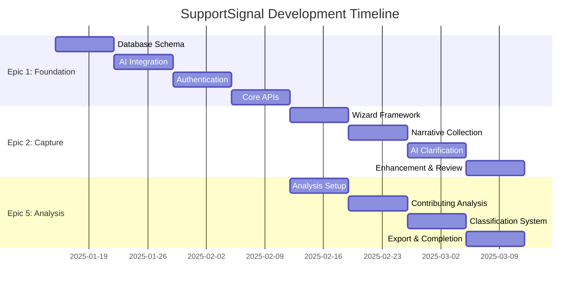

# SupportSignal - Product Requirements Documentation

## Overview

This comprehensive Product Requirements Document (PRD) defines the complete specification for **SupportSignal** - an AI-powered incident reporting and analysis platform designed for NDIS service providers. The PRD is structured as three focused epics that build progressively from data foundation through capture workflows to analysis capabilities.

---

## Navigation Hub

### 📋 **[Main PRD Document](../prd.md)**
Executive summary, project overview, success metrics, and architectural decisions for the complete SupportSignal platform.

### 🏗️ **Epic Documentation**
Detailed specifications for each development phase:

#### **[Epic 1: Data Foundation & Backend Setup](./epic-1.md)**
- **Scope**: Infrastructure, database schema, AI integration, authentication
- **Duration**: 2-3 weeks
- **Dependencies**: None (foundational)
- **Deliverables**: Convex backend, AI services, user management, core APIs

#### **[Epic 2: Incident Capture Workflow](./epic-2.md)**  
- **Scope**: 7-step capture wizard, narrative collection, AI clarification system
- **Duration**: 3-4 weeks
- **Dependencies**: Epic 1 (database and AI services)
- **Deliverables**: Complete frontline worker experience

#### **[Epic 3: Incident Capture Workflow](./epic-3.md)**  
- **Scope**: 7-step capture wizard, narrative collection, AI clarification system
- **Duration**: 3-4 weeks
- **Dependencies**: Epic 1 (database and AI services)
- **Deliverables**: Complete frontline worker experience

#### **Epic 4: [RESERVED]**
- **Scope**: To be defined
- **Status**: Reserved for future epic

#### **[Epic 5: Incident Analysis Workflow](./epic-5.md)**
- **Scope**: 4-step analysis process, contributing conditions, classification system
- **Duration**: 3-4 weeks  
- **Dependencies**: Epic 1 (APIs), Epic 3 (incident data)
- **Deliverables**: Complete team leader analysis tools

#### **[Epic 6: AI Prompt Management System](./epic-6.md)**
- **Scope**: AI prompt template management and configuration
- **Duration**: 1-2 weeks
- **Dependencies**: Epic 1 (AI services, authentication)
- **Deliverables**: Complete AI prompt management system

---

## Epic Development Approach

### Sequential Foundation with Parallel Features

### Dependencies Matrix
| Epic | Requires | Enables | Parallel Opportunities |
|------|----------|---------|----------------------|
| Epic 1 | Project setup | All features | None (foundation first) |
| Epic 2 | Epic 1 complete | Capture workflow | Epic 3 (after Epic 1) |
| Epic 3 | Epic 1 + Epic 2 | Analysis workflow | Epic 5 foundation, Epic 6 |
| Epic 4 | [RESERVED] | TBD | TBD |
| Epic 5 | Epic 1 + Epic 3 data | Full platform | None (analysis completion) |
| Epic 6 | Epic 1 only | AI customization | All AI features |

---

## Feature Completion Tracking

### Epic 1: Data Foundation & Backend Setup
- [ ] **Story 1.1**: Convex Database Implementation
- [ ] **Story 1.2**: AI Service Integration  
- [ ] **Story 1.3**: User Authentication & Permissions
- [ ] **Story 1.4**: Core API Layer

### Epic 2: Incident Capture Workflow
- [ ] **Story 2.1**: Wizard Framework & Navigation
- [ ] **Story 2.2**: Metadata & Narrative Collection
- [ ] **Story 2.3**: AI-Powered Clarification System
- [ ] **Story 2.4**: Narrative Enhancement & Completion

### Epic 3: Incident Capture Workflow  
- [x] **Story 3.1**: Metadata & Narrative Collection ✅
- [x] **Story 3.2**: AI-Powered Clarification System ✅
- [x] **Story 3.3**: Narrative Enhancement & Completion ✅

### Epic 4: [RESERVED]
- **Status**: Reserved for future epic definition

### Epic 5: Incident Analysis Workflow  
- [ ] **Story 5.1**: Analysis Workflow Setup
- [ ] **Story 5.2**: Contributing Conditions Analysis
- [ ] **Story 5.3**: Incident Classification System
- [ ] **Story 5.4**: Analysis Completion & Export

### Epic 6: AI Prompt Management System
- [x] **Story 6.1**: Core AI Prompt Management Foundation ✅
- [ ] **Story 6.2**: Advanced Prompt Management & Analytics

---

## Key Requirements Summary

### User Workflows

#### **Frontline Worker Journey** (Epic 2)
1. **Metadata Entry**: Reporter, participant, date/time, location
2. **Multi-Phase Narrative**: Before/During/End/Post-Event descriptions
3. **AI Clarification**: Context-aware follow-up questions (2-4 per phase)
4. **Enhancement Review**: AI-enhanced narrative for final approval
5. **Handoff**: Workflow transition to team leader analysis

#### **Team Leader Journey** (Epic 3)
1. **Narrative Review**: Complete incident summary with enhancements  
2. **Contributing Analysis**: AI-powered analysis with editing capabilities
3. **Classification**: Incident type, severity, and category assignment
4. **Export & Complete**: Final review and compliance report generation

### Technical Requirements

#### **Performance Standards**
- **Response Time**: <2 seconds for all user interactions
- **AI Processing**: <10 seconds for question generation and analysis
- **Real-time Updates**: <500ms latency for workflow handoffs
- **Mobile Performance**: Full functionality on iOS/Android browsers

#### **Data Requirements**
- **Audit Trail**: Complete change tracking for all incident data
- **Data Retention**: 7+ years for compliance requirements
- **Export Formats**: JSON, Markdown, PDF for different use cases
- **Data Validation**: Client and server-side validation with clear error messages

#### **Security & Compliance**
- **Role-Based Access**: Frontline workers, team leaders, administrators
- **Data Encryption**: In-transit and at-rest encryption for all incident data
- **Session Management**: Secure authentication with session timeout
- **Privacy Protection**: Participant data anonymization options

---

## Integration Requirements

### AI Services
- **OpenAI GPT-4**: Primary AI service for question generation and analysis
- **Anthropic Claude**: Secondary/backup AI service  
- **Prompt Management**: Versioned prompts with A/B testing capabilities
- **Response Caching**: Intelligent caching to reduce API costs

### External Systems
- **NDIS Reporting**: Export compatibility with NDIS incident reporting requirements
- **Email Notifications**: Workflow status updates and completion notifications
- **Audit Logging**: Comprehensive logging for compliance and debugging
- **Analytics**: Usage metrics and performance monitoring

---

## Quality Assurance

### Testing Strategy
- **Unit Tests**: 90%+ coverage for business logic and data operations
- **Integration Tests**: Complete workflow testing from capture to export
- **E2E Tests**: Critical user journeys for both frontline and team leader workflows
- **Performance Tests**: Load testing for concurrent users and AI processing

### User Acceptance Criteria
- **Usability Testing**: Real NDIS workers validate capture workflow ease-of-use
- **Compliance Review**: Legal/compliance team validates report outputs
- **Performance Validation**: Response time and reliability under realistic load
- **Accessibility**: WCAG 2.1 AA compliance for inclusive design

---

## Release Planning

### MVP Release (All Epics Complete)
- **Target**: 8-10 weeks from project start  
- **Scope**: Complete capture and analysis workflows
- **Success Criteria**: 
  - Successful pilot with 1-2 NDIS providers
  - <15 minute average capture time
  - >90% incident completion rate
  - Compliance-ready report exports

### Post-MVP Enhancements
- **Advanced Analytics**: Trend analysis and pattern recognition
- **Mobile App**: Native iOS/Android applications  
- **Bulk Operations**: Multi-incident analysis and reporting
- **Integrations**: NDIS portal direct submission, CRM integrations

---

## Contact & Support

**Product Owner**: [To be assigned]  
**Technical Lead**: [To be assigned]  
**Compliance Advisor**: [To be assigned]

**Documentation Updates**: This PRD is a living document that will be updated throughout development to reflect scope changes, technical decisions, and lessons learned.

---

*Last Updated: 2025-01-15*  
*Version: 1.0*  
*Status: Requirements Complete*